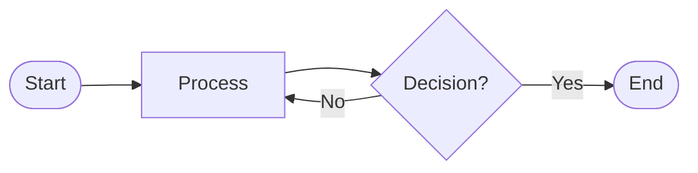
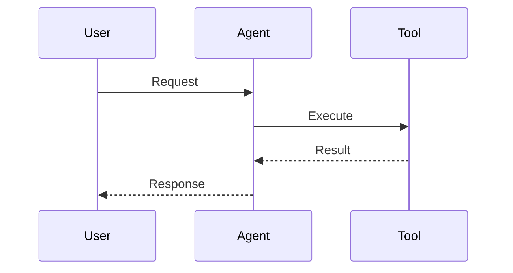
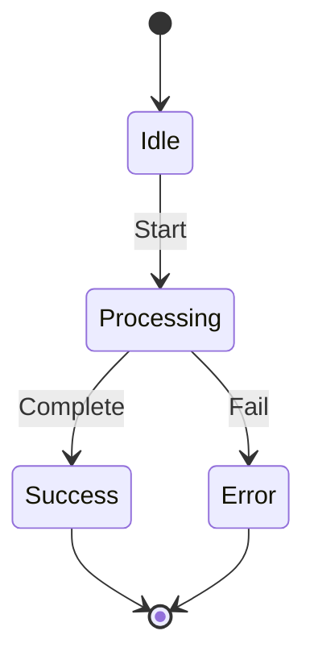
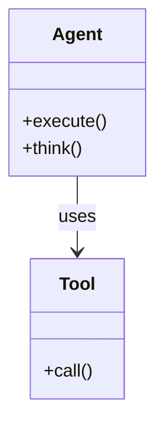
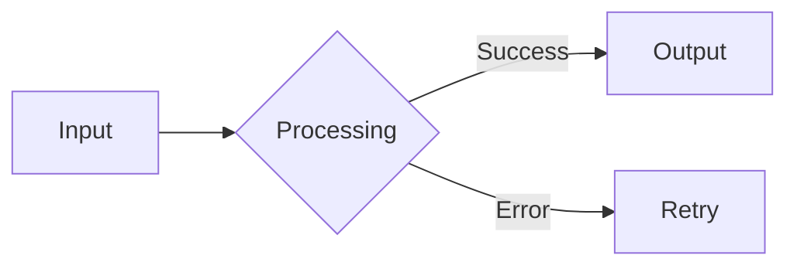
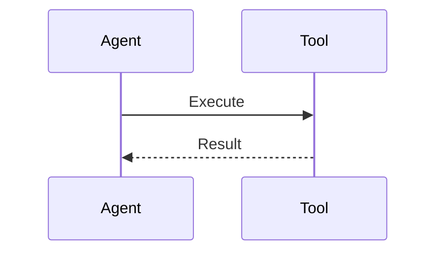
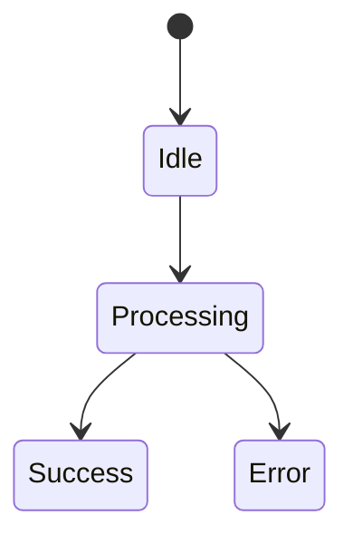

# Universal Documentation Template

**Purpose**: Standard structure for all knowledge base documents
**Last Updated**: 2025-11-20
**Usage**: Copy this template when creating new docs in `/docs/kb/`

---

## Template Structure

````markdown
# [Layer].[Section].[Topic] - [Title]

## TL;DR

[1-3 sentence capturing the essence of the topi but in an understandable, easy to read way - what problem this solves and the key benefit]

**Status**: [✅ Complete | 🚧 In Progress | ⏳ Pending]
**Last Updated**: YYYY-MM-DD
**Versions**: [e.g. Next.js 15, AI SDK 6.0, Node 20]
**Prerequisites**: [[Link to prerequisite doc 1], [Link to prerequisite doc 2]]
**Grounded In**: [Key research papers/production systems, 2024-2025]

---

## Table of Contents

[This section is OPTIONAL but RECOMMENDED for documents >500 lines]

-   [Overview](#overview)
-   [The Problem](#the-problem-clear-problem-statement)
-   [Core Concept](#core-concept)
-   [Implementation Patterns](#implementation-patterns)
-   [Framework Integration](#framework-integration)
-   [Research & Benchmarks](#research--benchmarks)
-   [When to Use This Pattern](#when-to-use-this-pattern)
-   [Production Best Practices](#production-best-practices)
-   [Observability & Debugging](#observability--debugging) _(if applicable)_
-   [Token Efficiency](#token-efficiency) _(if applicable)_
-   [Trade-offs & Considerations](#trade-offs--considerations)
-   [Integration with Your Codebase](#integration-with-your-codebase) _(if applicable)_
-   [Key Takeaways](#key-takeaways)
-   [References](#references)

**Note**: Update this TOC to match your document's actual sections. Many markdown editors can auto-generate TOCs.

---

## Overview

[2-3 paragraphs that answer:]

-   What is this pattern/concept?
-   Why does it matter?
-   What's the core innovation or key insight?

**Key Research Findings** (2024-2025):

-   **[Metric/Finding]**: [Specific improvement with source]
-   **[Metric/Finding]**: [Specific improvement with source]
-   **[Metric/Finding]**: [Specific improvement with source]

**Date Verified**: [Current date for freshness]

---

## The Problem: [Clear problem statement]

[Describe the problem this pattern solves using:]

### The Classic Challenge

[Concrete scenario showing the problem]

```typescript
// ❌ BAD: [What goes wrong]
[Code example showing the problem]
```

**Problems**:

-   ❌ [Specific issue 1 with impact]
-   ❌ [Specific issue 2 with impact]
-   ❌ [Specific issue 3 with impact]

### Why This Matters

[Business/technical impact of the problem - costs, failures, user experience]

---

## Core Concept

[Deep dive into the solution:]

### What is [Pattern Name]?

[Definition in plain English]

### Visual Representation

**Choose based on complexity:**

**For simple textual/data transformations** (use ASCII):

```
"The quick brown fox jumps over the lazy dog."

→ 10 words
→ ~13 tokens (including punctuation and spaces)
```

**For complex workflows/architecture** (use Mermaid - choose the right chart type):

**Flowchart** (processes, decision trees, agent loops):



**Sequence Diagram** (interactions over time, API calls, agent-tool communication):



**State Diagram** (state machines, lifecycle, transitions):



**Class Diagram** (relationships, inheritance, composition):



**Choose the chart type that best fits your explanation:**

-   **Flowchart**: Step-by-step processes, decision trees, agent loops (Think → Act → Observe)
-   **Sequence Diagram**: Time-based interactions, API calls, multi-party communication
-   **State Diagram**: State machines, lifecycle management, status transitions
-   **Class Diagram**: Object relationships, architecture, component structure
-   **ER Diagram**: Database schemas, data relationships
-   **Gantt Chart**: Timelines, project planning, scheduling
-   **Mindmap**: Hierarchical concepts, knowledge organization
-   **Timeline**: Chronological events, history, evolution

### Key Principles

1. **[Principle 1]**: [Explanation]
2. **[Principle 2]**: [Explanation]
3. **[Principle 3]**: [Explanation]

---

## Implementation Patterns

### Pattern 1: [Basic/Simple Pattern Name]

**Use Case**: [When to use this variant]

```typescript
// [Pattern implementation with comments]
[Code example]
```

**Pros**:

-   ✅ [Benefit]
-   ✅ [Benefit]

**Cons**:

-   ❌ [Limitation]
-   ❌ [Limitation]

**When to Use**: [Specific scenarios]

### Pattern 2: [Advanced Pattern Name]

[Repeat structure above]

### Pattern 3: [Production Pattern Name]

[Repeat structure above, focus on production-ready]

---

## Framework Integration

### Next.js (App Router)

```typescript
// app/[feature]/[component].tsx
[Next.js specific implementation]
```

### NestJS (Backend)

```typescript
// src/[module]/[service].ts
[NestJS specific implementation]
```

### Vercel AI SDK 6

```typescript
// [AI SDK specific implementation]
[Code with AI SDK v6]
```

**[Optional: Your Codebase Example]**

-   **File**: `[path/to/file.ts]`
-   **Description**: [How it implements this pattern]

---

## Research & Benchmarks

### Academic Research (2024-2025)

#### [Research Paper/Framework 1]

**Paper**: "[Title]"

-   **Authors**: [Names]
-   **Source**: [ArXiv/Conference]
-   **Key Innovation**: [What they discovered]
-   **Results**: [Metrics/improvements]

[2-3 more research sections]

### Production Benchmarks

**Test Case**: [Realistic scenario]

| Metric         | Baseline | With Pattern | Improvement |
| -------------- | -------- | ------------ | ----------- |
| **[Metric 1]** | [Value]  | [Value]      | **[%]**     |
| **[Metric 2]** | [Value]  | [Value]      | **[%]**     |
| **[Metric 3]** | [Value]  | [Value]      | **[%]**     |

---

## When to Use This Pattern

### ✅ Use When:

1. **[Scenario 1]**

    - [Specific condition]
    - [Example use case]

2. **[Scenario 2]**
    - [Specific condition]
    - [Example use case]

### ❌ Don't Use When:

1. **[Scenario 1]**

    - [Why it's not suitable]
    - [Better alternative]

2. **[Scenario 2]**
    - [Why it's not suitable]
    - [Better alternative]

### Decision Matrix

| Your Situation | Recommended Approach |
| -------------- | -------------------- |
| [Condition 1]  | [Pattern variant]    |
| [Condition 2]  | [Pattern variant]    |
| [Condition 3]  | [Alternative]        |

---

## Production Best Practices

### 1. [Best Practice Category]

```typescript
// Production-ready implementation
[Code example]
```

**Why**: [Rationale]
**Impact**: [Metric/benefit]

### 2. [Best Practice Category]

[Repeat above]

### 3. Common Pitfalls

#### ❌ Pitfall 1: [What not to do]

```typescript
// BAD
[Anti-pattern code]
```

**Problem**: [Why this fails]

#### ✅ Solution: [Correct approach]

```typescript
// GOOD
[Correct code]
```

**Benefit**: [Why this works]

---

## Observability & Debugging

[This section is OPTIONAL - include for agent/autonomous patterns, ReAct loops, tool orchestration, multi-agent systems]

### Logging Strategy

```typescript
// Log agent steps, tool calls, and reasoning traces
import { logger } from "@/lib/logger";

async function executeAgent(input: string) {
	logger.info("Agent started", { input, timestamp: Date.now() });

	const result = await agent.execute({
		input,
		onStep: (step) => {
			logger.debug("Agent step", {
				step: step.type,
				tool: step.toolName,
				input: step.input,
				output: step.output,
			});
		},
	});

	logger.info("Agent completed", {
		output: result.output,
		steps: result.steps.length,
		tokens: result.usage.totalTokens,
	});

	return result;
}
```

**Why**: Agent failures are non-deterministic. Comprehensive logging enables debugging production issues.

**Impact**: Reduces mean time to resolution (MTTR) by 60-80% for agent-related incidents.

### Testing Approach

```typescript
// Test non-deterministic agent behavior
describe("Agent Tool Calling", () => {
	it("should call correct tool for user query", async () => {
		const result = await agent.execute({
			input: "What's the weather in Paris?",
		});

		// Assert tool was called (not exact output)
		expect(result.steps).toContainEqual(
			expect.objectContaining({
				type: "tool-call",
				toolName: "getWeather",
			})
		);

		// Assert final output structure
		expect(result.output).toMatch(/temperature|weather|degrees/i);
	});

	it("should handle tool errors gracefully", async () => {
		const result = await agent.execute({
			input: "Get weather for invalid location",
		});

		expect(result.output).toContain("error");
		expect(result.steps.length).toBeLessThan(10); // Prevents infinite loops
	});
});
```

**Why**: Traditional unit tests fail with LLMs. Test for behavior patterns, not exact outputs.

### Common Failure Modes

1. **Infinite Loops**: Agent repeatedly calls same tool without progress

    - **Detection**: Track step count, detect repeated tool calls
    - **Mitigation**: Implement `maxSteps` limit, detect stuck patterns

2. **Hallucinated Tool Calls**: Agent invokes non-existent tools

    - **Detection**: Validate tool names before execution
    - **Mitigation**: Use structured tool schemas (Zod), provide tool registry

3. **Tool Misuse**: Agent passes invalid parameters
    - **Detection**: Validate parameters against schema
    - **Mitigation**: Use Zod validation, provide clear tool descriptions

### Monitoring Metrics

**Key Metrics to Track**:

| Metric                    | Target | Alert Threshold |
| ------------------------- | ------ | --------------- |
| **Success Rate**          | >90%   | <85%            |
| **Avg Steps per Task**    | 3-5    | >10             |
| **Token Usage per Task**  | <2000  | >5000           |
| **Latency (p95)**         | <5s    | >10s            |
| **Cost per Conversation** | <$0.10 | >$0.50          |

**Implementation**:

```typescript
// Track agent metrics
import { metrics } from "@/lib/metrics";

async function executeWithMetrics(input: string) {
	const startTime = Date.now();

	try {
		const result = await agent.execute({ input });

		metrics.increment("agent.success");
		metrics.histogram("agent.steps", result.steps.length);
		metrics.histogram("agent.tokens", result.usage.totalTokens);
		metrics.histogram("agent.latency", Date.now() - startTime);

		return result;
	} catch (error) {
		metrics.increment("agent.failure");
		throw error;
	}
}
```

---

## Token Efficiency

[This section is OPTIONAL - include for prompt/context-heavy patterns, RAG, long-context management, prompt engineering]

### Context Size Impact

**Example**: RAG pattern with document retrieval

```
Without optimization:
- System prompt: 500 tokens
- User query: 50 tokens
- Retrieved docs: 8000 tokens
- Total: 8550 tokens per request

With compression:
- System prompt: 500 tokens
- User query: 50 tokens
- Compressed docs: 2000 tokens (75% reduction)
- Total: 2550 tokens per request
```

**Impact**: 70% token reduction = 70% cost reduction at scale.

### Optimization Strategies

#### 1. Context Compression

```typescript
// Compress retrieved context before injection
import { compressContext } from "@/lib/context-compression";

async function retrieveAndCompress(query: string, topK: number = 5) {
	const docs = await vectorSearch(query, topK);

	// Compress if total tokens exceed limit
	const totalTokens = estimateTokens(docs.map((d) => d.content).join("\n"));

	if (totalTokens > MAX_CONTEXT_TOKENS) {
		const compressed = await compressContext(docs, {
			targetTokens: MAX_CONTEXT_TOKENS,
			preserveKeyFacts: true,
		});

		return compressed;
	}

	return docs;
}
```

**Why**: Most retrieved documents contain redundant information. Compression preserves key facts while reducing tokens.

**Savings**: 50-70% token reduction with <5% accuracy loss.

#### 2. Lazy Context Loading

```typescript
// Load context only when needed
async function agentWithLazyContext(input: string) {
  const agent = new ToolLoopAgent({
    model: openrouter.languageModel("google/gemini-2.0-flash"),
    tools: {
      // Don't load full context upfront
      searchDocs: {
        description: "Search documentation when needed",
        execute: async ({ query }) => {
          // Load only relevant docs on-demand
          return await vectorSearch(query, topK: 3);
        },
      },
    },
  });

  return await agent.execute({ input });
}
```

**Why**: Many agent tasks don't need full context. Load only what's required per step.

**Savings**: 40-60% token reduction for multi-step tasks.

#### 3. Prompt Template Optimization

```typescript
// ❌ BAD: Verbose prompts
const prompt = `
You are a helpful assistant. 
Your job is to answer questions accurately.
Please be thorough and detailed.
Always cite your sources.
Make sure to provide context.
Answer the following question: ${query}
`;

// ✅ GOOD: Concise prompts
const prompt = `Answer accurately with citations: ${query}`;
```

**Why**: Every token costs money. Remove unnecessary words.

**Savings**: 20-30% token reduction per request.

### Cost at Scale

**Scenario**: Customer support chatbot handling user queries

**Baseline** (no optimization):

-   1M queries/month
-   Avg 2000 tokens/query
-   Cost: $5/1M tokens (GPT-4o)
-   **Monthly cost**: $10,000

**With Optimizations**:

-   Context compression: -50% tokens
-   Lazy loading: -30% tokens
-   Prompt optimization: -20% tokens
-   **Effective reduction**: ~70% tokens
-   **Monthly cost**: $3,000
-   **Savings**: $7,000/month ($84K/year)

**Break-even**: Optimization implementation takes 2 weeks. ROI positive after 1 month.

---

## Trade-offs & Considerations

### Advantages

1. **[Advantage 1]**: [Description with metric if available]
2. **[Advantage 2]**: [Description with metric if available]
3. **[Advantage 3]**: [Description with metric if available]

### Disadvantages

1. **[Disadvantage 1]**: [Description with mitigation strategy]
2. **[Disadvantage 2]**: [Description with mitigation strategy]

### Cost Analysis

**Example**: [Realistic scenario]

**Traditional Approach**:

```
- [Cost factor 1]: [Amount]
- [Cost factor 2]: [Amount]
- Total: [Amount]
```

**With This Pattern**:

```
- [Cost factor 1]: [Amount]
- [Cost factor 2]: [Amount]
- Total: [Amount]
- Savings: [Amount] ([%])
```

---

## Integration with Your Codebase

[This section is OPTIONAL - only include if you have direct examples]

### Current Implementation

**File**: `[path/to/file.ts]`

[Brief description of how your codebase uses this pattern]

### Enhancement Opportunities

1. **[Enhancement 1]**: [What could be improved]
    - **Current**: [Current approach]
    - **Recommended**: [Better approach]
    - **Benefit**: [Why it's better]

[Optional: Code examples showing before/after]

---

## Key Takeaways

1. **[Core Insight 1]** - [One sentence]
2. **[Core Insight 2]** - [One sentence]
3. **[Core Insight 3]** - [One sentence]
4. **[Core Insight 4]** - [One sentence]

**Quick Implementation Checklist**:

-   [ ] [First step]
-   [ ] [Second step]
-   [ ] [Third step]
-   [ ] [Fourth step]

---

## References

1. **[Paper/Framework 1]**: [Authors], "[Title]", [Venue/Date], [URL]
2. **[Paper/Framework 2]**: [Authors], "[Title]", [Venue/Date], [URL]
3. **[Paper/Framework 3]**: [Authors], "[Title]", [Venue/Date], [URL]

[Continue numbered list]

---

**Related Topics**:

-   [Link to previous topic in sequence]
-   [Link to next topic in sequence]
-   [Link to related topic in different layer]

**Layer Index**: [Layer N: Layer Name](docs/AI_KNOWLEDGE_BASE_TOC.md#layer-n)

---
````

## Usage Guidelines

### Section Flexibility

**✅ Required Sections** (always include):

-   Header with TL;DR
-   Overview
-   The Problem
-   Core Concept
-   Implementation Patterns (at least 1)
-   When to Use
-   Key Takeaways
-   References

**⚡ Optional Sections** (include when relevant):

-   **Table of Contents** (recommended for documents >500 lines, helps navigation)
-   Framework Integration (if you have framework-specific code)
-   Research & Benchmarks (if heavily research-based topics)
-   Production Best Practices (for implementation-focused topics)
-   Integration with Your Codebase (when you have direct examples)
-   **Observability & Debugging** (for agent/autonomous patterns, ReAct loops, tool orchestration, multi-agent systems)
-   **Token Efficiency** (for prompt/context-heavy patterns, RAG, long-context management, prompt engineering)

**🔄 Flexible Sections** (adapt to content):

-   "The Problem" can be shorter for well-understood issues
-   "Implementation Patterns" can have 1-5 patterns depending on complexity
-   "Research" can be merged into "Overview" for simpler topics

### Length Guidelines

-   **Theoretical topics** (Layer 0-2): 400-700 lines
-   **Implementation topics** (Layer 3-9): 700-1200 lines
-   **Advanced topics** (Layer 10-12): 500-900 lines

### Content Types

**For Theoretical Content:**

-   Focus on "Core Concept" and "Research & Benchmarks"
-   Lighter on "Implementation Patterns"
-   More diagrams and conceptual explanations

**For Code-Heavy Content:**

-   Focus on "Implementation Patterns" and "Framework Integration"
-   Multiple code examples across frameworks
-   Lighter on theoretical background

**For Production Patterns:**

-   Focus on "Production Best Practices" and "Trade-offs"
-   Real metrics and cost analysis
-   Integration with existing codebase

**For Agent/Autonomous Patterns:**

-   Include "Observability & Debugging" section (logging, testing, monitoring)
-   Focus on failure modes and recovery strategies
-   Emphasize non-deterministic behavior handling
-   Examples: ReAct loops, tool orchestration, multi-agent systems

**For Prompt/Context-Heavy Patterns:**

-   Include "Token Efficiency" section (optimization strategies, cost analysis)
-   Focus on context management and compression techniques
-   Provide real cost calculations at scale
-   Examples: RAG, long-context management, prompt engineering

### Visual Elements

Use these liberally:

**Emoji Indicators:**

-   ✅ Good practice / Use when
-   ❌ Bad practice / Don't use when
-   🚧 In progress
-   ⏳ Pending
-   ⚡ Optional
-   🔄 Flexible

**Code Formatting:**

```typescript
// Use TypeScript as default
// Mark with comments: BAD vs GOOD
// Include realistic examples from your stack
```

**Visual Diagrams - Choose Based on Complexity:**

**ASCII Diagrams** (use for simple textual/data transformations):

-   Quick, scannable examples
-   Tokenization, data flow, simple transformations
-   No rendering overhead, works everywhere

```
"The quick brown fox jumps over the lazy dog."

→ 10 words
→ ~13 tokens (including punctuation and spaces)
```

**Mermaid Diagrams** (use for complex workflows/architecture - choose the right chart type):

**Don't default to flowcharts** - select the chart type that best fits your explanation:

-   **Flowchart**: Processes, decision trees, agent loops (Think → Act → Observe)
-   **Sequence Diagram**: Time-based interactions, API calls, agent-tool communication
-   **State Diagram**: State machines, lifecycle management, status transitions
-   **Class Diagram**: Object relationships, architecture, component structure
-   **ER Diagram**: Database schemas, data relationships
-   **Gantt Chart**: Timelines, scheduling, project planning
-   **Mindmap**: Hierarchical concepts, knowledge organization
-   **Timeline**: Chronological events, history, evolution

**Examples:**







**Decision Rule**:

1. **Textual/simple data** → ASCII (tokenization, quick examples)
2. **Processes/flows** → Flowchart
3. **Time-based interactions** → Sequence Diagram
4. **State changes** → State Diagram
5. **Relationships/structure** → Class/ER Diagram
6. **Choose the chart type that best visualizes your concept**

**Tables:**
Use for comparisons, benchmarks, decision matrices

### Citation Format

Use numbered footnotes at bottom:

```markdown
Text with citation[^1].

More text with another citation[^2].

---

## References

1. **Author et al.** (2025). "Title". _Source_. https://url.com
2. **Author et al.** (2024). "Title". _Conference_. https://url.com
```

### Writing Style

1. **Start broad, go deep**: TL;DR → Overview → Problem → Solution → Details
2. **Be concrete**: Use real examples, metrics, and code
3. **Cite heavily**: Ground in 2024-2025 research
4. **Stay practical**: Focus on production-ready patterns
5. **Keep it scannable**: Use headers, bullets, and visual elements
6. **Enable navigation**: Include Table of Contents for documents >500 lines (many editors can auto-generate)

### Quality Checklist

Before marking a doc as "Complete", ensure:

-   [ ] TL;DR is one sentence and captures the essence
-   [ ] Problem is clearly stated with concrete example
-   [ ] At least one implementation pattern with code
-   [ ] "When to Use" section with ✅ and ❌ scenarios
-   [ ] Minimum 3 research citations from 2024-2025
-   [ ] Key Takeaways summarize in 3-5 bullets
-   [ ] Related topics linked at bottom
-   [ ] Code examples use TypeScript
-   [ ] Metrics included where applicable (%, time, cost)
-   [ ] Proofread for consistency and clarity
-   [ ] Versions pinned in header
-   [ ] Table of Contents included (if document >500 lines)

---
