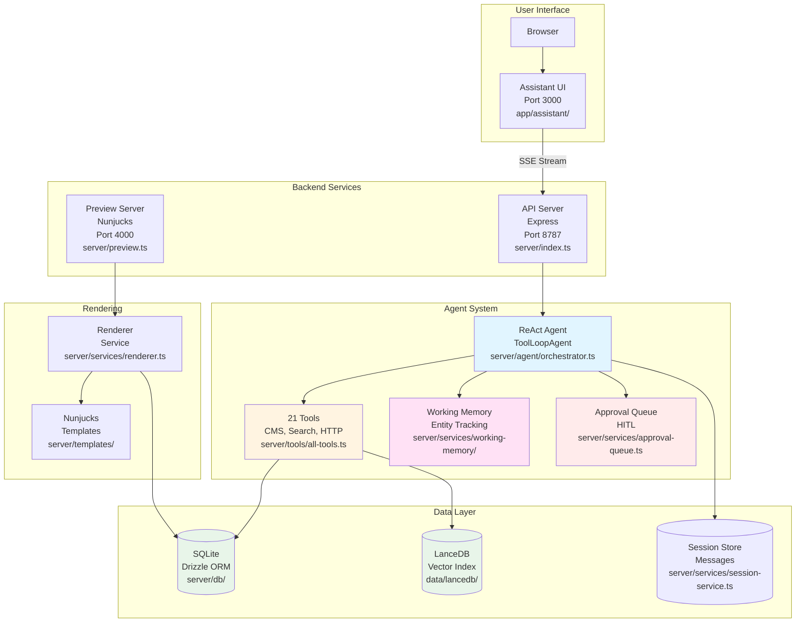
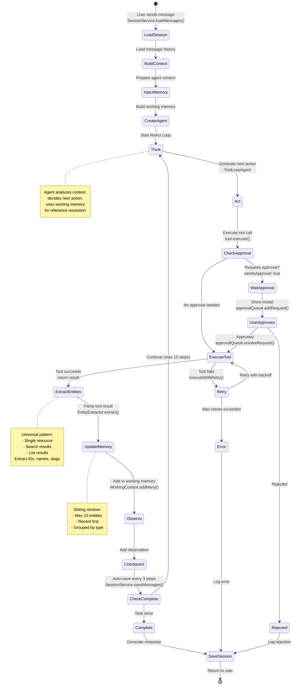
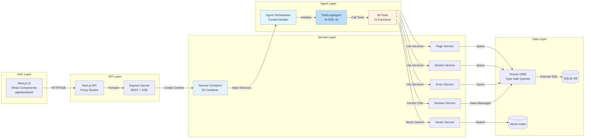
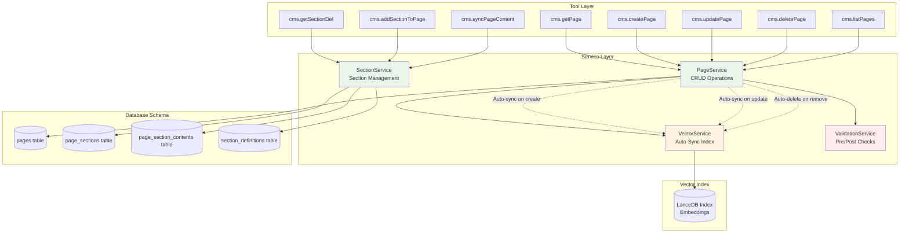
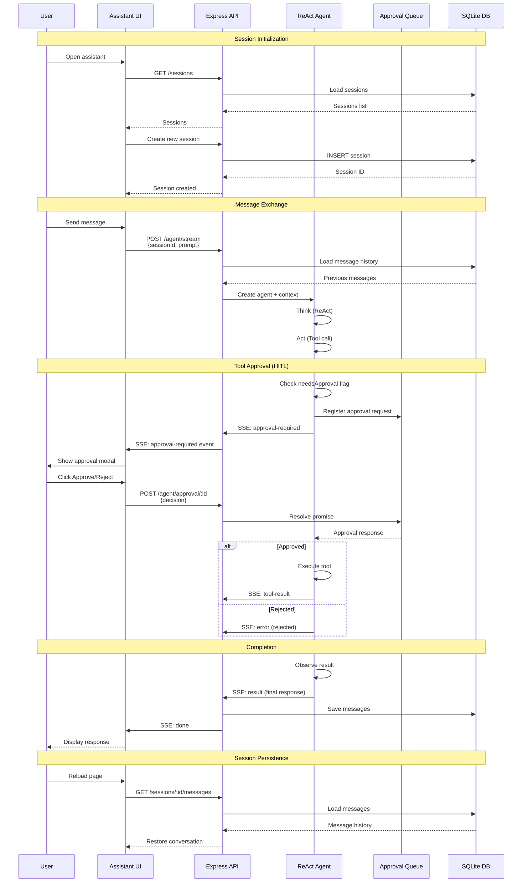
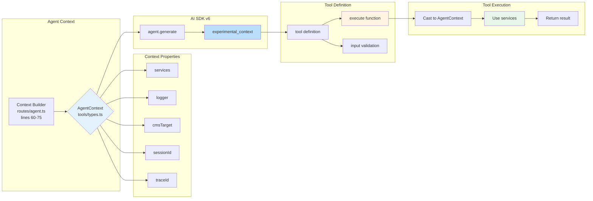
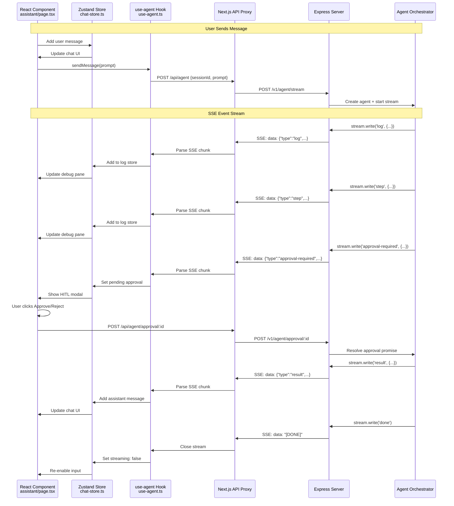

# Architecture Visualizations - ReAct AI Agent

This document provides comprehensive flowcharts and architectural diagrams showing how the ReAct AI Agent system works, how components integrate, and how core patterns like memory, human-in-the-loop, sessions, and tools connect together.

## Table of Contents

1. [System Architecture Overview](#1-system-architecture-overview)
2. [Agent Execution Flow (ReAct Pattern)](#2-agent-execution-flow-react-pattern)
3. [Data Flow & Integration Layers](#3-data-flow--integration-layers)
4. [CMS Operations & Services](#4-cms-operations--services)
5. [Memory & Context Management](#5-memory--context-management)
6. [Session & Human-in-the-Loop Flow](#6-session--human-in-the-loop-flow)
7. [Tool Execution & Dependency Injection](#7-tool-execution--dependency-injection)
8. [Frontend-Backend Integration](#8-frontend-backend-integration)

---

## 1. System Architecture Overview

**High-level view of the entire system showing the 3-server architecture and major components.**

**📁 Key Files:**
- `server/index.ts` - Express API server entry point
- `server/preview.ts` - Preview server entry point  
- `app/assistant/page.tsx` - Main assistant UI
- `package.json` - Dev scripts (`pnpm dev`, `pnpm dev:server`, etc.)



**Key Components:**
- **3-Server Architecture**: Next.js (UI), Express (API), Preview (Rendering)
- **Agent System**: Single ReAct agent with all tools, memory, and approval
- **Data Layer**: SQLite for persistence, LanceDB for semantic search
- **Rendering**: Nunjucks templates for page preview

---

## 2. Agent Execution Flow (ReAct Pattern)

**Detailed flow showing Think → Act → Observe → Repeat loop with retry logic.**

**📁 Key Files:**
- `server/agent/orchestrator.ts` - `streamAgentWithApproval()` function
- `server/tools/all-tools.ts` - All 21 tool definitions with `execute` functions
- `server/services/working-memory/entity-extractor.ts` - `EntityExtractor.extract()` method
- `server/services/session-service.ts` - `SessionService.loadMessages()` and `saveMessages()`

**🔧 Key Functions:**
- `createAgent(context, workingMemory)` - Creates ToolLoopAgent with prompt
- `streamAgentWithApproval()` - Main orchestration with retry logic
- `getSystemPrompt()` - Loads and compiles react.xml with Handlebars
- `executeWithRetry()` - 3 attempts with exponential backoff



**Core Loop Stages:**
1. **Think**: Agent reasons about next action using prompt + working memory
2. **Act**: Agent decides to call a tool with specific parameters
3. **Observe**: Tool executes, result added to context and memory
4. **Repeat**: Loop continues until task complete or max steps

---

## 3. Data Flow & Integration Layers

**How data flows through the system from user input to response.**

**📁 Key Files:**
- `app/assistant/_hooks/use-agent.ts` - SSE streaming hook
- `app/api/agent/route.ts` - Next.js API proxy
- `server/routes/agent.ts` - Express SSE endpoint
- `server/services/service-container.ts` - DI container
- `server/db/client.ts` - Drizzle database connection

**🔧 Key Classes:**
- `ServiceContainer` - Singleton holding all services
- `PageService`, `SectionService`, `EntryService` - Business logic
- `VectorIndexService` - LanceDB operations
- `SessionService` - Message persistence



**Integration Pattern:**
1. **User Layer**: React components + Zustand stores
2. **API Layer**: Next.js proxies → Express REST/SSE endpoints
3. **Service Layer**: Business logic services (DI via ServiceContainer)
4. **Agent Layer**: Orchestrator builds context → Agent executes tools
5. **Data Layer**: Drizzle ORM for SQLite, LanceDB for vectors

---

## 4. CMS Operations & Services

**How CMS operations are handled through the service layer.**



**CMS Operation Flow:**
1. **Tool Calls Service**: Agent calls cms.* tool
2. **Service Validates**: Pre-mutation validation checks
3. **Service Executes**: Database operations via Drizzle
4. **Auto-Sync Vector**: Index updated automatically
5. **Post-Validation**: Verify expected state

---

## 5. Memory & Context Management

**Working memory system for entity reference resolution.**

**📁 Key Files:**
- `server/services/working-memory/entity-extractor.ts` - Entity extraction logic
- `server/services/working-memory/working-context.ts` - Sliding window storage
- `server/services/working-memory/types.ts` - Type definitions
- `server/agent/orchestrator.ts` - Integration (lines 30-40, 70-85, 250-270)

**🔧 Key Methods:**
- `EntityExtractor.extract(toolName, result)` - Extracts entities from any tool result
- `WorkingContext.add(entity)` - Adds entity to sliding window
- `WorkingContext.toContextString()` - Formats for prompt injection
- `getWorkingContext(sessionId)` - Retrieves context for session

```mermaid
graph TB
    subgraph "Agent Execution"
        Step[Agent Step<br/>Tool Execution<br/>streamAgentWithApproval()]
    end
    
    subgraph "Entity Extraction"
        Extractor[EntityExtractor<br/>Universal Patterns<br/>extract() method]
        Patterns{Pattern Match}
        Single[Single Resource<br/>cms.getPage result]
        Search[Search Results<br/>cms.findResource]
        List[List Results<br/>cms.listPages]
    end
    
    subgraph "Working Memory"
        Context[WorkingContext<br/>Sliding Window]
        Entities[(Recent Entities<br/>Max 10)]
        Groups[Grouped by Type<br/>pages, sections, etc]
    end
    
    subgraph "Prompt Injection"
        System[System Prompt]
        MemoryBlock[WORKING MEMORY Block]
        Formatted[Formatted Context]
    end
    
    Step --> Extractor
    Extractor --> Patterns
    Patterns --> Single
    Patterns --> Search
    Patterns --> List
    Single --> Context
    Search --> Context
    List --> Context
    Context --> Entities
    Entities --> Groups
    Groups --> MemoryBlock
    System --> MemoryBlock
    MemoryBlock --> Formatted
    Formatted -.->|Next Step| Step
    
    note right of Context
        Sliding Window:
        - Add to front
        - Keep 10 most recent
        - Prune old entries
    end note
    
    note right of MemoryBlock
        [WORKING MEMORY]
        pages:
          - "About" (abc-123)
        sections:
          - "Hero" (def-456)
    end note
    
    style Extractor fill:#ffe1f5
    style Context fill:#e1f5ff
    style MemoryBlock fill:#fff4e1
```

**Memory System Features:**
- **Entity Extraction**: Universal patterns for any resource type
- **Sliding Window**: Max 10 entities, recent first
- **Grouped Display**: By type (pages, sections, collections, etc.)
- **Prompt Injection**: Always injected, LLM ignores if not needed
- **Reference Resolution**: Resolves "this page", "that section", "it"

---

## 6. Session & Human-in-the-Loop Flow

**Session management and approval workflow.**



**Key Flows:**
1. **Session Management**: Create, list, load, delete sessions
2. **Message Persistence**: All messages saved to DB after each turn
3. **HITL Approval**: Promise-based approval queue with 5-min timeout
4. **Context Restoration**: Load message history on session switch

---

## 7. Tool Execution & Dependency Injection

**How tools receive context and execute operations.**

**📁 Key Files:**
- `server/tools/all-tools.ts` - All 21 tool definitions (export const ALL_TOOLS)
- `server/tools/types.ts` - AgentContext interface definition
- `server/routes/agent.ts` - Context building (lines 60-75)
- `server/agent/orchestrator.ts` - Agent creation with context

**🔧 Key Code:**
```typescript
// Tool definition (all-tools.ts)
export const cmsGetPage = tool({
  execute: async (input, { experimental_context }) => {
    const ctx = experimental_context as AgentContext
    return await ctx.services.pageService.getPageBySlug(input.slug)
  }
})

// Context building (routes/agent.ts)
const context: AgentContext = {
  services: ServiceContainer.get(),
  logger: logger.child({ traceId }),
  cmsTarget: { teamId, siteId, environmentId },
  sessionId,
  traceId
}
```



**Native AI SDK v6 Pattern:**
```typescript
// Tool definition (created ONCE)
export const myTool = tool({
  description: 'Tool description',
  inputSchema: z.object({
    param: z.string()
  }),
  execute: async (input, { experimental_context }) => {
    // Context automatically injected by AI SDK!
    const ctx = experimental_context as AgentContext
    
    // Access all services
    return await ctx.services.pageService.doSomething(
      input.param
    )
  }
})

// Agent execution
const result = await agent.generate({
  messages,
  experimental_context: context  // Injected into ALL tools
})
```

**Benefits:**
- ✅ No closures (framework handles injection)
- ✅ Tools created once (not per request)
- ✅ Type-safe context casting
- ✅ All services available to all tools

---

## 8. Frontend-Backend Integration

**SSE streaming and real-time UI updates.**

**📁 Key Files:**
- `app/assistant/_hooks/use-agent.ts` - SSE streaming logic (sendMessage function)
- `app/assistant/_stores/chat-store.ts` - Message state management
- `app/assistant/_stores/log-store.ts` - Debug log entries
- `app/assistant/_stores/approval-store.ts` - HITL state
- `app/api/agent/route.ts` - Next.js API proxy
- `server/routes/agent.ts` - Express SSE endpoint (POST /stream)

**🔧 Key Functions:**
- `useChatStore.sendMessage()` - Initiates agent request
- `useAgent.sendMessage()` - Handles SSE stream parsing
- `stream.write()` - Server emits SSE events
- `useApprovalStore.setPendingApproval()` - Shows HITL modal



**SSE Event Types:**
- `log` - Debug log messages (info/warn/error)
- `step` - Agent step completion
- `tool-call` - Tool execution start
- `tool-result` - Tool execution result
- `approval-required` - HITL approval request
- `result` - Final agent response
- `error` - Error occurred
- `done` - Stream complete

---

## Key Design Patterns

### 1. **Native AI SDK v6 Pattern**
- Tools created ONCE with `execute` function
- Context injected via `experimental_context` (no closures!)
- `prepareStep` for memory management (replaces complex managers)
- Native message array handling (no transformations)

### 2. **ReAct Loop (Think-Act-Observe-Repeat)**
- Agent reasons about next action (Think)
- Agent executes tool call (Act)
- Agent observes result (Observe)
- Agent continues or completes (Repeat)
- Max 15 steps per turn

### 3. **Working Memory (Universal Entity Tracking)**
- Extract entities from ANY tool result
- Sliding window (max 10 entities)
- Always inject in prompt (LLM ignores if not needed)
- Resolves references: "this page", "that section", "it"

### 4. **Human-in-the-Loop (HITL)**
- Tools marked with `needsApproval: true`
- Promise-based approval queue
- 5-minute timeout (auto-reject)
- Frontend modal with approve/reject
- Agent resumes after approval

### 5. **Session Management**
- Unlimited sessions
- All messages persisted to SQLite
- Load/save via SessionService
- Switch sessions instantly
- Clear history or delete session

### 6. **Service Layer Architecture**
- ServiceContainer for DI
- Business logic in services
- Services use Drizzle ORM
- Tools call services (not DB directly)
- Auto-sync vector index

---

## Technology Stack

### Frontend
- **Framework**: Next.js 15, React 19
- **Styling**: Tailwind CSS, shadcn/ui
- **State**: Zustand with localStorage persistence
- **UI Components**: AI Elements (shadcn-based)

### Backend
- **API**: Express with CORS
- **Database**: SQLite via Drizzle ORM
- **Vector**: LanceDB with OpenRouter embeddings
- **Templates**: Nunjucks with custom filters

### Agent
- **AI SDK**: Vercel AI SDK v6 (native patterns)
- **LLM**: OpenRouter (GPT-4o-mini)
- **Tools**: 21 native tools (no factories)
- **Memory**: Working context (sliding window)

---

## Summary

This architecture provides:

1. **Simplicity**: Native AI SDK v6 patterns, no custom abstractions
2. **Reliability**: Zero "_zod" errors, proper context injection
3. **Observability**: SSE streaming with real-time debug logs
4. **Safety**: Human-in-the-loop approval for high-risk operations
5. **Persistence**: All sessions and messages saved to SQLite
6. **Scalability**: Service layer with proper separation of concerns
7. **Memory**: Universal working memory for reference resolution

The system follows production-ready patterns from major AI companies (Anthropic, OpenAI, Vercel) while maintaining simplicity and maintainability.
