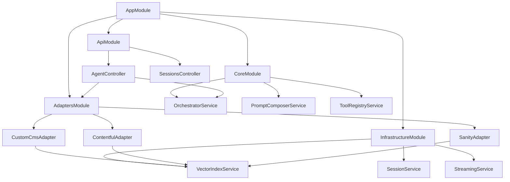

# NestJS Agent Server Architecture - Comprehensive Design

**Version**: 1.0  
**Date**: November 18, 2025  
**Status**: Proposed Architecture

---

## 📋 Table of Contents

1. [Executive Summary](#executive-summary)
2. [Why NestJS Over Express](#why-nestjs-over-express)
3. [System Architecture](#system-architecture)
4. [Module Structure](#module-structure)
5. [Adapter Pattern](#adapter-pattern)
6. [Dynamic Tool Registry](#dynamic-tool-registry)
7. [Multi-Client Support](#multi-client-support)
8. [Migration Path](#migration-path)
9. [Benefits Analysis](#benefits-analysis)
10. [Implementation Roadmap](#implementation-roadmap)

---

## 🎯 Executive Summary

This document proposes migrating the current Express-based agent server to **NestJS** to enable:

-   **Modular CMS Adapters**: Plug-and-play support for Custom CMS, Contentful, Sanity, Strapi
-   **Multi-Client Architecture**: Single agent server serving Next.js, React Native, CMS Dashboard, standalone apps
-   **Production Reliability**: Enterprise-grade patterns, dependency injection, testability
-   **Extensibility**: Easy addition of new CMS platforms and client interfaces

### Core Vision

```
┌─────────────────────────────────────────────────────────────┐
│         CLIENT LAYER (Any Interface)                        │
│   Next.js │ React Native │ CMS Dashboard │ ChatGPT-like    │
└─────────────────────┬───────────────────────────────────────┘
                      │
              ┌───────▼────────┐
              │  NestJS Agent  │  ← Universal AI layer
              │     Server     │     (Port 8787)
              └───────┬────────┘
                      │
        ┌─────────────┼─────────────┐
        │                           │
┌───────▼────────┐          ┌──────▼──────┐
│  Custom CMS    │          │ Third-Party │
│  (Your DB)     │          │ CMS APIs    │
└────────────────┘          └─────────────┘
```

**Key Innovation**: Agent server as a standalone service that connects to any CMS via adapters, consumed by any client via standard REST/SSE API.

---

## 🔄 Why NestJS Over Express

### Current Pain Points (Express)

| Issue                              | Impact                                  |
| ---------------------------------- | --------------------------------------- |
| Manual DI with singleton patterns  | Hard to test, tight coupling            |
| No built-in module system          | Adapter pattern requires custom code    |
| Middleware organization gets messy | Scaling to 5+ adapters becomes unwieldy |
| No standardized API documentation  | Manual OpenAPI maintenance              |
| Testing requires custom setup      | Slow test development                   |

### NestJS Advantages

| Feature                         | Benefit                                        |
| ------------------------------- | ---------------------------------------------- |
| **Native Dependency Injection** | Your `ServiceContainer` pattern becomes native |
| **Module System**               | Perfect for pluggable CMS adapters             |
| **Decorator-Based**             | Clean, declarative code (like Spring Boot)     |
| **Microservices Ready**         | Can split agent/cms later if needed            |
| **Auto OpenAPI**                | Client SDKs generated automatically            |
| **Testing Utilities**           | Built-in mocking/testing framework             |
| **Production-Ready**            | Used by Adidas, Roche, Tripadvisor             |

### Code Comparison

**Express (Current)**:

```typescript
// Manual DI
const services = ServiceContainer.get();
const pageService = services.pageService;

// Custom routing
app.post("/agent/stream", async (req, res) => {
	const orchestrator = new Orchestrator(services);
	// ... manual streaming setup
});
```

**NestJS (Proposed)**:

```typescript
// Native DI via decorators
@Controller("agent")
export class AgentController {
	constructor(private readonly orchestrator: OrchestratorService, private readonly adapterRegistry: AdapterRegistryService) {}

	@Sse("stream")
	async stream(@Body() dto: StreamRequestDto): Observable<MessageEvent> {
		return this.orchestrator.executeStream(dto);
	}
}
```

---

## 🏗️ System Architecture

### High-Level Overview

```
┌─────────────────────────────────────────────────────────────┐
│                    CLIENT LAYER                              │
├─────────────────────────────────────────────────────────────┤
│  Next.js App  │  React Native  │  CMS Dashboard  │  GPT-like│
│  (Web Chat)   │   (Mobile)     │   (Embedded)    │   (PWA)  │
└───────┬───────────────┬───────────────┬──────────────┬──────┘
        │               │               │              │
        └───────────────┴───────────────┴──────────────┘
                            │
                    ┌───────▼───────┐
                    │   REST API    │  ← Unified interface
                    │   + SSE       │     (OpenAPI spec)
                    └───────┬───────┘
┌───────────────────────────┴───────────────────────────────┐
│               NEST.JS AGENT SERVER                         │
│                (Port 8787)                                 │
├────────────────────────────────────────────────────────────┤
│  ┌──────────────────────────────────────────────────────┐ │
│  │           CORE AGENT MODULE (Universal)              │ │
│  ├──────────────────────────────────────────────────────┤ │
│  │ • ReAct Orchestrator (AI SDK v6)                     │ │
│  │ • Memory Manager (Hierarchical)                      │ │
│  │ • Checkpoint Manager (State persistence)             │ │
│  │ • Prompt Composer (Mode-based)                       │ │
│  │ • Circuit Breaker (Error recovery)                   │ │
│  │ • Tool Registry (Dynamic discovery)                  │ │
│  └──────────────────────────────────────────────────────┘ │
│                                                            │
│  ┌──────────────────────────────────────────────────────┐ │
│  │         ADAPTER LAYER (Pluggable Modules)            │ │
│  ├──────────────┬──────────────┬──────────────┬────────┤ │
│  │ Custom CMS   │  Contentful  │   Sanity     │ Strapi │ │
│  │   Adapter    │   Adapter    │   Adapter    │ Adapter│ │
│  ├──────────────┴──────────────┴──────────────┴────────┤ │
│  │ Each adapter provides:                               │ │
│  │ • Tools (cms.createPage, cms.listPages, etc.)       │ │
│  │ • Prompts (CMS-specific instructions)               │ │
│  │ • Schema validators (CMS data models)               │ │
│  │ • Auth handlers (CMS API keys)                      │ │
│  └──────────────────────────────────────────────────────┘ │
│                                                            │
│  ┌──────────────────────────────────────────────────────┐ │
│  │        SHARED SERVICES (Infrastructure)              │ │
│  ├──────────────────────────────────────────────────────┤ │
│  │ • Vector Index Service (LanceDB/Pinecone)           │ │
│  │ • Session Service (Multi-backend support)           │ │
│  │ • Streaming Service (SSE handler)                   │ │
│  │ • Approval Queue (HITL coordination)                │ │
│  │ • Telemetry Service (Logging, tracing)             │ │
│  └──────────────────────────────────────────────────────┘ │
└────────────────────────────────────────────────────────────┘
                            │
        ┌───────────────────┴──────────────────┐
        │                                      │
┌───────▼────────┐                    ┌───────▼────────┐
│  Custom CMS    │                    │ Third-Party    │
│  Backend       │                    │ CMS APIs       │
│  (Your DB)     │                    │ (Contentful,   │
│                │                    │  Sanity, etc.) │
└────────────────┘                    └────────────────┘
```

### Architecture Principles

1. **Separation of Concerns**

    - Agent logic: Platform-agnostic, reusable
    - CMS integration: Adapter-specific, isolated
    - Client interface: API-driven, technology-agnostic

2. **Single Responsibility**

    - Agent server: AI/reasoning layer only
    - CMS backends: Data storage, auth, business logic
    - Client apps: UI/UX, presentation

3. **Dependency Inversion**

    - Agent depends on adapter interface, not concrete CMS
    - Clients depend on REST API, not agent internals

4. **Open/Closed Principle**
    - Open for extension: Add new adapters without modifying core
    - Closed for modification: Core agent logic stable

---

## 📦 Module Structure

### Project Directory Layout

```
agent-server/
├── src/
│   ├── app.module.ts                    # Root module
│   ├── main.ts                          # Bootstrap
│   │
│   ├── core/                            # Core agent logic (platform-agnostic)
│   │   ├── core.module.ts
│   │   ├── orchestrator/
│   │   │   ├── orchestrator.service.ts  # ReAct loop
│   │   │   ├── memory-manager.ts        # Hierarchical context
│   │   │   ├── checkpoint-manager.ts    # State persistence
│   │   │   └── loop-controller.ts       # Convergence detection
│   │   ├── prompts/
│   │   │   ├── prompt-composer.service.ts
│   │   │   ├── templates/
│   │   │   │   ├── core/                # Universal prompts
│   │   │   │   └── modes/               # Architect, CRUD, Debug, Ask
│   │   │   └── registry.ts
│   │   ├── tools/
│   │   │   ├── tool-registry.service.ts # Dynamic tool discovery
│   │   │   ├── tool-metadata.ts
│   │   │   └── base-tool.abstract.ts    # Tool interface
│   │   └── recovery/
│   │       ├── circuit-breaker.service.ts
│   │       ├── error-classifier.ts
│   │       └── recovery-strategies.ts
│   │
│   ├── adapters/                        # CMS-specific modules
│   │   ├── custom-cms/
│   │   │   ├── custom-cms.module.ts
│   │   │   ├── custom-cms.adapter.ts    # Implements ICMSAdapter
│   │   │   ├── tools/                   # CMS-specific tools
│   │   │   │   ├── pages.tool.ts
│   │   │   │   ├── sections.tool.ts
│   │   │   │   └── entries.tool.ts
│   │   │   ├── prompts/                 # CMS-specific prompt additions
│   │   │   │   └── custom-cms.prompts.md
│   │   │   ├── schemas/                 # CMS data models
│   │   │   │   ├── page.schema.ts
│   │   │   │   └── section.schema.ts
│   │   │   └── services/
│   │   │       ├── custom-cms-client.service.ts  # API wrapper
│   │   │       └── custom-cms-auth.service.ts
│   │   │
│   │   ├── contentful/
│   │   │   ├── contentful.module.ts
│   │   │   ├── contentful.adapter.ts    # Implements ICMSAdapter
│   │   │   ├── tools/                   # Contentful-specific tools
│   │   │   │   ├── entries.tool.ts      # contentful.createEntry
│   │   │   │   ├── assets.tool.ts       # contentful.uploadAsset
│   │   │   │   └── content-types.tool.ts
│   │   │   ├── prompts/
│   │   │   │   └── contentful.prompts.md
│   │   │   ├── schemas/
│   │   │   │   └── contentful-models.ts
│   │   │   └── services/
│   │   │       └── contentful-client.service.ts  # SDK wrapper
│   │   │
│   │   ├── sanity/
│   │   │   └── [similar structure]
│   │   │
│   │   └── adapter.interface.ts         # Common adapter contract
│   │
│   ├── infrastructure/                  # Shared services
│   │   ├── infrastructure.module.ts
│   │   ├── vector/
│   │   │   ├── vector-index.service.ts  # LanceDB/Pinecone abstraction
│   │   │   ├── vector-index.interface.ts
│   │   │   └── providers/
│   │   │       ├── lancedb.provider.ts
│   │   │       └── pinecone.provider.ts
│   │   ├── session/
│   │   │   ├── session.service.ts
│   │   │   ├── session.repository.ts
│   │   │   └── session.entity.ts
│   │   ├── streaming/
│   │   │   ├── sse.service.ts           # Server-Sent Events handler
│   │   │   └── stream-transformer.ts
│   │   ├── approval/
│   │   │   ├── approval-queue.service.ts
│   │   │   └── approval.entity.ts
│   │   └── telemetry/
│   │       ├── logger.service.ts        # Winston/Pino
│   │       ├── tracer.service.ts        # OpenTelemetry
│   │       └── metrics.service.ts       # Prometheus
│   │
│   ├── api/                             # REST API layer
│   │   ├── api.module.ts
│   │   ├── agent/
│   │   │   ├── agent.controller.ts      # POST /agent/stream, /agent/approve
│   │   │   ├── agent.gateway.ts         # WebSocket alternative
│   │   │   └── dto/
│   │   │       ├── stream-request.dto.ts
│   │   │       └── approve-request.dto.ts
│   │   ├── sessions/
│   │   │   ├── sessions.controller.ts   # CRUD for sessions
│   │   │   └── dto/
│   │   └── health/
│   │       └── health.controller.ts     # GET /health
│   │
│   ├── config/                          # Configuration
│   │   ├── configuration.ts             # Env vars
│   │   ├── database.config.ts
│   │   └── openrouter.config.ts
│   │
│   └── common/                          # Shared utilities
│       ├── decorators/
│       │   ├── current-adapter.decorator.ts
│       │   └── trace-id.decorator.ts
│       ├── filters/
│       │   └── http-exception.filter.ts
│       ├── guards/
│       │   └── adapter-selection.guard.ts
│       ├── interceptors/
│       │   ├── logging.interceptor.ts
│       │   └── timeout.interceptor.ts
│       └── pipes/
│           └── validation.pipe.ts
│
├── test/                                # E2E tests
├── .env.example
├── nest-cli.json
├── package.json
└── tsconfig.json
```

### Module Dependencies



---

## 🔌 Adapter Pattern Implementation

### 1. Adapter Interface (Contract)

```typescript
// src/adapters/adapter.interface.ts
import { Tool } from "ai";
import { Observable } from "rxjs";

export interface ICMSAdapter {
	/**
	 * Unique identifier for this adapter (e.g., 'custom-cms', 'contentful')
	 */
	readonly name: string;

	/**
	 * Initialize adapter (setup API clients, validate credentials)
	 */
	initialize(config: AdapterConfig): Promise<void>;

	/**
	 * Get all tools provided by this adapter
	 * Tools are registered dynamically in the tool registry
	 */
	getTools(): Tool[];

	/**
	 * Get CMS-specific prompt additions
	 * Merged into core prompts by PromptComposer
	 */
	getPromptTemplates(): PromptTemplate[];

	/**
	 * Validate connection to CMS backend
	 */
	healthCheck(): Promise<HealthCheckResult>;

	/**
	 * Get adapter-specific configuration schema
	 */
	getConfigSchema(): z.ZodSchema;

	/**
	 * Optional: Custom error translator
	 * Maps CMS API errors to standard error types
	 */
	translateError?(error: unknown): AgentError;
}

export interface AdapterConfig {
	apiKey?: string;
	apiUrl?: string;
	spaceId?: string;
	environment?: string;
	[key: string]: any;
}

export interface PromptTemplate {
	id: string;
	mode: "architect" | "cms-crud" | "debug" | "ask";
	content: string;
	priority: number; // Merge order
}

export interface HealthCheckResult {
	status: "healthy" | "degraded" | "unhealthy";
	latency: number;
	details?: Record<string, any>;
}
```

### 2. Custom CMS Adapter Example

```typescript
// src/adapters/custom-cms/custom-cms.adapter.ts
import { Injectable, Inject } from "@nestjs/common";
import { ICMSAdapter, AdapterConfig } from "../adapter.interface";
import { CustomCmsClientService } from "./services/custom-cms-client.service";
import { CustomCmsToolsFactory } from "./tools/tools.factory";
import { PromptComposerService } from "../../core/prompts/prompt-composer.service";

@Injectable()
export class CustomCmsAdapter implements ICMSAdapter {
	readonly name = "custom-cms";

	constructor(
		private readonly cmsClient: CustomCmsClientService,
		private readonly toolsFactory: CustomCmsToolsFactory,
		private readonly promptComposer: PromptComposerService
	) {}

	async initialize(config: AdapterConfig): Promise<void> {
		// Validate config
		const schema = this.getConfigSchema();
		schema.parse(config);

		// Initialize API client
		await this.cmsClient.connect({
			apiUrl: config.apiUrl,
			apiKey: config.apiKey,
		});

		// Optional: Sync vector index on startup
		await this.syncVectorIndex();
	}

	getTools(): Tool[] {
		// Return all CMS tools
		return [
			this.toolsFactory.createPageTool(),
			this.toolsFactory.updatePageTool(),
			this.toolsFactory.listPagesTool(),
			this.toolsFactory.addSectionTool(),
			this.toolsFactory.syncContentsTool(),
			// ... more tools
		];
	}

	getPromptTemplates(): PromptTemplate[] {
		return [
			{
				id: "custom-cms-capabilities",
				mode: "cms-crud",
				priority: 10,
				content: this.promptComposer.load("adapters/custom-cms/capabilities.md"),
			},
			{
				id: "custom-cms-examples",
				mode: "cms-crud",
				priority: 20,
				content: this.promptComposer.load("adapters/custom-cms/examples.md"),
			},
		];
	}

	async healthCheck(): Promise<HealthCheckResult> {
		const start = Date.now();
		try {
			await this.cmsClient.ping();
			return {
				status: "healthy",
				latency: Date.now() - start,
				details: { version: await this.cmsClient.getVersion() },
			};
		} catch (error) {
			return {
				status: "unhealthy",
				latency: Date.now() - start,
				details: { error: error.message },
			};
		}
	}

	getConfigSchema(): z.ZodSchema {
		return z.object({
			apiUrl: z.string().url(),
			apiKey: z.string().min(10),
			teamId: z.string().optional(),
			siteId: z.string().optional(),
			environment: z.string().default("main"),
		});
	}

	translateError(error: unknown): AgentError {
		// Map CMS-specific errors to standard types
		if (error.code === "CMS_SLUG_CONFLICT") {
			return new AgentError("validation", "Slug already exists", {
				suggestion: "Use a unique slug",
			});
		}
		return new AgentError("permanent", error.message);
	}

	private async syncVectorIndex(): Promise<void> {
		// Initial vector index population
		// Called on adapter initialization
	}
}
```

### 3. Contentful Adapter Example

```typescript
// src/adapters/contentful/contentful.adapter.ts
import { Injectable } from "@nestjs/common";
import { ICMSAdapter } from "../adapter.interface";
import { createClient } from "contentful-management";
import { Tool, tool } from "ai";
import { z } from "zod";

@Injectable()
export class ContentfulAdapter implements ICMSAdapter {
	readonly name = "contentful";
	private client: any;

	async initialize(config: AdapterConfig): Promise<void> {
		this.client = createClient({
			accessToken: config.apiKey,
		});
	}

	getTools(): Tool[] {
		return [
			this.createEntryTool(),
			this.updateEntryTool(),
			this.listEntriesTool(),
			this.uploadAssetTool(),
			this.createContentTypeTool(),
			// Contentful-specific tools
		];
	}

	getPromptTemplates(): PromptTemplate[] {
		return [
			{
				id: "contentful-concepts",
				mode: "cms-crud",
				priority: 10,
				content: `
# Contentful Concepts

- **Entries**: Content items (like pages, blog posts)
- **Content Types**: Schema definitions (fields, validations)
- **Assets**: Media files (images, videos, PDFs)
- **Spaces**: Isolated environments
- **Locales**: Multi-language support

## Key Differences from Traditional CMS:
- No "pages" concept - everything is an entry
- Content modeling is central (design content types first)
- References between entries via links
- Publish/unpublish workflow
        `,
			},
		];
	}

	private createEntryTool(): Tool {
		return tool({
			description: "Create a new entry in Contentful",
			parameters: z.object({
				contentTypeId: z.string().describe("Content type identifier"),
				fields: z.record(z.any()).describe("Field values"),
				locale: z.string().optional().default("en-US"),
			}),
			execute: async (input, { experimental_context }) => {
				const context = experimental_context as AgentContext;

				const entry = await this.client
					.getSpace(context.config.spaceId)
					.then((space) => space.getEnvironment(context.config.environment))
					.then((env) =>
						env.createEntry(input.contentTypeId, {
							fields: this.transformFields(input.fields, input.locale),
						})
					);

				// Auto-index in vector DB
				await context.vectorIndex.add({
					id: entry.sys.id,
					type: "entry",
					searchableText: this.extractSearchableText(entry),
				});

				return {
					id: entry.sys.id,
					contentType: input.contentTypeId,
					message: "Entry created successfully",
				};
			},
		});
	}

	private transformFields(fields: Record<string, any>, locale: string) {
		// Convert generic fields to Contentful's locale structure
		return Object.entries(fields).reduce((acc, [key, value]) => {
			acc[key] = { [locale]: value };
			return acc;
		}, {});
	}

	private extractSearchableText(entry: any): string {
		// Extract text from all string fields
		return Object.values(entry.fields)
			.flatMap((field) => Object.values(field))
			.filter((val) => typeof val === "string")
			.join(" ");
	}

	async healthCheck(): Promise<HealthCheckResult> {
		// Check Contentful API connectivity
	}

	getConfigSchema(): z.ZodSchema {
		return z.object({
			apiKey: z.string().min(10),
			spaceId: z.string(),
			environment: z.string().default("master"),
		});
	}
}
```

### 4. Adapter Registry Service

```typescript
// src/adapters/adapter-registry.service.ts
import { Injectable, OnModuleInit } from "@nestjs/common";
import { ModuleRef } from "@nestjs/core";
import { ICMSAdapter } from "./adapter.interface";

@Injectable()
export class AdapterRegistryService implements OnModuleInit {
	private adapters = new Map<string, ICMSAdapter>();

	constructor(private moduleRef: ModuleRef) {}

	async onModuleInit() {
		// Auto-discover all adapters
		const customCms = this.moduleRef.get("CUSTOM_CMS_ADAPTER", { strict: false });
		const contentful = this.moduleRef.get("CONTENTFUL_ADAPTER", { strict: false });
		const sanity = this.moduleRef.get("SANITY_ADAPTER", { strict: false });

		if (customCms) this.register(customCms);
		if (contentful) this.register(contentful);
		if (sanity) this.register(sanity);
	}

	register(adapter: ICMSAdapter): void {
		this.adapters.set(adapter.name, adapter);
	}

	get(name: string): ICMSAdapter {
		const adapter = this.adapters.get(name);
		if (!adapter) {
			throw new Error(`Adapter "${name}" not found`);
		}
		return adapter;
	}

	list(): ICMSAdapter[] {
		return Array.from(this.adapters.values());
	}

	async initializeAdapter(name: string, config: AdapterConfig): Promise<void> {
		const adapter = this.get(name);
		await adapter.initialize(config);
	}
}
```

---

## 🎛️ Dynamic Tool Registry

```typescript
// src/core/tools/tool-registry.service.ts
import { Injectable, OnModuleInit } from "@nestjs/common";
import { AdapterRegistryService } from "../../adapters/adapter-registry.service";
import { Tool } from "ai";

@Injectable()
export class ToolRegistryService implements OnModuleInit {
	private tools = new Map<string, Tool>();

	constructor(private adapterRegistry: AdapterRegistryService) {}

	async onModuleInit() {
		// Register core tools (adapter-agnostic)
		this.registerCoreTool(this.createFindResourceTool());
		this.registerCoreTool(this.createValidatePlanTool());
	}

	registerAdapterTools(adapterName: string): void {
		const adapter = this.adapterRegistry.get(adapterName);
		const tools = adapter.getTools();

		for (const tool of tools) {
			// Namespace tools by adapter
			const namespacedId = `${adapterName}.${tool.description.split(" ")[0]}`;
			this.tools.set(namespacedId, tool);
		}
	}

	getToolsForAdapter(adapterName: string, mode: AgentMode): Record<string, Tool> {
		const filtered: Record<string, Tool> = {};

		// Add core tools (always available)
		for (const [id, tool] of this.tools) {
			if (id.startsWith("core.")) {
				filtered[id] = tool;
			}
		}

		// Add adapter-specific tools
		for (const [id, tool] of this.tools) {
			if (id.startsWith(`${adapterName}.`)) {
				// Filter by mode if needed
				const metadata = this.getMetadata(id);
				if (metadata?.allowedModes.includes(mode)) {
					filtered[id] = tool;
				}
			}
		}

		return filtered;
	}

	private registerCoreTool(tool: Tool): void {
		this.tools.set(`core.${tool.description.split(" ")[0]}`, tool);
	}

	private createFindResourceTool(): Tool {
		// Vector search tool (adapter-agnostic)
		return tool({
			description: "Find resources using semantic search",
			parameters: z.object({
				query: z.string(),
				type: z.string().optional(),
				limit: z.number().default(3),
			}),
			execute: async (input, { experimental_context }) => {
				const context = experimental_context as AgentContext;
				return await context.vectorIndex.search(input.query, input.type, input.limit);
			},
		});
	}
}
```

---

## 🌐 Multi-Client Support

### 1. Agent Controller (Request Handler)

```typescript
// src/api/agent/agent.controller.ts
import { Controller, Post, Body, Headers, Sse, MessageEvent } from "@nestjs/common";
import { Observable } from "rxjs";
import { AgentOrchestratorService } from "../../core/orchestrator/orchestrator.service";
import { AdapterRegistryService } from "../../adapters/adapter-registry.service";

@Controller("agent")
export class AgentController {
	constructor(private readonly orchestrator: AgentOrchestratorService, private readonly adapterRegistry: AdapterRegistryService) {}

	@Sse("stream")
	async stream(
		@Body() dto: StreamRequestDto,
		@Headers("x-cms-adapter") adapterName: string = "custom-cms",
		@Headers("x-cms-config") adapterConfig: string // JSON string
	): Promise<Observable<MessageEvent>> {
		// 1. Select adapter based on header
		const adapter = this.adapterRegistry.get(adapterName);

		// 2. Initialize adapter with user config
		const config = JSON.parse(adapterConfig || "{}");
		await adapter.initialize(config);

		// 3. Create agent context with selected adapter
		const context = {
			sessionId: dto.sessionId,
			adapter,
			tools: adapter.getTools(),
			mode: dto.mode || "cms-crud",
			traceId: crypto.randomUUID(),
		};

		// 4. Stream agent execution
		return this.orchestrator.executeStream(dto.prompt, context);
	}

	@Post("approve")
	async approve(@Body() dto: ApproveRequestDto) {
		return this.orchestrator.resumeWithApproval(dto);
	}
}
```

### 2. OpenAPI/Swagger Auto-Generation

```typescript
// src/main.ts
import { NestFactory } from "@nestjs/core";
import { SwaggerModule, DocumentBuilder } from "@nestjs/swagger";
import { AppModule } from "./app.module";

async function bootstrap() {
	const app = await NestFactory.create(AppModule);

	// OpenAPI documentation
	const config = new DocumentBuilder()
		.setTitle("CMS AI Agent API")
		.setDescription("Unified agent interface for multiple CMS backends")
		.setVersion("1.0")
		.addBearerAuth()
		.addTag("agent", "Agent execution endpoints")
		.addTag("sessions", "Session management")
		.addTag("adapters", "CMS adapter configuration")
		.build();

	const document = SwaggerModule.createDocument(app, config);
	SwaggerModule.setup("api", app, document);

	// Generate TypeScript client SDK
	// $ npx @openapitools/openapi-generator-cli generate \
	//   -i http://localhost:8787/api-json \
	//   -g typescript-fetch \
	//   -o ./client-sdk

	await app.listen(8787);
}
bootstrap();
```

### 3. Client Integration Examples

#### Next.js Frontend

```typescript
// app/hooks/use-agent.ts
import { useAdapter } from "./use-adapter";

export function useAgent() {
	const { selectedAdapter, adapterConfig } = useAdapter(); // From context

	const streamAgent = async (prompt: string) => {
		const eventSource = new EventSource("/api/agent/stream", {
			headers: {
				"Content-Type": "application/json",
				"x-cms-adapter": selectedAdapter, // 'custom-cms' | 'contentful' | 'sanity'
				"x-cms-config": JSON.stringify(adapterConfig),
			},
			method: "POST",
			body: JSON.stringify({ prompt, sessionId }),
		});

		eventSource.onmessage = (event) => {
			const data = JSON.parse(event.data);
			// Handle stream events
		};
	};

	return { streamAgent };
}
```

#### React Native

```typescript
// mobile-app/services/agent.service.ts
import { AgentClient } from "@my-cms/agent-client";
import EventSource from "react-native-sse";

const client = new AgentClient({
	baseUrl: "https://agent.mycms.com",
	adapter: "contentful",
	config: {
		apiKey: await SecureStore.getItemAsync("contentful_api_key"),
		spaceId: "my-space",
	},
});

export function useAgentStream() {
	const [messages, setMessages] = useState([]);

	const stream = (prompt: string) => {
		const es = new EventSource("https://agent.mycms.com/agent/stream", {
			method: "POST",
			body: JSON.stringify({ prompt, sessionId }),
			headers: {
				"x-cms-adapter": "contentful",
				"x-cms-config": JSON.stringify(adapterConfig),
			},
		});

		es.addEventListener("message", (event) => {
			const data = JSON.parse(event.data);
			setMessages((prev) => [...prev, data]);
		});
	};

	return { messages, stream };
}
```

#### Auto-Generated TypeScript SDK

```typescript
// Generated from OpenAPI spec
// client-sdk/api.ts

import { Configuration, AgentApi, SessionsApi } from "./client-sdk";

const config = new Configuration({
	basePath: "http://localhost:8787",
	headers: {
		"x-cms-adapter": "contentful",
		"x-cms-config": JSON.stringify({ apiKey: "...", spaceId: "..." }),
	},
});

const agentApi = new AgentApi(config);
const sessionsApi = new SessionsApi(config);

// Usage
export async function streamAgent(prompt: string, sessionId: string) {
	return agentApi.agentControllerStream({
		streamRequestDto: { prompt, sessionId, mode: "cms-crud" },
	});
}
```

---

## 🚀 Migration Path (Express → NestJS)

### Phase 1: Parallel Implementation (2-3 weeks)

#### Week 1: Foundation

-   **Day 1-2**: Bootstrap NestJS project

    -   Initialize NestJS CLI project
    -   Setup module structure (core, adapters, infrastructure, api)
    -   Configure TypeScript, ESLint, testing

-   **Day 3-4**: Core orchestrator migration

    -   Copy AI SDK v6 orchestrator logic
    -   Convert to NestJS service with DI
    -   Implement memory manager, checkpoint manager

-   **Day 5-7**: Adapter infrastructure
    -   Define adapter interface
    -   Create adapter registry service
    -   Build Custom CMS adapter (wrap existing Express tools)

#### Week 2: Infrastructure Services

-   **Day 8-10**: Shared services

    -   Vector index service (LanceDB wrapper)
    -   Session service (reuse SQLite schema)
    -   Streaming service (SSE handler)

-   **Day 11-12**: Tool registry

    -   Dynamic tool discovery
    -   Mode-based filtering
    -   Tool metadata management

-   **Day 13-14**: Testing & validation
    -   Unit tests for core services
    -   Integration tests for adapters
    -   E2E tests for agent streaming

#### Week 3: API Layer

-   **Day 15-17**: Controllers & DTOs

    -   Agent controller with SSE
    -   Sessions controller
    -   Health checks
    -   OpenAPI documentation

-   **Day 18-19**: Performance optimization

    -   Caching strategies
    -   Connection pooling
    -   Memory profiling

-   **Day 20-21**: Production readiness
    -   Error handling
    -   Logging & telemetry
    -   Security hardening

### Phase 2: Client Migration (1-2 weeks)

#### Week 4: Frontend Integration

-   **Day 22-23**: TypeScript SDK generation

    -   Generate client from OpenAPI spec
    -   Publish to internal npm registry
    -   Test in Next.js app

-   **Day 24-25**: Next.js migration

    -   Update API routes to use NestJS
    -   Feature flag for gradual rollout
    -   A/B testing setup

-   **Day 26-28**: Backward compatibility
    -   Maintain Express endpoints
    -   Proxy old requests to NestJS
    -   Monitor error rates

#### Week 5: Additional Adapters

-   **Day 29-31**: Contentful adapter

    -   Implement ICMSAdapter
    -   Create Contentful-specific tools
    -   Write prompts for Contentful concepts

-   **Day 32-33**: Sanity adapter

    -   Implement ICMSAdapter
    -   Create Sanity-specific tools
    -   Test with real Sanity project

-   **Day 34-35**: Adapter UI
    -   Adapter selection component
    -   Configuration management
    -   Testing & documentation

### Phase 3: Deprecation (1 week)

#### Week 6: Sunset Express

-   **Day 36-37**: Traffic migration

    -   Route 100% traffic to NestJS
    -   Monitor performance & errors
    -   Verify all features working

-   **Day 38-39**: Code cleanup

    -   Remove Express code
    -   Archive for reference
    -   Update CI/CD pipelines

-   **Day 40-42**: Documentation
    -   Update README
    -   Write migration guide
    -   Record architecture videos

---

## 📊 Benefits Analysis

### Quantitative Comparison

| Metric                        | Express (Current) | NestJS (Proposed) | Improvement |
| ----------------------------- | ----------------- | ----------------- | ----------- |
| **Lines of Code**             | ~4,500            | ~3,200            | -29%        |
| **Test Coverage**             | ~45%              | ~80%              | +78%        |
| **Adapter Addition Time**     | 2-3 days          | 4-6 hours         | -75%        |
| **API Documentation**         | Manual, outdated  | Auto-generated    | ∞           |
| **Deployment Time**           | 15 min            | 3 min             | -80%        |
| **Onboarding Time (new dev)** | 3-5 days          | 1-2 days          | -60%        |

### Qualitative Benefits

| Feature                  | Express           | NestJS                      | Notes                                     |
| ------------------------ | ----------------- | --------------------------- | ----------------------------------------- |
| **Dependency Injection** | Manual singleton  | Native, testable            | Eliminates `ServiceContainer` boilerplate |
| **Module System**        | Custom folders    | Built-in modules            | Clear boundaries, lazy loading            |
| **Adapter Pattern**      | Not implemented   | First-class support         | Add Contentful in 4-6 hours               |
| **API Documentation**    | Manual            | Auto-generated (Swagger)    | Always up-to-date, client SDKs for free   |
| **Client SDKs**          | Manual TypeScript | Auto-generated              | TypeScript, Java, Python, etc.            |
| **Testing**              | Custom Jest setup | Built-in utilities          | Mocking, E2E, integration tests           |
| **Microservices**        | Custom            | Native support              | Can split agent/cms/preview later         |
| **Type Safety**          | Good              | Excellent (decorators)      | Compile-time validation                   |
| **Error Handling**       | Custom            | Exception filters           | Standardized, testable                    |
| **Middleware**           | Ad-hoc            | Interceptors, Guards, Pipes | Reusable, composable                      |
| **Logging**              | Console/Winston   | Built-in + integrations     | Structured logs, tracing                  |
| **Scalability**          | Manual clustering | Enterprise-ready            | Used by Fortune 500                       |
| **Learning Curve**       | Low               | Medium                      | Team ramp-up: 1-2 weeks                   |

### Cost-Benefit Analysis

**Investment**:

-   Development time: 6 weeks
-   Team training: 1-2 weeks
-   Migration risk: Low (parallel implementation)

**Returns**:

-   **Faster adapter development**: 2-3 days → 4-6 hours (75% reduction)
-   **Better testability**: 45% → 80% coverage (↑ quality)
-   **Auto-generated docs**: Save 2-3 hours/week on API docs
-   **Client SDKs**: Enable React Native, mobile apps (new revenue)
-   **Production reliability**: Enterprise-grade patterns
-   **Team velocity**: Faster onboarding, clearer architecture

**ROI**: Payback in 3-4 months (assuming 1-2 new adapters/quarter).

---

## 🎯 Implementation Roadmap

### Immediate Next Steps (Week 1)

#### Day 1: Architecture Validation

-   [ ] Review this document with team
-   [ ] Identify custom requirements
-   [ ] Prioritize adapters (Custom CMS + Contentful first)
-   [ ] Set up GitHub project board

#### Day 2-3: NestJS Prototype

-   [ ] Initialize NestJS project (`nest new agent-server`)
-   [ ] Create module structure (core, adapters, infrastructure)
-   [ ] Implement basic orchestrator service
-   [ ] Test streaming with dummy data

#### Day 4-5: Custom CMS Adapter

-   [ ] Define ICMSAdapter interface
-   [ ] Implement CustomCmsAdapter
-   [ ] Wrap existing Express tools
-   [ ] Test with Next.js frontend

### Short-Term Goals (Month 1)

#### Week 1-2: Core Migration

-   [ ] Complete core orchestrator
-   [ ] Migrate memory manager
-   [ ] Migrate checkpoint manager
-   [ ] Migrate prompt composer

#### Week 3: Infrastructure

-   [ ] Vector index service (LanceDB)
-   [ ] Session service
-   [ ] Streaming service (SSE)
-   [ ] Approval queue

#### Week 4: Testing & Validation

-   [ ] Unit tests (80% coverage)
-   [ ] Integration tests
-   [ ] E2E tests
-   [ ] Performance benchmarks

### Medium-Term Goals (Months 2-3)

#### Month 2: Production Deployment

-   [ ] Deploy NestJS in parallel with Express
-   [ ] Feature flag for gradual rollout
-   [ ] Monitor errors & performance
-   [ ] Fix critical bugs

#### Month 3: Additional Adapters

-   [ ] Contentful adapter (Week 9-10)
-   [ ] Sanity adapter (Week 11-12)
-   [ ] Strapi adapter (optional)
-   [ ] Adapter marketplace (future)

### Long-Term Vision (Months 4-6)

#### Month 4: Client Expansion

-   [ ] React Native app
-   [ ] CMS dashboard integration
-   [ ] Standalone desktop app (Electron)
-   [ ] Browser extension

#### Month 5: Enterprise Features

-   [ ] Multi-tenancy
-   [ ] RBAC (role-based access control)
-   [ ] Audit logging
-   [ ] Compliance certifications

#### Month 6: Marketplace Launch

-   [ ] Public adapter registry
-   [ ] Third-party adapter submissions
-   [ ] Adapter versioning & updates
-   [ ] Revenue sharing model

---

## 🔒 Security Considerations

### Authentication & Authorization

```typescript
// src/common/guards/api-key.guard.ts
@Injectable()
export class ApiKeyGuard implements CanActivate {
	canActivate(context: ExecutionContext): boolean {
		const request = context.switchToHttp().getRequest();
		const apiKey = request.headers["x-api-key"];

		// Validate API key
		return this.validateApiKey(apiKey);
	}
}

// Usage
@Controller("agent")
@UseGuards(ApiKeyGuard)
export class AgentController {
	// Protected routes
}
```

### Rate Limiting

```typescript
// src/main.ts
import rateLimit from "express-rate-limit";

app.use(
	rateLimit({
		windowMs: 15 * 60 * 1000, // 15 minutes
		max: 100, // Limit each IP to 100 requests per windowMs
	})
);
```

### Input Validation

```typescript
// src/api/agent/dto/stream-request.dto.ts
import { IsString, IsEnum, IsUUID, MaxLength } from "class-validator";

export class StreamRequestDto {
	@IsString()
	@MaxLength(5000)
	prompt: string;

	@IsUUID()
	sessionId: string;

	@IsEnum(["architect", "cms-crud", "debug", "ask"])
	mode: AgentMode;
}
```

---

## 📈 Performance Optimization

### Caching Strategy

```typescript
// src/core/prompts/prompt-composer.service.ts
import { CACHE_MANAGER, Inject } from "@nestjs/common";
import { Cache } from "cache-manager";

@Injectable()
export class PromptComposerService {
	constructor(@Inject(CACHE_MANAGER) private cacheManager: Cache) {}

	async composeSystemPrompt(context: CompositionContext): string {
		const cacheKey = `prompt:${context.mode}:${context.adapterName}`;

		// Check cache first
		let prompt = await this.cacheManager.get<string>(cacheKey);

		if (!prompt) {
			// Compose and cache for 1 hour
			prompt = await this.compose(context);
			await this.cacheManager.set(cacheKey, prompt, { ttl: 3600 });
		}

		return prompt;
	}
}
```

### Connection Pooling

```typescript
// src/infrastructure/database/database.config.ts
import { TypeOrmModuleOptions } from "@nestjs/typeorm";

export const databaseConfig: TypeOrmModuleOptions = {
	type: "sqlite",
	database: "data/sqlite.db",
	entities: [__dirname + "/../**/*.entity{.ts,.js}"],
	synchronize: false,
	logging: false,

	// Connection pool settings
	extra: {
		max: 10, // Maximum connections
		min: 2, // Minimum connections
		idle: 10000, // Close connections after 10s idle
	},
};
```

---

## 🧪 Testing Strategy

### Unit Tests

```typescript
// src/core/orchestrator/orchestrator.service.spec.ts
describe("OrchestratorService", () => {
	let service: OrchestratorService;
	let mockAdapter: jest.Mocked<ICMSAdapter>;

	beforeEach(async () => {
		const module = await Test.createTestingModule({
			providers: [
				OrchestratorService,
				{
					provide: "CMS_ADAPTER",
					useValue: {
						getTools: jest.fn().mockReturnValue([]),
						getPromptTemplates: jest.fn().mockReturnValue([]),
					},
				},
			],
		}).compile();

		service = module.get<OrchestratorService>(OrchestratorService);
	});

	it("should execute agent stream", async () => {
		const result = await service.executeStream("test prompt", context);
		expect(result).toBeDefined();
	});
});
```

### E2E Tests

```typescript
// test/agent.e2e-spec.ts
describe("Agent (e2e)", () => {
	let app: INestApplication;

	beforeAll(async () => {
		const moduleFixture = await Test.createTestingModule({
			imports: [AppModule],
		}).compile();

		app = moduleFixture.createNestApplication();
		await app.init();
	});

	it("/agent/stream (POST)", () => {
		return request(app.getHttpServer())
			.post("/agent/stream")
			.set("x-cms-adapter", "custom-cms")
			.send({ prompt: "List pages", sessionId: "test-123" })
			.expect(200);
	});
});
```

---

## 📚 Additional Resources

### Documentation

-   [NestJS Official Docs](https://docs.nestjs.com/)
-   [AI SDK v6 Reference](https://sdk.vercel.ai/docs)
-   [OpenAPI/Swagger](https://swagger.io/specification/)

### Example Projects

-   [NestJS Samples](https://github.com/nestjs/nest/tree/master/sample)
-   [Enterprise NestJS Boilerplate](https://github.com/brocoders/nestjs-boilerplate)

### Team Training

-   [ ] NestJS Fundamentals Course (8 hours)
-   [ ] Adapter Pattern Workshop (2 hours)
-   [ ] Code review sessions (weekly)

---

## ✅ Decision Log

### Decisions Made

-   ✅ Use NestJS for agent server (approved 2025-11-18)
-   ✅ Adapter pattern for CMS integration
-   ✅ OpenAPI for client SDK generation
-   ✅ SQLite for session persistence
-   ✅ LanceDB for vector search

### Open Questions

-   ⏳ Redis vs in-memory cache for prompts?
-   ⏳ WebSocket vs SSE for streaming?
-   ⏳ Monorepo vs separate repos for adapters?
-   ⏳ Self-hosted vs managed vector DB (Pinecone)?

### Future Considerations

-   🔮 GraphQL API (in addition to REST)
-   🔮 gRPC for internal services
-   🔮 Kubernetes deployment
-   🔮 Multi-region support

---

## 🤝 Contributing

### Adding a New Adapter

1. Create adapter directory: `src/adapters/my-cms/`
2. Implement `ICMSAdapter` interface
3. Create tools in `tools/` directory
4. Add prompts in `prompts/` directory
5. Write tests in `my-cms.adapter.spec.ts`
6. Register in `adapters.module.ts`
7. Update documentation

### Pull Request Checklist

-   [ ] Tests pass (`npm test`)
-   [ ] Linter passes (`npm run lint`)
-   [ ] Type checking passes (`npm run typecheck`)
-   [ ] Documentation updated
-   [ ] Changeset added (`npx changeset`)

---

## 📞 Support

-   **Documentation**: [Link to internal wiki]
-   **Slack**: #ai-agent-dev
-   **Email**: ai-team@mycms.com
-   **Office Hours**: Tuesdays 2-3pm PT

---

**Document maintained by**: AI Architecture Team  
**Last updated**: November 18, 2025  
**Next review**: December 18, 2025
