# Agent System Architecture Diagram

> Comprehensive Mermaid visualization of how tools, prompts, memory, context, and the agent loop chain together into one working system

**Related Documentation:**

-   [Layer 3: Agent System](./LAYER_3_AGENT.md) - Main agent overview
-   [Core Pattern Connections](./CORE_PATTERN_CONNECTIONS.md) - Pattern relationships

---

## 1. Complete Agent System Flow

**The full picture: from user message to final response**

**Layers shown:** [Layer 1](./LAYER_1_SERVER_CORE.md) | [Layer 2](./LAYER_2_DATABASE.md) | [Layer 3](./LAYER_3_AGENT.md) | [Layer 4](./LAYER_4_SERVICES.md) | [Layer 6](./LAYER_6_CLIENT.md)

---

## 2. ReAct Loop Detail

**The Think→Act→Observe cycle that powers autonomous task completion**

📖 **Deep dive:** [Layer 3.1: ReAct Loop](./LAYER_3.1_REACT_LOOP.md)

---

## 3. Context Injection Pipeline

**How tools receive everything they need without global state**

📖 **Deep dive:** [Layer 3.8: Context Injection](./LAYER_3.8_CONTEXT_INJECTION.md) | [Layer 1.2: Service Container](./LAYER_1.2_SERVICE_CONTAINER.md)

```mermaid
flowchart TB
    subgraph Request["📨 Incoming Request"]
        ReqBody[Request Body]
        SessionId[sessionId]
        CmsTargetReq[cmsTarget?]
    end

    subgraph Singleton["🏭 ServiceContainer (Singleton)"]
        DB[(DrizzleDB)]
        VectorIndex[VectorIndexService]
        PageSvc[PageService]
        SectionSvc[SectionService]
        EntrySvc[EntryService]
        ImageSvc[ImageService]
        SessionSvc[SessionService]
    end

    subgraph PerRequest["🔄 Per-Request Context"]
        Logger[Streaming Logger]
        StreamWriter[SSE Stream Writer]
        TraceIdGen[TraceId: UUID]
        CmsResolve[CMS Target Resolver]
    end

    subgraph AssembledContext["📦 AgentContext"]
        CtxDB[db]
        CtxVector[vectorIndex]
        CtxServices[services object]
        CtxLogger[logger]
        CtxStream[stream]
        CtxTrace[traceId]
        CtxSession[sessionId]
        CtxCms[cmsTarget]
    end

    subgraph ToolExecution["🔧 Tool Execution"]
        ExperimentalCtx[experimental_context]
        ToolAccess[Tool Access Pattern]
    end

    ReqBody --> SessionId
    ReqBody --> CmsTargetReq

    DB --> CtxDB
    VectorIndex --> CtxVector
    PageSvc --> CtxServices
    SectionSvc --> CtxServices
    EntrySvc --> CtxServices
    ImageSvc --> CtxServices
    SessionSvc --> CtxServices

    Logger --> CtxLogger
    StreamWriter --> CtxStream
    TraceIdGen --> CtxTrace
    SessionId --> CtxSession
    CmsTargetReq --> CmsResolve
    CmsResolve --> CtxCms

    CtxDB --> ExperimentalCtx
    CtxVector --> ExperimentalCtx
    CtxServices --> ExperimentalCtx
    CtxLogger --> ExperimentalCtx
    CtxStream --> ExperimentalCtx
    CtxTrace --> ExperimentalCtx
    CtxSession --> ExperimentalCtx
    CtxCms --> ExperimentalCtx

    ExperimentalCtx --> ToolAccess

    style Singleton fill:#bbdefb
    style PerRequest fill:#fff4e1
    style AssembledContext fill:#e8f5e9
```

---

## 4. Working Memory Flow

**Entity tracking and reference resolution across conversation turns**

📖 **Deep dive:** [Layer 3.3: Working Memory](./LAYER_3.3_WORKING_MEMORY.md)

---

## 5. Prompt Compilation Pipeline

**How the system prompt is dynamically assembled**

📖 **Deep dive:** [Layer 3.4: Prompts](./LAYER_3.4_PROMPTS.md)

---

## 6. HITL Approval Flow

**Human-in-the-loop coordination for destructive operations**

📖 **Deep dive:** [Layer 3.5: HITL](./LAYER_3.5_HITL.md) | [Layer 4.7: Approval Queue](./LAYER_4.7_APPROVAL_QUEUE.md)

---

## 7. Tool Execution Pipeline

**From tool call to database operation**

📖 **Deep dive:** [Layer 3.2: Tools](./LAYER_3.2_TOOLS.md) | [Layer 4: Services](./LAYER_4_SERVICES.md) | [Layer 2: Database](./LAYER_2_DATABASE.md)

```mermaid
flowchart TB
    subgraph AgentDecision["🤖 Agent Decision"]
        LLM[LLM Output]
        ToolCall[Tool Call<br/>name + arguments]
    end

    subgraph Validation["✅ Validation Layer"]
        ZodSchema[Zod Schema Validation]
        TypeCheck{Valid Input?}
    end

    subgraph ExecuteFunction["⚡ Execute Function"]
        ContextExtract[Extract AgentContext]
        ServiceCall[Service Method Call]
        ResultFormat[Format Result]
    end

    subgraph ServiceLayer["⚙️ Service Layer"]
        PageService[PageService]
        SectionService[SectionService]
        ImageService[ImageService]
        VectorService[VectorIndexService]
    end

    subgraph Database["💾 Database Layer"]
        Drizzle[Drizzle ORM]
        SQLite[(SQLite)]
        LanceDB[(LanceDB)]
    end

    subgraph AutoSync["🔄 Auto-Sync"]
        VectorSync[Vector Index Sync<br/>on create/update/delete]
    end

    subgraph Response["📤 Tool Response"]
        Success["success: true, data: result"]
        Error["error: message"]
    end

    LLM --> ToolCall
    ToolCall --> ZodSchema
    ZodSchema --> TypeCheck

    TypeCheck -->|Invalid| Error
    TypeCheck -->|Valid| ContextExtract

    ContextExtract --> ServiceCall
    ServiceCall --> PageService
    ServiceCall --> SectionService
    ServiceCall --> ImageService
    ServiceCall --> VectorService

    PageService --> Drizzle
    SectionService --> Drizzle
    ImageService --> Drizzle
    VectorService --> LanceDB

    Drizzle --> SQLite

    SQLite --> VectorSync
    VectorSync --> LanceDB

    ServiceCall --> ResultFormat
    ResultFormat --> Success

    style Validation fill:#ffebeb
    style ExecuteFunction fill:#e1f5ff
    style ServiceLayer fill:#e8f5e9
    style Database fill:#fff4e1
```

---

## 8. SSE Streaming Architecture

**Real-time event flow from server to client**

📖 **Deep dive:** [Layer 3.7: Streaming](./LAYER_3.7_STREAMING.md) | [Layer 6.2: SSE Streaming](./LAYER_6.2_SSE_STREAMING.md)

```mermaid
flowchart LR
    subgraph Server["🖥️ Server"]
        Agent[Agent Orchestrator]
        Events[Event Types:<br/>- text-delta<br/>- tool-call<br/>- tool-result<br/>- approval-required<br/>- step-completed<br/>- finish<br/>- error]
        SSEWriter[SSE Writer]
    end

    subgraph Wire["📡 SSE Protocol"]
        Format["event: type<br/>data: JSON payload"]
    end

    subgraph Client["💻 Client"]
        FetchSSE[fetch with<br/>ReadableStream]
        BufferParser[Buffer Parser<br/>split on double newline]
        EventDispatch[Event Dispatch]
    end

    subgraph Stores["🗃️ Zustand Stores"]
        ChatStore[useChatStore<br/>messages, streaming]
        SessionStore[useSessionStore<br/>sessions, activeId]
    end

    subgraph UI["🎨 UI Components"]
        ChatPane[ChatPane]
        MessageBubble[MessageBubble]
        ApprovalModal[ApprovalModal]
    end

    Agent --> Events
    Events --> SSEWriter
    SSEWriter --> Format
    Format --> FetchSSE
    FetchSSE --> BufferParser
    BufferParser --> EventDispatch

    EventDispatch -->|text-delta| ChatStore
    EventDispatch -->|tool-result| ChatStore
    EventDispatch -->|approval-required| SessionStore

    ChatStore --> ChatPane
    ChatPane --> MessageBubble
    SessionStore --> ApprovalModal

    style Server fill:#e1f5ff
    style Client fill:#e8f5e9
    style Stores fill:#fff4e1
```

---

## 9. Error Recovery & Checkpointing

**Reliability mechanisms that ensure data integrity**

📖 **Deep dive:** [Layer 3.6: Error Recovery](./LAYER_3.6_ERROR_RECOVERY.md) | [Layer 4.2: Session Management](./LAYER_4.2_SESSION_MANAGEMENT.md)

---

## 10. Complete Data Flow Sequence

**End-to-end message lifecycle**

📖 **All layers:** [Layer 1](./LAYER_1_SERVER_CORE.md) | [Layer 2](./LAYER_2_DATABASE.md) | [Layer 3](./LAYER_3_AGENT.md) | [Layer 4](./LAYER_4_SERVICES.md) | [Layer 6](./LAYER_6_CLIENT.md)

---

## Quick Reference: Component Mapping

| Diagram Component | Source File                            | Layer Doc                                                 |
| ----------------- | -------------------------------------- | --------------------------------------------------------- |
| ToolLoopAgent     | `server/agent/orchestrator.ts`         | [3.1 ReAct Loop](./LAYER_3.1_REACT_LOOP.md)               |
| ALL_TOOLS         | `server/tools/all-tools.ts`            | [3.2 Tools](./LAYER_3.2_TOOLS.md)                         |
| WorkingContext    | `server/services/working-memory/`      | [3.3 Working Memory](./LAYER_3.3_WORKING_MEMORY.md)       |
| react.xml         | `server/prompts/react.xml`             | [3.4 Prompts](./LAYER_3.4_PROMPTS.md)                     |
| ApprovalQueue     | `server/services/approval-queue.ts`    | [3.5 HITL](./LAYER_3.5_HITL.md)                           |
| Retry Logic       | `server/agent/orchestrator.ts`         | [3.6 Error Recovery](./LAYER_3.6_ERROR_RECOVERY.md)       |
| SSE Writer        | `server/routes/agent.ts`               | [3.7 Streaming](./LAYER_3.7_STREAMING.md)                 |
| AgentContext      | `server/agent/orchestrator.ts`         | [3.8 Context Injection](./LAYER_3.8_CONTEXT_INJECTION.md) |
| ServiceContainer  | `server/services/service-container.ts` | [1.2 Service Container](./LAYER_1.2_SERVICE_CONTAINER.md) |
| useAgent          | `app/assistant/_hooks/use-agent.ts`    | [6.2 SSE Streaming](./LAYER_6.2_SSE_STREAMING.md)         |
| useChatStore      | `app/assistant/_stores/`               | [6.1 State Management](./LAYER_6.1_STATE_MANAGEMENT.md)   |

---

## Key Architectural Insights

### 1. Native AI SDK v6 Pattern

Tools receive context via `experimental_context`, eliminating closures and global state.

### 2. Single Agent, All Tools

No mode switching or tool filtering. The agent always has access to all 21 tools.

### 3. Working Memory = Token Savings

Entity tracking reduces repeated context by 70%, enabling natural reference resolution.

### 4. HITL = Safety Net

Destructive operations pause for user approval before execution.

### 5. Checkpoint = Reliability

State is saved every 3 steps, enabling recovery from crashes.

### 6. SSE = Real-time UX

Events stream to the UI as they happen, not batched at the end.
