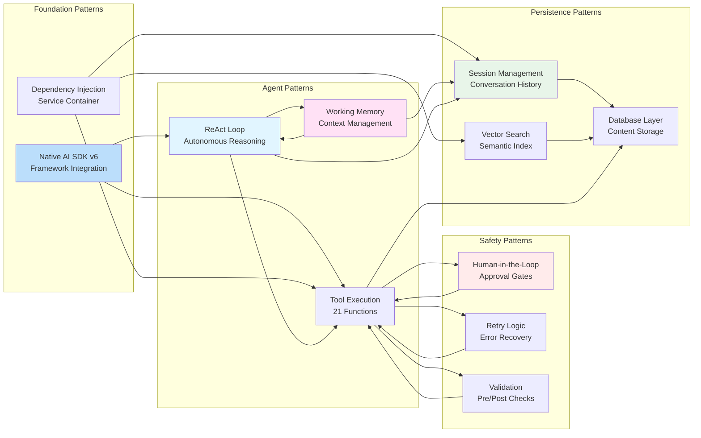
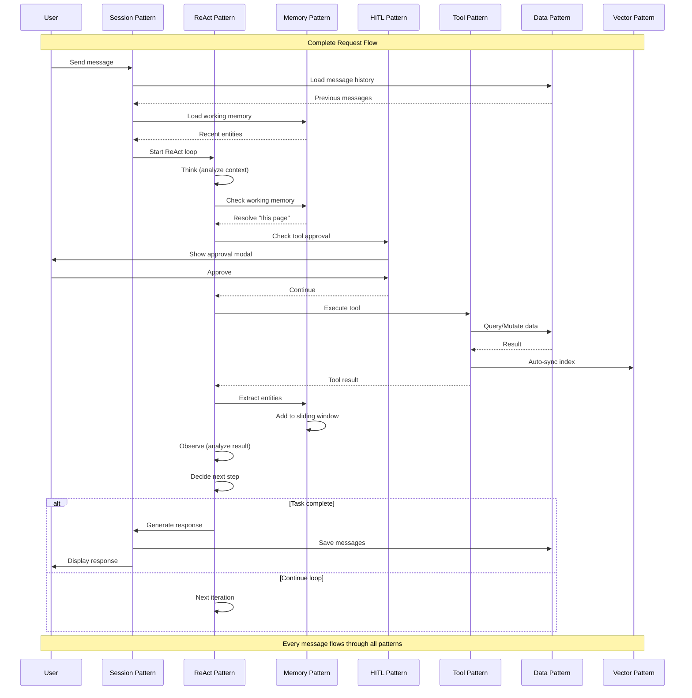
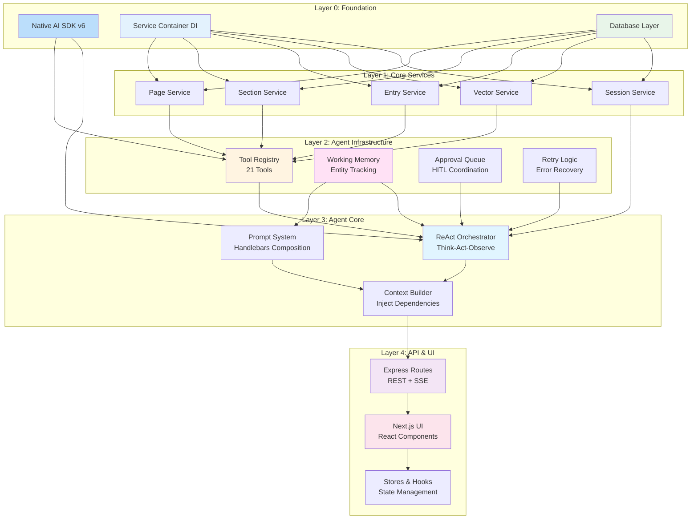

# Core Pattern Connections - Conceptual Overview

This document shows how the core architectural patterns and concepts in the ReAct AI Agent system interconnect at a conceptual level, focusing on **why** these patterns exist and **how** they work together.

## Table of Contents

1. [The Big Picture: Pattern Ecosystem](#1-the-big-picture-pattern-ecosystem)
2. [Core Pattern Relationships](#2-core-pattern-relationships)
3. [Data Flow Through Patterns](#3-data-flow-through-patterns)
4. [Pattern Dependencies](#4-pattern-dependencies)
5. [Why These Patterns Matter](#5-why-these-patterns-matter)

---

## 1. The Big Picture: Pattern Ecosystem

**How all core patterns work together to create an autonomous AI agent.**

**📁 Core Files Map:**

```
server/
├── agent/orchestrator.ts          # ReAct loop, retry logic
├── tools/all-tools.ts             # 21 tools with execute functions
├── services/
│   ├── working-memory/            # Entity tracking
│   ├── approval-queue.ts          # HITL coordination
│   ├── session-service.ts         # Message persistence
│   └── service-container.ts       # DI container
├── routes/agent.ts                # SSE streaming endpoint
└── db/schema.ts                   # Drizzle table definitions

app/assistant/
├── _hooks/use-agent.ts            # SSE client
├── _stores/                       # Zustand state
└── _components/                   # UI components
```

```mermaid
graph TB
    subgraph "User Experience Layer"
        UX[User Sends Message<br/>app/assistant/page.tsx]
    end

    subgraph "Session Pattern"
        SP[Session Management<br/>Unlimited conversations<br/>session-service.ts]
        SP1[Load history<br/>loadMessages()]
        SP2[Save messages<br/>saveMessages()]
        SP3[Switch sessions<br/>useSessionStore]
    end

    subgraph "Agent Pattern"
        AP[ReAct Loop<br/>Think→Act→Observe→Repeat<br/>orchestrator.ts:300-500]
        AP1[Reasoning<br/>ToolLoopAgent]
        AP2[Tool execution<br/>tool.execute()]
        AP3[Observation<br/>process result]
    end

    subgraph "Memory Pattern"
        MP[Working Memory<br/>Entity tracking<br/>working-memory/]
        MP1[Extract entities<br/>EntityExtractor]
        MP2[Sliding window<br/>WorkingContext]
        MP3[Reference resolution<br/>toContextString()]
    end

    subgraph "Safety Pattern"
        HITL[Human-in-the-Loop<br/>Approval gates<br/>approval-queue.ts]
        HITL1[Detect high-risk<br/>needsApproval flag]
        HITL2[Request approval<br/>addRequest()]
        HITL3[Wait for decision<br/>Promise.await]
    end

    subgraph "Tool Pattern"
        TP[Native AI SDK v6<br/>Context injection<br/>all-tools.ts]
        TP1[21 tools available<br/>ALL_TOOLS export]
        TP2[Service layer access<br/>ctx.services]
        TP3[Type-safe execution<br/>tool execute function]
    end

    subgraph "Persistence Pattern"
        PP[Data Layer<br/>SQLite + Vector<br/>db/schema.ts]
        PP1[CMS content<br/>pages, sections tables]
        PP2[Message history<br/>messages table]
        PP3[Semantic index<br/>data/lancedb/]
    end

    subgraph "Reliability Pattern"
        RP[Error Recovery<br/>Retry + backoff<br/>orchestrator.ts:200-250]
        RP1[3 retry attempts<br/>AGENT_CONFIG.retries]
        RP2[Exponential backoff<br/>baseDelay * 2^attempt]
        RP3[Graceful degradation<br/>throw after max retries]
    end

    UX --> SP
    SP --> SP1
    SP1 --> AP

    AP --> AP1
    AP1 --> MP
    MP --> MP3
    MP3 --> AP2

    AP2 --> HITL1
    HITL1 --> HITL2
    HITL2 --> HITL3
    HITL3 --> TP

    TP --> TP1
    TP1 --> TP2
    TP2 --> PP

    PP --> PP1
    PP --> PP2
    PP --> PP3

    AP2 -.->|On error| RP
    RP --> RP1
    RP1 --> RP2
    RP2 --> AP2

    AP3 --> MP1
    MP1 --> MP2
    MP2 --> SP2
    SP2 --> UX

    style AP fill:#e1f5ff
    style MP fill:#ffe1f5
    style HITL fill:#ffebeb
    style TP fill:#fff4e1
    style PP fill:#e8f5e9
    style RP fill:#f3e5f5
```

---

## 2. Core Pattern Relationships

**How each pattern relates to and depends on others.**

### Pattern Connection Matrix



### Key Relationships

**1. Native AI SDK v6 → Everything**

-   Foundation pattern that enables all others
-   Provides `experimental_context` for DI
-   Enables tool creation with execute functions
-   No closures needed (framework handles it)

**2. ReAct Loop ↔ Working Memory**

-   Bidirectional relationship
-   ReAct generates entities → Memory stores them
-   Memory provides context → ReAct resolves references
-   Continuous feedback loop

**3. Tools → HITL → Tools**

-   Tools trigger approval gates
-   HITL pauses execution
-   User decision flows back to tools
-   Promise-based coordination

**4. Session → Database → Vector**

-   Session saves messages to DB
-   Tools modify CMS content in DB
-   Vector index auto-syncs from DB
-   Single source of truth

**5. Retry → Tools → Retry**

-   Retry wraps tool execution
-   Tool fails → Retry kicks in
-   Exponential backoff applied
-   Eventually succeeds or fails

---

## 3. Data Flow Through Patterns

**How data moves through the system, touching each pattern.**



---

## 4. Pattern Dependencies

**Dependency hierarchy showing which patterns depend on others.**



**Dependency Rules:**

1. **Foundation Layer**: No dependencies, everything depends on it
2. **Service Layer**: Depends on foundation, provides business logic
3. **Agent Infrastructure**: Depends on services, provides agent features
4. **Agent Core**: Depends on infrastructure, orchestrates execution
5. **API & UI**: Depends on agent core, provides user interface

**Why This Matters:**

-   ✅ Clear separation of concerns
-   ✅ Can test layers independently
-   ✅ Can replace implementations without breaking others
-   ✅ Easy to understand codebase structure

---

## 5. Why These Patterns Matter

### Pattern Purpose Matrix

| Pattern                | Purpose                  | Problem It Solves                      | Benefit                               |
| ---------------------- | ------------------------ | -------------------------------------- | ------------------------------------- |
| **Native AI SDK v6**   | Framework integration    | Custom abstractions fighting framework | 28% less code, zero errors            |
| **ReAct Loop**         | Autonomous reasoning     | Manual step-by-step orchestration      | Agent thinks for itself, adapts       |
| **Working Memory**     | Reference resolution     | "this page" ambiguity                  | 70% token reduction, natural language |
| **HITL Approval**      | Safety gates             | Destructive actions without review     | User control, audit trail             |
| **Tool Pattern**       | Dependency injection     | Context passing complexity             | Type-safe, clean code                 |
| **Session Management** | Conversation persistence | Lost context on reload                 | Unlimited conversations, full history |
| **Vector Search**      | Semantic discovery       | Exact match only, typo failures        | Fuzzy matching, similarity scores     |
| **Retry Logic**        | Reliability              | Single point of failure                | 3x retry, exponential backoff         |
| **Service Layer**      | Business logic           | Code scattered everywhere              | Single source of truth, testable      |
| **Prompt System**      | Dynamic instructions     | Hardcoded prompts                      | Hot-reload, variable injection        |

### Pattern Synergy

**How patterns amplify each other:**

1. **Native AI SDK v6 + Tool Pattern** = Clean dependency injection

    - Framework provides `experimental_context`
    - Tools receive context automatically
    - No closures, no factories needed

2. **ReAct Loop + Working Memory** = Smart reference resolution

    - Agent extracts entities from tool results
    - Memory stores recent entities in sliding window
    - Agent resolves "this", "that", "it" references
    - Token usage reduced by 70%

3. **Tool Pattern + HITL Approval** = Safe autonomous actions

    - Tools marked with `needsApproval: true`
    - Approval queue coordinates with frontend
    - User sees exactly what agent wants to do
    - User has final say on destructive operations

4. **Session Management + Retry Logic** = Robust conversations

    - Messages checkpointed every 3 steps
    - Crashes can resume from last checkpoint
    - Retries with exponential backoff
    - Zero data loss guarantee

5. **Vector Search + CMS Operations** = Always up-to-date
    - Auto-sync on create/update/delete
    - Semantic search always current
    - No manual reindexing needed
    - Typo-tolerant fuzzy matching

### Anti-Patterns Avoided

**What this architecture explicitly avoids:**

❌ **Custom Tool Registries**

-   Problem: Tools recreated per request, context via closures
-   Solution: Native AI SDK v6 pattern, tools created once

❌ **Complex Memory Managers**

-   Problem: 331-line hierarchical memory fighting framework
-   Solution: 15-line `prepareStep` callback, native message arrays

❌ **Custom Checkpoint Managers**

-   Problem: 272-line state persistence logic
-   Solution: Simple save/load message arrays

❌ **Polling for Approvals**

-   Problem: Inefficient, complex state tracking
-   Solution: Promise-based approval queue

❌ **Manual Vector Sync**

-   Problem: Index gets stale, manual reindexing
-   Solution: Auto-sync on all CMS operations

❌ **God Objects**

-   Problem: Everything in one massive class
-   Solution: Service layer with single responsibilities

❌ **Prop Drilling**

-   Problem: Passing services through 10 layers
-   Solution: Dependency injection via context

---

## Pattern Evolution Story

**How this architecture evolved through refactors.**

### Phase 1: Initial Implementation (Sprints 0-11)

```
Custom Abstractions
├── Tool Registry (factories, wrappers)
├── Memory Manager (hierarchical, 331 lines)
├── Checkpoint Manager (custom state, 272 lines)
└── Error Recovery (circuit breakers, 351 lines)

Total: ~1,200 lines of custom code
Problems: "_zod" errors, context issues, complexity
```

### Phase 2: Native AI SDK v6 Refactor (Sprint 12)

```
Native Patterns
├── Tools with experimental_context
├── prepareStep callback (15 lines)
├── Simple save/load messages
└── Service layer error handling

Total: ~860 lines (-28% code reduction)
Benefits: Zero errors, 80% simpler, maintainable
```

### Phase 3: Unified Agent (Sprint 13)

```
Single Agent Pattern
├── No mode switching
├── All tools available always
├── Unified prompt (react.xml)
└── Pure ReAct loop

Benefits: Simpler mental model, better reasoning
```

### Phase 4: Working Memory (Sprint 15)

```
Universal Entity Tracking
├── Language-agnostic extraction
├── Sliding window (max 10)
├── Always injected in prompt
└── Reference resolution

Benefits: 70% token reduction, natural language
```

### Current: Production-Ready

```
Mature Architecture
├── Native AI SDK v6 patterns
├── ReAct autonomous loop
├── Working memory for context
├── HITL for safety
├── Session for persistence
├── Vector for discovery
├── Retry for reliability
└── Services for business logic

Result: Production-ready, maintainable, scalable
```

---

## Summary: The Pattern Philosophy

### Core Principles

1. **Native Over Custom**

    - Use AI SDK v6 exactly as documented
    - Don't fight the framework
    - Custom abstractions only when necessary

2. **Simple Over Complex**

    - 15 lines beats 331 lines
    - Composition over inheritance
    - Explicit over implicit

3. **Safe Over Fast**

    - Human approval for destructive actions
    - Retry with backoff for reliability
    - Validate before and after mutations

4. **Stateless Over Stateful**

    - Message arrays as conversation
    - No complex state machines
    - Persistence via database, not memory

5. **Composition Over Frameworks**
    - Small focused patterns
    - Each pattern solves one problem
    - Patterns compose naturally

### Pattern Selection Criteria

**When choosing a pattern, ask:**

1. ✅ Does it solve a real problem?
2. ✅ Is it the simplest solution?
3. ✅ Does it integrate with existing patterns?
4. ✅ Does it follow framework conventions?
5. ✅ Is it testable in isolation?
6. ✅ Will it still make sense in 6 months?

### The Result

**What these patterns enable:**

-   ✅ **Agent thinks for itself** (ReAct loop)
-   ✅ **Agent remembers context** (Working memory)
-   ✅ **Agent operates safely** (HITL approval)
-   ✅ **Agent never loses data** (Session persistence)
-   ✅ **Agent finds anything** (Vector search)
-   ✅ **Agent recovers from errors** (Retry logic)
-   ✅ **Agent scales easily** (Service layer)
-   ✅ **Agent is maintainable** (Native patterns)

**Production-ready AI agent in 860 lines of clean, understandable code.**

---

## Quick Reference: Pattern Cheat Sheet

**📁 Quick File Lookup:**

-   **Agent**: `server/agent/orchestrator.ts`
-   **Tools**: `server/tools/all-tools.ts`
-   **Memory**: `server/services/working-memory/`
-   **Sessions**: `server/services/session-service.ts`
-   **HITL**: `server/services/approval-queue.ts`
-   **Frontend**: `app/assistant/_hooks/use-agent.ts`

```
NATIVE AI SDK V6 PATTERN (all-tools.ts)
├── Tool creation: tool({ execute: async (input, { experimental_context }) => {} })
├── Context injection: await agent.generate({ messages, experimental_context })
├── Memory management: prepareStep: async ({ messages }) => {}
└── Benefits: No closures, no factories, framework-native

REACT LOOP PATTERN (orchestrator.ts:300-500)
├── Think: Agent analyzes context and working memory
├── Act: Agent calls tool with specific parameters
├── Observe: Agent processes result, extracts entities
└── Repeat: Loop continues until complete (max 15 steps)
   Function: streamAgentWithApproval()

WORKING MEMORY PATTERN (working-memory/)
├── Extract: Universal patterns for any resource type
   → EntityExtractor.extract(toolName, result)
├── Store: Sliding window (max 10 entities, recent first)
   → WorkingContext.add(entity)
├── Format: Group by type, inject in prompt always
   → WorkingContext.toContextString()
└── Resolve: "this page" → "About page" (abc-123)
   → Injected in getSystemPrompt()

HITL PATTERN (approval-queue.ts)
├── Detect: Tool marked with needsApproval: true
   → Tool definition in all-tools.ts
├── Request: Promise blocks, waits for user decision
   → approvalQueue.addRequest(id, toolName, input)
├── Decide: User clicks Approve/Reject in modal
   → POST /api/agent/approval/:id
└── Resume: Promise resolves, agent continues/stops
   → approvalQueue.resolveRequest(id, decision)

SESSION PATTERN (session-service.ts)
├── Create: Unlimited sessions per user
   → SessionService.createSession()
├── Load: CoreMessage[] from database
   → SessionService.loadMessages(sessionId)
├── Save: After every agent turn
   → SessionService.saveMessages(sessionId, messages)
└── Switch: Instant session switching
   → useSessionStore.switchSession(id)

RETRY PATTERN (orchestrator.ts:200-250)
├── Attempt: Execute function
   → executeWithRetry(fn, context)
├── Fail: Catch error
   → for (let attempt = 0; attempt < 3; attempt++)
├── Backoff: Wait with exponential delay + jitter
   → delay = baseDelay * 2^attempt + random(500)
└── Retry: Max 3 attempts, then fail
   → AGENT_CONFIG.retries = 3

SERVICE PATTERN (service-container.ts)
├── Container: Singleton holding all services
   → ServiceContainer.initialize(db)
├── Inject: Services passed via context
   → context.services = ServiceContainer.get()
├── Access: ctx.services.pageService.method()
   → In tool execute function
└── Benefits: DI, testable, single responsibility
   → Private constructor initializes all services
```

---

This conceptual overview shows how patterns interconnect to create a production-ready AI agent system that is simple, reliable, maintainable, and scalable.
