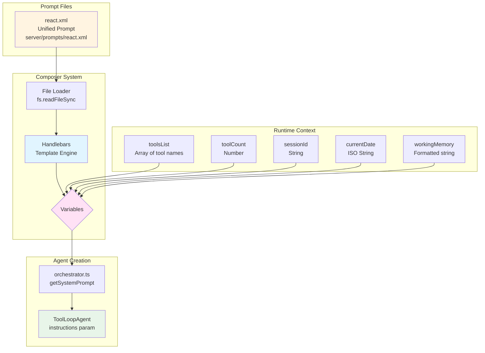
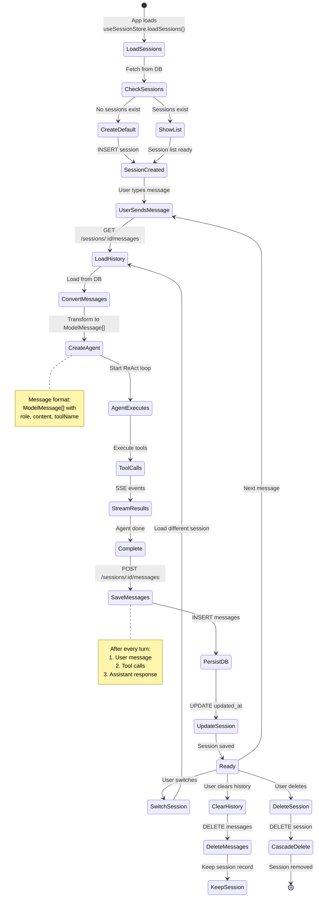
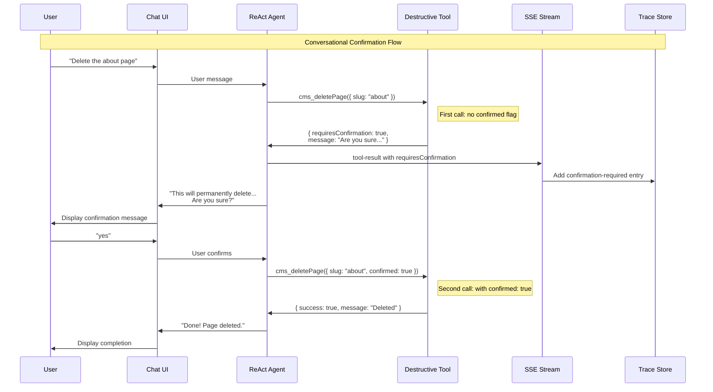
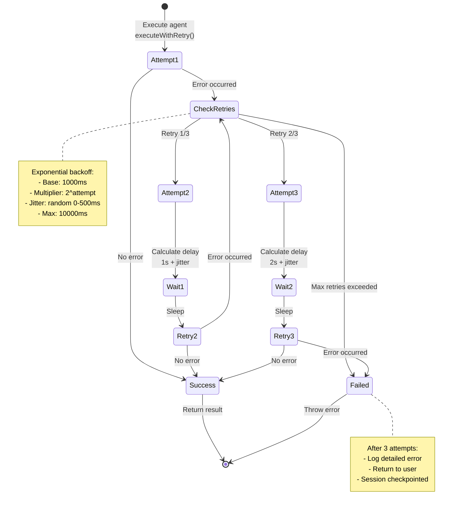

# Module Integration Patterns - Technical Deep Dive

This document provides detailed technical diagrams showing how specific modules, patterns, and core concepts integrate at the code level.

## Table of Contents

1. [Prompt System Integration](#1-prompt-system-integration)
2. [Tool Registry & Execution Pipeline](#2-tool-registry--execution-pipeline)
3. [Memory Management Architecture](#3-memory-management-architecture)
4. [Session Lifecycle & Persistence](#4-session-lifecycle--persistence)
5. [HITL Approval Flow (Promise-Based)](#5-hitl-approval-flow-promise-based)
6. [Vector Search Integration](#6-vector-search-integration)
7. [Service Container & Dependency Injection](#7-service-container--dependency-injection)
8. [Retry & Error Recovery](#8-retry--error-recovery)

---

## 1. Prompt System Integration

**How prompts are loaded, composed, and injected into the agent.**

**📁 Key Files:**
- `server/prompts/react.xml` - Single unified prompt template
- `server/agent/orchestrator.ts` - `getSystemPrompt()` function (lines 45-65)

**🔧 Key Functions:**
- `getSystemPrompt(context)` - Loads prompt, injects variables with Handlebars
- `Handlebars.compile(template)` - Template compilation
- `compiled({ toolsList, workingMemory, ... })` - Variable injection



**Code Pattern:**
```typescript
// server/agent/orchestrator.ts
function getSystemPrompt(context: {
  toolsList: string[];
  toolCount: number;
  sessionId: string;
  currentDate: string;
  workingMemory?: string;
}): string {
  const promptPath = path.join(__dirname, '../prompts/react.xml');
  const template = fs.readFileSync(promptPath, 'utf-8');
  
  // Compile with Handlebars
  const compiled = Handlebars.compile(template);
  return compiled({
    ...context,
    toolsFormatted: context.toolsList.map(t => `- ${t}`).join('\n'),
    workingMemory: context.workingMemory || '',
  });
}

// Usage
const systemPrompt = getSystemPrompt({
  toolsList: Object.keys(ALL_TOOLS),
  toolCount: Object.keys(ALL_TOOLS).length,
  sessionId: context.sessionId,
  currentDate: new Date().toISOString().split('T')[0],
  workingMemory: workingContext.toContextString(),
});

const agent = new ToolLoopAgent({
  model: openrouter.languageModel(modelId),
  instructions: systemPrompt,  // Injected here
  tools: ALL_TOOLS,
  stopWhen: stepCountIs(15)
});
```

**Key Benefits:**
- ✅ Single source of truth (react.xml)
- ✅ Dynamic variable injection
- ✅ Hot-reload in development
- ✅ Working memory always included

---

## 2. Tool Registry & Execution Pipeline

**How tools are registered, filtered, and executed with context injection.**

**📁 Key Files:**
- `server/tools/all-tools.ts` - All 45 tools
- `server/tools/types.ts` - AgentContext interface
- `server/routes/agent.ts` - Thin controller (~100 lines)
- `server/services/agent/orchestrator.ts` - AgentOrchestrator service

**🔧 Key Exports:**
- `export const ALL_TOOLS = { 'cms.getPage': cmsGetPage, ... }` (line 750)
- `export const TOOL_METADATA = { ... }` (line 760)

```mermaid
flowchart TB
    subgraph "Tool Definitions"
        T1[cmsGetPage<br/>tool definition]
        T2[cmsCreatePage<br/>tool definition]
        T3[cmsListPages<br/>tool definition]
        TN[... 42 more tools]
    end
    
    subgraph "Registry"
        ALL[ALL_TOOLS<br/>Export object]
        Meta[TOOL_METADATA<br/>Mode info]
    end
    
    subgraph "Context Building"
        Services[ServiceContainer<br/>All services]
        Logger[Structured Logger<br/>Pino]
        Target[CMS Target<br/>{siteId, envId}]
        SessionId[Session ID]
        TraceId[Trace ID<br/>UUID]
    end
    
    subgraph "Agent Initialization"
        Orchestrator[createAgent<br/>orchestrator.ts]
        Context{AgentContext}
        AgentSDK[ToolLoopAgent<br/>AI SDK v6]
    end
    
    subgraph "Tool Execution"
        SDKCall[agent.generate<br/>experimental_context]
        ToolExec[execute function<br/>receives context]
        ServiceCall[Call service methods<br/>PageService, etc]
    end
    
    T1 --> ALL
    T2 --> ALL
    T3 --> ALL
    TN --> ALL
    ALL --> Meta
    
    Services --> Context
    Logger --> Context
    Target --> Context
    SessionId --> Context
    TraceId --> Context
    
    Context --> Orchestrator
    Orchestrator --> AgentSDK
    ALL --> AgentSDK
    
    AgentSDK --> SDKCall
    SDKCall --> ToolExec
    ToolExec --> ServiceCall
    
    style ALL fill:#fff4e1
    style Context fill:#e1f5ff
    style ToolExec fill:#e8f5e9
```

**Code Pattern:**
```typescript
// 1. Tool Definition (server/tools/all-tools.ts)
export const cmsGetPage = tool({
  description: 'Get page by slug or ID',
  inputSchema: z.object({
    slug: z.string().optional(),
    id: z.string().optional()
  }),
  execute: async (input, { experimental_context }) => {
    // Context injection happens here!
    const ctx = experimental_context as AgentContext
    
    // Access all services
    const page = await ctx.services.pageService.getPageBySlug(
      input.slug
    )
    
    // Use logger
    ctx.logger.info('Page retrieved', { 
      slug: input.slug, 
      traceId: ctx.traceId 
    })
    
    return page
  }
})

// 2. Registry (server/tools/all-tools.ts)
export const ALL_TOOLS = {
  cmsGetPage,
  cmsCreatePage,
  // ... all 45 tools
}

// 3. Context Building (server/routes/agent.ts)
const context: AgentContext = {
  services: ServiceContainer.get(),
  logger: logger.child({ traceId }),
  cmsTarget: {
    teamId: params.team,
    siteId: params.site,
    environmentId: params.env
  },
  sessionId,
  traceId
}

// 4. Agent Creation (server/agent/orchestrator.ts)
const agent = new ToolLoopAgent({
  model: openrouter.languageModel(modelId),
  instructions: systemPrompt,
  tools: ALL_TOOLS,  // All tools, no filtering
  stopWhen: stepCountIs(15)
})

// 5. Execution with context
const result = await agent.generate({
  messages: [...history, userMessage],
  experimental_context: context  // Injected into ALL tools!
})
```

**Key Points:**
- ✅ Tools created ONCE (not per request)
- ✅ Context injected by AI SDK framework
- ✅ No closures, no factories
- ✅ Type-safe context casting

---

## 3. Memory Management Architecture

**Working memory system for entity tracking and reference resolution.**

**📁 Key Files:**
- `server/services/working-memory/entity-extractor.ts` - Extraction logic
- `server/services/working-memory/working-context.ts` - Storage & formatting
- `server/services/working-memory/types.ts` - Entity interface
- `server/agent/orchestrator.ts` - Integration (lines 30-40, 250-270)

**🔧 Key Classes & Methods:**
- `class EntityExtractor` - `extract(toolName, result)` method
- `class WorkingContext` - `add()`, `toContextString()` methods
- `getWorkingContext(sessionId)` - Per-session storage (line 35)
- `workingContexts = new Map<string, WorkingContext>()` (line 30)

```mermaid
graph TD
    subgraph "Tool Execution"
        Tool[Tool executes<br/>all-tools.ts]
        Result[Tool result<br/>JSON object]
    end
    
    subgraph "Entity Extraction"
        Extractor[EntityExtractor<br/>extract method<br/>entity-extractor.ts:15-60]
        Pattern{Detect Pattern}
        Single[Single resource<br/>{id, name, slug}]
        Search[Search results<br/>{matches: [...]}]
        List[List results<br/>Array of objects]
    end
    
    subgraph "Entity Storage"
        Entity{Entity Object}
        Type[type: string]
        ID[id: string]
        Name[name: string]
        Slug[slug?: string]
        Time[timestamp: Date]
    end
    
    subgraph "Working Context"
        Context[WorkingContext<br/>class]
        SlidingWindow[Sliding Window<br/>Max 10 entities]
        AddFront[Add to front]
        Prune[Prune old]
    end
    
    subgraph "Formatting"
        Group[Group by type]
        Format[Format as text]
        Output[WORKING MEMORY block]
    end
    
    subgraph "Prompt Injection"
        Prompt[System prompt]
        Inject[Inject memory block]
        NextStep[Next agent step]
    end
    
    Tool --> Result
    Result --> Extractor
    Extractor --> Pattern
    Pattern --> Single
    Pattern --> Search
    Pattern --> List
    
    Single --> Entity
    Search --> Entity
    List --> Entity
    
    Entity --> Type
    Entity --> ID
    Entity --> Name
    Entity --> Slug
    Entity --> Time
    
    Entity --> Context
    Context --> SlidingWindow
    SlidingWindow --> AddFront
    AddFront --> Prune
    
    Prune --> Group
    Group --> Format
    Format --> Output
    Output --> Prompt
    Prompt --> Inject
    Inject --> NextStep
    NextStep -.->|Next iteration| Tool
    
    style Extractor fill:#ffe1f5
    style Context fill:#e1f5ff
    style Output fill:#fff4e1
    style NextStep fill:#e8f5e9
```

**Code Pattern:**
```typescript
// 1. Entity Extractor (server/services/working-memory/entity-extractor.ts)
export class EntityExtractor {
  extract(toolName: string, toolResult: any): Entity[] {
    if (!toolResult) return [];
    
    const entities: Entity[] = [];
    const type = this.inferType(toolName);  // cms_getPage → page
    
    // Pattern 1: Single resource
    if (toolResult.id && toolResult.name) {
      entities.push(this.createEntity(type, toolResult));
    }
    
    // Pattern 2: Search results
    if (toolResult.matches && Array.isArray(toolResult.matches)) {
      for (const match of toolResult.matches.slice(0, 3)) {
        entities.push(this.createEntity(match.type || type, match));
      }
    }
    
    // Pattern 3: List results
    if (Array.isArray(toolResult)) {
      for (const item of toolResult.slice(0, 5)) {
        if (item?.id) {
          entities.push(this.createEntity(type, item));
        }
      }
    }
    
    return entities;
  }
  
  private createEntity(type: string, data: any): Entity {
    return {
      type,
      id: data.id,
      name: data.name || data.slug || data.title || 'Unnamed',
      slug: data.slug,
      timestamp: new Date()
    };
  }
}

// 2. Working Context (server/services/working-memory/working-context.ts)
export class WorkingContext {
  private entities: Entity[] = [];
  private readonly MAX_ENTITIES = 10;
  
  add(entity: Entity): void {
    // Add to front (most recent first)
    this.entities.unshift(entity);
    // Prune to max
    this.entities = this.entities.slice(0, this.MAX_ENTITIES);
  }
  
  toContextString(): string {
    if (this.entities.length === 0) return '';
    
    // Group by type
    const grouped: Record<string, Entity[]> = {};
    for (const entity of this.entities) {
      if (!grouped[entity.type]) grouped[entity.type] = [];
      grouped[entity.type].push(entity);
    }
    
    // Format as text block
    const lines: string[] = ['[WORKING MEMORY]'];
    for (const [type, items] of Object.entries(grouped)) {
      lines.push(`${type}s:`);
      for (const item of items.slice(0, 3)) {
        lines.push(`  - "${item.name}" (${item.id})`);
      }
    }
    
    return lines.join('\n');
  }
}

// 3. Integration in Orchestrator (server/agent/orchestrator.ts)
export async function streamAgentWithApproval(...) {
  const extractor = new EntityExtractor();
  const workingContext = getWorkingContext(sessionId);
  
  // Inject working memory in prompt
  const systemPrompt = getSystemPrompt({
    toolsList: Object.keys(ALL_TOOLS),
    toolCount: Object.keys(ALL_TOOLS).length,
    sessionId,
    currentDate: new Date().toISOString().split('T')[0],
    workingMemory: workingContext.toContextString(),  // Injected
  });
  
  // Process stream
  for await (const chunk of streamResult.fullStream) {
    if (chunk.type === 'tool-result') {
      // Extract entities from result
      const entities = extractor.extract(chunk.toolName, chunk.output);
      if (entities.length > 0) {
        workingContext.addMany(entities);
        context.logger.info('Extracted entities', {
          toolName: chunk.toolName,
          entityCount: entities.length
        });
      }
    }
  }
}
```

**Benefits:**
- ✅ Universal pattern (works for ANY resource type)
- ✅ Language-agnostic (no hardcoded English)
- ✅ Always injected (LLM ignores if not needed)
- ✅ 70%+ token reduction (vs full context)
- ✅ Resolves "this", "that", "it" references

---

## 4. Session Lifecycle & Persistence

**Complete session lifecycle from creation to message persistence.**

**📁 Key Files:**
- `server/services/session-service.ts` - All session operations
- `app/assistant/_stores/session-store.ts` - Frontend session state
- `app/api/sessions/route.ts` - API proxy for sessions
- `server/routes/sessions.ts` - Express session routes

**🔧 Key Methods:**
- `SessionService.createSession()` - Creates new session (line 35)
- `SessionService.loadMessages(sessionId)` - Returns ModelMessage[] (line 85)
- `SessionService.saveMessages(sessionId, messages)` - Persists to DB (line 110)
- `useSessionStore.loadSessions()` - Frontend load (session-store.ts:40)



**Code Pattern:**
```typescript
// 1. Session Creation (server/services/session-service.ts)
export class SessionService {
  async createSession(input?: CreateSessionInput): Promise<Session> {
    const session = {
      id: randomUUID(),
      title: input?.title || 'New Session',
      checkpoint: null,
      createdAt: new Date(),
      updatedAt: new Date()
    };
    
    await this.db.insert(schema.sessions).values(session);
    return session;
  }
  
  async loadMessages(sessionId: string): Promise<ModelMessage[]> {
    const messages = await this.db.query.messages.findMany({
      where: eq(schema.messages.sessionId, sessionId),
      orderBy: (m) => m.createdAt
    });
    
    // Transform to ModelMessage format
    return messages.map(m => ({
      role: m.role,
      content: typeof m.content === 'string' 
        ? JSON.parse(m.content) 
        : m.content
    }));
  }
  
  async saveMessages(
    sessionId: string, 
    messages: ModelMessage[]
  ): Promise<void> {
    // Save each message
    for (const message of messages) {
      await this.db.insert(schema.messages).values({
        id: randomUUID(),
        sessionId,
        role: message.role,
        content: JSON.stringify(message.content),
        toolName: message.role === 'tool' 
          ? (message.content as any).toolName 
          : null,
        createdAt: new Date()
      });
    }
    
    // Update session timestamp
    await this.db.update(schema.sessions)
      .set({ updatedAt: new Date() })
      .where(eq(schema.sessions.id, sessionId));
  }
}

// 2. Frontend Session Store (app/assistant/_stores/session-store.ts)
interface SessionStore {
  sessions: Session[];
  currentSessionId: string | null;
  
  loadSessions: () => Promise<void>;
  createSession: () => Promise<void>;
  switchSession: (id: string) => Promise<void>;
  deleteSession: (id: string) => Promise<void>;
}

export const useSessionStore = create<SessionStore>((set, get) => ({
  sessions: [],
  currentSessionId: null,
  
  loadSessions: async () => {
    const res = await fetch('/api/sessions');
    const data = await res.json();
    set({ sessions: data });
    
    // Auto-create if empty
    if (data.length === 0) {
      await get().createSession();
    }
  },
  
  createSession: async () => {
    const res = await fetch('/api/sessions', { method: 'POST' });
    const session = await res.json();
    set({ 
      sessions: [...get().sessions, session],
      currentSessionId: session.id
    });
  },
  
  switchSession: async (id: string) => {
    set({ currentSessionId: id });
    // Trigger message load in chat store
    const chatStore = useChatStore.getState();
    await chatStore.loadMessages(id);
  },
}));

// 3. Agent Integration (server/routes/agent.ts)
export function createAgentRoutes(services: ServiceContainer) {
  const router = express.Router();
  
  router.post('/stream', async (req, res) => {
    const { sessionId, prompt } = req.body;
    
    // Load message history
    const history = await services.sessionService.loadMessages(sessionId);
    
    // Add user message to history
    const messages = [
      ...history,
      { role: 'user', content: prompt }
    ];
    
    // Create agent and stream
    const result = await streamAgentWithApproval({
      messages,
      context,
      stream: res
    });
    
    // Save messages after completion
    await services.sessionService.saveMessages(
      sessionId,
      result.messages
    );
  });
  
  return router;
}
```

**Key Features:**
- ✅ Unlimited sessions per user
- ✅ Full message history persistence
- ✅ Cascade delete (session → messages)
- ✅ Auto-create default session
- ✅ Smart title generation
- ✅ Switch sessions instantly

---

## 5. HITL Confirmation Flow (Conversational)

**Destructive operations use a conversational confirmation pattern via the `confirmed` flag.**

**📁 Key Files:**
- `server/tools/all-tools.ts` - Tools with `confirmed` flag pattern
- `server/prompts/core/base-rules.xml` - Confirmation behavior instructions
- `app/assistant/_stores/trace-store.ts` - Tracks confirmation-required entries
- `app/assistant/_hooks/use-agent.ts` - Detects requiresConfirmation in tool results

**🔧 Key Pattern:**
- First call: Tool returns `{ requiresConfirmation: true, message: "..." }`
- Agent asks user for confirmation in chat
- Second call: User confirms, agent calls with `confirmed: true`
- Tool executes destructive operation



**Code Pattern:**
```typescript
// Tool with confirmed flag (server/tools/all-tools.ts)
export const cmsDeletePage = tool({
  description: 'Delete a page - REQUIRES CONFIRMATION',
  inputSchema: z.object({
    id: z.string().optional(),
    slug: z.string().optional(),
    confirmed: z.boolean().optional().describe('Must be true to execute deletion'),
  }),
  execute: async (input, { experimental_context }) => {
    const ctx = experimental_context as AgentContext;

    // Get the page first
    const page = await ctx.services.pageService.getPageBySlugOrId(input.slug, input.id);
    if (!page) return { error: 'Page not found' };

    // Check confirmation
    if (!input.confirmed) {
      return {
        requiresConfirmation: true,
        message: `Are you sure you want to delete "${page.name}"? This will permanently remove the page and all sections.`,
        page: { id: page.id, slug: page.slug, name: page.name },
      };
    }

    // Execute deletion
    await ctx.services.pageService.deletePage(page.id);
    return { success: true, message: `Page "${page.name}" deleted` };
  },
});

// Frontend detection (app/assistant/_hooks/use-agent.ts)
case 'tool-result': {
  const result = data.result || {};
  if (result.requiresConfirmation === true) {
    // Log as special trace entry type
    addEntry({
      traceId: currentTraceId,
      type: 'confirmation-required',
      level: 'warn',
      toolName: data.toolName,
      summary: `${data.toolName}: Confirmation required`,
      output: result,
    });
  }
}
```

**Key Features:**
- ✅ No separate approval endpoint needed
- ✅ No modal UI needed - all inline chat
- ✅ Agent explains consequences before confirming
- ✅ Natural conversational flow
- ✅ Simple tool-level implementation

---

## 6. Vector Search Integration

**Auto-sync vector index on CMS operations.**

**📁 Key Files:**
- `server/services/vector-index.ts` - LanceDB operations
- `server/services/cms/page-service.ts` - Auto-sync integration (lines 45, 85, 120)
- `server/tools/all-tools.ts` - `searchVector` tool (line 650)

**🔧 Key Methods:**
- `VectorIndexService.syncResource(doc)` - Adds/updates in index (line 40)
- `VectorIndexService.deleteResource(id)` - Removes from index (line 70)
- `VectorIndexService.search(query, type, limit)` - Semantic search (line 95)
- `PageService.createPage()` - Calls syncResource after insert (line 50)

```mermaid
graph TD
    subgraph "CMS Operations"
        Create[Create Resource<br/>Page/Section/Entry<br/>PageService.createPage()]
        Update[Update Resource<br/>Metadata/Content]
        Delete[Delete Resource<br/>Cascade]
    end
    
    subgraph "Service Layer"
        PageService[PageService]
        SectionService[SectionService]
        EntryService[EntryService]
    end
    
    subgraph "Vector Service"
        VS[VectorIndexService]
        EmbedAPI[OpenRouter<br/>Embeddings API]
        Lance[(LanceDB)]
    end
    
    subgraph "Search Tool"
        SearchTool[search.vector]
        Query[User query]
        Results[Ranked results<br/>with similarity]
    end
    
    Create --> PageService
    Update --> PageService
    Delete --> PageService
    
    PageService -->|syncResource| VS
    SectionService -->|syncResource| VS
    EntryService -->|syncResource| VS
    
    VS -->|Generate embedding| EmbedAPI
    EmbedAPI -->|Vector| Lance
    
    Delete -->|deleteResource| VS
    VS -->|Remove from index| Lance
    
    SearchTool -->|Query| VS
    Query -->|Generate embedding| EmbedAPI
    EmbedAPI -->|Search vector| Lance
    Lance -->|Top K results| Results
    
    style VS fill:#fff4e1
    style Lance fill:#e8f5e9
    style SearchTool fill:#e1f5ff
```

**Code Pattern:**
```typescript
// 1. Vector Service (server/services/vector-index.ts)
export class VectorIndexService {
  async syncResource(doc: ResourceDocument): Promise<void> {
    // Generate embedding
    const embedding = await this.generateEmbedding(
      doc.searchableText
    );
    
    // Upsert to LanceDB
    await this.table.add([{
      id: doc.id,
      type: doc.type,
      name: doc.name,
      slug: doc.slug,
      searchableText: doc.searchableText,
      metadata: doc.metadata,
      embedding,
      updatedAt: doc.updatedAt
    }]);
  }
  
  async deleteResource(id: string): Promise<void> {
    await this.table.delete(`id = '${id}'`);
  }
  
  async search(
    query: string,
    type?: string,
    limit: number = 5
  ): Promise<SearchResult[]> {
    // Generate query embedding
    const embedding = await this.generateEmbedding(query);
    
    // Search LanceDB
    const results = await this.table
      .search(embedding)
      .limit(limit)
      .where(type ? `type = '${type}'` : undefined)
      .execute();
    
    return results.map(r => ({
      id: r.id,
      type: r.type,
      name: r.name,
      slug: r.slug,
      similarity: r._distance
    }));
  }
}

// 2. Service Integration (server/services/cms/page-service.ts)
export class PageService {
  async createPage(input: CreatePageInput) {
    // Create page in DB
    const page = await this.db.insert(schema.pages).values({
      id: randomUUID(),
      ...input
    });
    
    // Auto-sync to vector index
    await this.vectorService.syncResource({
      id: page.id,
      type: 'page',
      name: page.name,
      slug: page.slug,
      searchableText: `${page.name} ${page.slug}`,
      metadata: { siteId: page.siteId },
      embedding: [],  // Generated by vector service
      updatedAt: page.updatedAt
    });
    
    return page;
  }
  
  async updatePage(id: string, input: UpdatePageInput) {
    // Update in DB
    const page = await this.db.update(schema.pages)
      .set(input)
      .where(eq(schema.pages.id, id));
    
    // Re-sync if name/slug changed
    if (input.name || input.slug) {
      await this.vectorService.syncResource({
        id: page.id,
        type: 'page',
        name: page.name,
        slug: page.slug,
        searchableText: `${page.name} ${page.slug}`,
        metadata: { siteId: page.siteId },
        embedding: [],
        updatedAt: new Date()
      });
    }
    
    return page;
  }
  
  async deletePage(id: string) {
    // Delete from DB (cascade to sections)
    await this.db.delete(schema.pages)
      .where(eq(schema.pages.id, id));
    
    // Delete from vector index
    await this.vectorService.deleteResource(id);
  }
}

// 3. Search Tool (server/tools/all-tools.ts)
export const searchVector = tool({
  description: 'Semantic search across all CMS resources',
  inputSchema: z.object({
    query: z.string().describe('Search query'),
    type: z.enum(['page', 'section_def', 'collection', 'entry']).optional(),
    limit: z.number().min(1).max(10).optional().default(5)
  }),
  execute: async (input, { experimental_context }) => {
    const ctx = experimental_context as AgentContext;
    
    const results = await ctx.services.vectorService.search(
      input.query,
      input.type,
      input.limit
    );
    
    return {
      query: input.query,
      matches: results,
      count: results.length
    };
  }
});
```

**Key Features:**
- ✅ Auto-sync on create/update
- ✅ Auto-delete on remove
- ✅ Semantic search with similarity scores
- ✅ Type filtering (page, section, etc.)
- ✅ Typo-tolerant fuzzy matching

---

## 7. Service Container & Dependency Injection

**Lightweight DI pattern for service lifecycle management.**

**📁 Key Files:**
- `server/services/service-container.ts` - Container implementation
- `server/db/client.ts` - Database connection
- `server/index.ts` - Server initialization (lines 15-25)

**🔧 Key Methods:**
- `ServiceContainer.initialize(db)` - Creates singleton instance (line 30)
- `ServiceContainer.get()` - Returns singleton (line 50)
- Private constructor initializes all services (lines 60-80)

**Usage Pattern:**
```typescript
// Initialization (server/index.ts:20)
const services = ServiceContainer.initialize(db);

// Access anywhere (routes/agent.ts:65)
const context: AgentContext = {
  services: ServiceContainer.get(),
  // ...
}
```

```mermaid
graph TB
    subgraph "Initialization"
        DB[Drizzle DB<br/>SQLite Connection<br/>db/client.ts]
        Server[Express Server<br/>Startup<br/>index.ts:15-25]
    end
    
    subgraph "Service Container"
        Container[ServiceContainer<br/>Singleton<br/>service-container.ts]
        Init[initialize method<br/>line 30]
    end
    
    subgraph "Services"
        PageSvc[PageService<br/>new PageService(db)]
        SectionSvc[SectionService<br/>new SectionService(db)]
        EntrySvc[EntryService<br/>new EntryService(db)]
        VectorSvc[VectorService<br/>new VectorService(db)]
        SessionSvc[SessionService<br/>new SessionService(db)]
        RenderSvc[RendererService<br/>new RendererService(db)]
    end
    
    subgraph "Consumer Layer"
        Routes[Express Routes]
        Tools[Agent Tools]
        Agent[Agent Orchestrator]
    end
    
    DB --> Container
    Server --> Init
    Init --> Container
    
    Container --> PageSvc
    Container --> SectionSvc
    Container --> EntrySvc
    Container --> VectorSvc
    Container --> SessionSvc
    Container --> RenderSvc
    
    Routes --> Container
    Tools --> Container
    Agent --> Container
    
    style Container fill:#e3f2fd
    style Init fill:#e1f5ff
    style Routes fill:#fff4e1
    style Tools fill:#ffe1f5
```

**Code Pattern:**
```typescript
// 1. Service Container (server/services/service-container.ts)
export class ServiceContainer {
  private static instance: ServiceContainer;
  
  readonly pageService: PageService;
  readonly sectionService: SectionService;
  readonly entryService: EntryService;
  readonly vectorService: VectorIndexService;
  readonly sessionService: SessionService;
  readonly rendererService: RendererService;
  readonly validationService: ValidationService;
  
  private constructor(db: DrizzleDB) {
    // Initialize all services
    this.pageService = new PageService(db, this);
    this.sectionService = new SectionService(db, this);
    this.entryService = new EntryService(db, this);
    this.vectorService = new VectorIndexService();
    this.sessionService = new SessionService(db);
    this.rendererService = new RendererService(db);
    this.validationService = new ValidationService(db);
  }
  
  static initialize(db: DrizzleDB): ServiceContainer {
    if (!ServiceContainer.instance) {
      ServiceContainer.instance = new ServiceContainer(db);
    }
    return ServiceContainer.instance;
  }
  
  static get(): ServiceContainer {
    if (!ServiceContainer.instance) {
      throw new Error('ServiceContainer not initialized');
    }
    return ServiceContainer.instance;
  }
}

// 2. Server Initialization (server/index.ts)
import { db } from './db/client';
import { ServiceContainer } from './services/service-container';

// Initialize services
const services = ServiceContainer.initialize(db);

// Wait for async initialization
await services.vectorService.initialize();

console.log('✅ Services initialized');

// 3. Usage in Routes (server/routes/agent.ts)
export function createAgentRoutes(services: ServiceContainer) {
  const router = express.Router();
  
  router.post('/stream', async (req, res) => {
    // Access services via container
    const messages = await services.sessionService.loadMessages(
      sessionId
    );
    
    // Build context with services
    const context: AgentContext = {
      services,  // All services available
      logger,
      cmsTarget,
      sessionId,
      traceId
    };
    
    // Pass to agent
    await streamAgentWithApproval({ context, messages, stream: res });
  });
  
  return router;
}

// 4. Usage in Tools (server/tools/all-tools.ts)
export const cmsGetPage = tool({
  execute: async (input, { experimental_context }) => {
    const ctx = experimental_context as AgentContext;
    
    // Access any service
    const page = await ctx.services.pageService.getPageBySlug(
      input.slug
    );
    
    return page;
  }
});
```

**Benefits:**
- ✅ Single initialization point
- ✅ Singleton pattern for consistency
- ✅ Easy service access everywhere
- ✅ Dependency injection built-in
- ✅ No prop drilling

---

## 8. Retry & Error Recovery

**Exponential backoff with jitter for robust error handling.**

**📁 Key Files:**
- `server/agent/orchestrator.ts` - Retry logic (lines 200-250)

**🔧 Key Constants & Functions:**
- `AGENT_CONFIG` - maxRetries: 3, baseDelay: 1000ms (line 25)
- `executeWithRetry<T>(fn, context)` - Retry wrapper (line 200)
- Formula: `delay = min(baseDelay * 2^attempt + jitter, maxDelay)` (line 230)

**Implementation:**
```typescript
// orchestrator.ts:200-250
async function executeWithRetry<T>(
  fn: () => Promise<T>,
  context: { logger: any; traceId: string }
): Promise<T> {
  for (let attempt = 0; attempt < AGENT_CONFIG.retries; attempt++) {
    try {
      return await fn();
    } catch (error) {
      const delay = Math.min(
        AGENT_CONFIG.baseDelay * Math.pow(2, attempt) + Math.random() * 500,
        10000
      );
      await new Promise(resolve => setTimeout(resolve, delay));
    }
  }
  throw lastError;
}
```



**Code Pattern:**
```typescript
// server/agent/orchestrator.ts
const AGENT_CONFIG = {
  maxSteps: 15,
  modelId: 'openai/gpt-4o-mini',
  retries: 3,              // Max retry attempts
  baseDelay: 1000,         // Base delay (ms)
  maxDelay: 10000,         // Max delay (ms)
  jitterRange: 500,        // Random jitter (ms)
};

/**
 * Execute with exponential backoff + jitter
 */
async function executeWithRetry<T>(
  fn: () => Promise<T>,
  context: { logger: any; traceId: string }
): Promise<T> {
  let lastError: Error | undefined;
  
  for (let attempt = 0; attempt < AGENT_CONFIG.retries; attempt++) {
    try {
      // Attempt execution
      return await fn();
      
    } catch (error) {
      lastError = error as Error;
      const isLastAttempt = attempt === AGENT_CONFIG.retries - 1;
      
      // Log retry info
      context.logger.warn('Execution failed, retrying', {
        attempt: attempt + 1,
        maxRetries: AGENT_CONFIG.retries,
        error: error.message,
        traceId: context.traceId,
      });
      
      // Don't retry on last attempt
      if (isLastAttempt) {
        break;
      }
      
      // Calculate delay with exponential backoff + jitter
      const exponentialDelay = AGENT_CONFIG.baseDelay * Math.pow(2, attempt);
      const jitter = Math.random() * AGENT_CONFIG.jitterRange;
      const delay = Math.min(
        exponentialDelay + jitter,
        AGENT_CONFIG.maxDelay
      );
      
      context.logger.info('Waiting before retry', {
        attempt: attempt + 1,
        delayMs: Math.round(delay),
        traceId: context.traceId,
      });
      
      // Sleep before retry
      await new Promise(resolve => setTimeout(resolve, delay));
    }
  }
  
  // All retries exhausted
  context.logger.error('All retry attempts exhausted', {
    error: lastError?.message,
    traceId: context.traceId,
  });
  
  throw lastError;
}

// Usage in orchestrator
export async function streamAgentWithApproval(...) {
  // Wrap entire execution in retry logic
  return await executeWithRetry(async () => {
    const result = await streamText({
      model: openrouter.languageModel(modelId),
      messages,
      tools: ALL_TOOLS,
      experimental_context: context,
      // ... other options
    });
    
    // Process stream
    for await (const chunk of result.fullStream) {
      // ... handle chunks
    }
    
    return result;
  }, context);
}
```

**Retry Strategy:**
- **Attempt 1**: Immediate execution
- **Attempt 2**: Wait ~1s (1000ms + jitter)
- **Attempt 3**: Wait ~2s (2000ms + jitter)
- **Failed**: Throw error after 3 attempts

**Jitter Benefits:**
- ✅ Prevents thundering herd
- ✅ Distributes load over time
- ✅ Improves success rate
- ✅ Production-ready pattern

---

## Summary of Integration Patterns

### 1. **Native AI SDK v6 Pattern**
- Context injection via `experimental_context`
- Tools created once, not recreated
- No closures, no factories
- Framework handles everything

### 2. **Prompt System**
- Single XML file (react.xml)
- Handlebars for variable injection
- Working memory always included
- Hot-reload in development

### 3. **Working Memory**
- Universal entity extraction
- Sliding window (max 10 entities)
- Always injected in prompt
- LLM ignores if not needed

### 4. **Session Management**
- Unlimited sessions
- Full message history in DB
- Load/save via SessionService
- ModelMessage[] format

### 5. **HITL Approval**
- Promise-based coordination
- 5-minute timeout
- No polling needed
- Clean async/await pattern

### 6. **Vector Search**
- Auto-sync on CMS operations
- Semantic similarity search
- Type filtering support
- Typo-tolerant matching

### 7. **Service Container**
- Singleton pattern
- Lightweight DI
- All services initialized once
- Easy access everywhere

### 8. **Retry & Error Recovery**
- Exponential backoff
- Jitter for load distribution
- 3 retry attempts
- Production-ready reliability

These patterns work together to create a robust, maintainable, and production-ready AI agent system.
