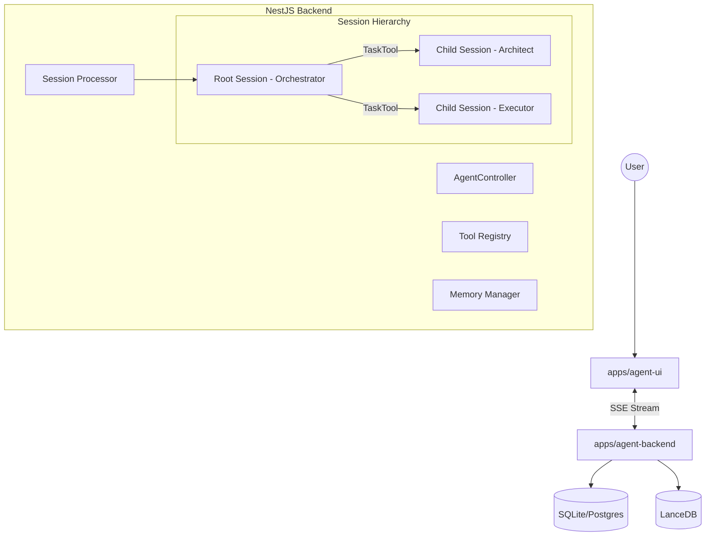

# Multiservice Agent Architecture Plan V2 (OpenCode-Inspired)

**Date**: 2025-12-16
**Status**: APPROVED For Implementation
**Reference**: OpenCode Architecture (`digest.txt`)
**Target Stack**: NestJS (Backend) + Next.js (Frontends) + AI SDK 6

---

## 1. Executive Summary

This plan refactors the prototype into a **Session-Based Multi-Agent System** inspired by the proven OpenCode architecture. Instead of a single monolithic loop, we use **Hierarchical Sessions** where agents can spawn sub-agents (child sessions) to handle specific tasks.

**Core Philosophy**:

1.  **Everything is a Session**: The main interaction is a session. A sub-task is a child session.
2.  **Processor Loop**: A robust `while(true)` loop that handles streaming, tool calls, and state transitions.
3.  **Dynamic Context**: Context is actively managed via **Compaction** (summarization) and **Pruning** (removing old tool outputs).
4.  **Snapshots**: State is checkpointed before/after every step for recovery and diffing.

---

## 2. System Architecture (Monorepo)



---

## 3. The Agent Layer (Deep Dive)

We will replicate the `src/session/` architecture from OpenCode.

### 3.1 Session Processor (`SessionProcessor`)

**Role**: The "Engine" that drives an agent loop.
**Implementation**: A NestJS Service wrapping AI SDK's `streamText`.

**Key Features to Port**:

-   **The Loop**: A `while(true)` loop that continues until `stop` signal or `MaxSteps`.
-   **Doom Loop Detection**: Track the last 3 tool calls. If `toolName` + `input` are identical, trigger `Permission.RejectedError` or ask user.
-   **Event Handling**: Listen to `tool-call`, `tool-result`, `reasoning-start` (for CoT models).
-   **Snapshotting**: Before every step, save a file system/DB snapshot. After step, save a patch.

### 3.2 Context Compaction (`MemoryManager`)

**Role**: Keep the context window efficient without losing "The Plan".
**Strategy**:

1.  **Pruning**: Iterate backwards. If total tool output tokens > 40k, replace older tool outputs with `[pruned]`.
2.  **Summarization**: When context overflows or explicitly triggered, runs a `SystemPrompt.compaction` job to compress history into a "Summary Message".
3.  **Implementation**: A `CompactionService` that runs after every `finish-step` event.

### 3.3 Dynamic Tool Registry (`ToolRegistry`)

**Role**: Single source of truth for all tools.
**Features**:

-   **Definition**: Tools defined using Zod schemas (AI SDK standard).
-   **Context Injection**: Tools receive a `ToolContext` object containing `sessionID`, `agentID`, and `abortSignal` (not global state).
-   **Permissioning**: Tools have `enabled: boolean` flags based on the active agent's role (e.g., `Architect` agent has `enabled: false` for `writeTool`).

### 3.4 Multi-Agent Co-ordination (`TaskTool`)

**Role**: The mechanism for agents to spawn sub-agents.
**Pattern**:

-   The **Orchestrator** has access to a special `task` tool.
-   **Tool Input**: `{ description: string, subagent_type: "architect" | "executor", prompt: string }`
-   **Execution**:
    1.  Creates a new `Session` record with `parentID = currentSessionID`.
    2.  Instantiates a new `SessionProcessor` for the child session.
    3.  Runs the child loop until completion.
    4.  Returns the child's final answer as the `tool-result` to the parent.

---

## 4. NestJS Application Structure

```
apps/agent-backend/src/
├── agent/
│   ├── processor/
│   │   ├── session.processor.ts   # The main loop (Ref: src/session/processor.ts)
│   │   ├── doom-loop.guard.ts     # Loop detection
│   │   └── retry.strategy.ts      # Error handling
│   ├── memory/
│   │   ├── compaction.service.ts  # Pruning/Summarization (Ref: src/session/compaction.ts)
│   │   └── snapshot.service.ts    # State checkpointing
│   ├── tools/
│   │   ├── registry.service.ts    # Tool Discovery
│   │   ├── dynamic.tools.ts       # Generated CMS tools
│   │   └── core/
│   │       ├── task.tool.ts       # THE Multi-agent spawner
│   │       ├── bash.tool.ts
│   │       └── file.tool.ts
│   └── prompts/
│       ├── prompt.service.ts      # Template resolution
│       └── templates/             # .txt prompt files
├── cms/
│   ├── adapters/                  # Internal/Contentful adapters
│   └── cms.module.ts
└── database/                      # Drizzle/SQLite configuration
```

---

## 5. Next.js Frontend Strategy

### 5.1 `apps/agent-ui`

-   **Stream Consumption**: Uses `useChat` but expects a rich stream of events (`text-delta`, `tool-call`, `tool-result`, `session-spawn`).
-   **Session Visualization**:
    -   **Sidebar**: Shows Session Hierarchy (Parent -> Children).
    -   **Main Chat**: Shows the _active_ session. When a `task` tool starts, UI shows a nested "Child Agent Working..." indicator.

### 5.2 `apps/preview-engine`

-   **Capabilities**: Reads from the `cms` database directly.
-   **Live Reload**: Subscribes to `cms.*` events from the backend via WebSockets/SSE to refresh previews instantly on agent changes.

---

## 6. Implementation Stages

### Stage 1: The Core Loop (Week 1)

1.  Setup NestJS + AI SDK 6.
2.  Implement `SessionProcessor` with the `while(true)` loop.
3.  Port `CompactionService` logic from OpenCode logic.
4.  Create basic `BashTool` and `ReadTool`.

### Stage 2: The Registry & CMS (Week 2)

1.  Build `ToolRegistry`.
2.  Implement `InternalCmsAdapter`.
3.  Create dynamic tool generator: `adapter.getSchema() -> tool()`.

### Stage 3: Multi-Agent Hierarchy (Week 3)

1.  Implement `TaskTool`.
2.  Add `Session.parentID` support in DB.
3.  Test: Orchestrator spawns Architect -> Architect spawns CodeSearch.

### Stage 4: UX & Polish (Week 4)

1.  Build `agent-ui` with hierarchical session view.
2.  Implement "Doom Loop" safeguards and HITL approvals.
3.  Connect `preview-engine`.

---

## 7. Key Learnings from OpenCode Implementation

1.  **Implicit State**: Don't pass huge context objects. Use the `Session` ID to allow services to look up what they need.
2.  **Prompt as Code**: Don't just use strings. Use a `PromptService` that resolves file imports (`import PLAN fro 'plan.txt'`) and variable interpolation.
3.  **Tools are First-Class**: They aren't just functions. They are entities with permissions, metadata, and lifecycle hooks (beforeExecute/afterExecute).

This plan provides a direct path to a production-grade agent system using industry-proven patterns.
