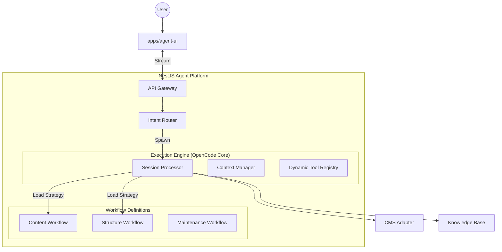

# Multiservice Agent Architecture Plan V3 (The CMS-First Hybrid)

**Date**: 2025-12-16
**Status**: APPROVED Strategy
**Focus**: CMS-Specific, User-Centric, Robust Execution
**Inputs**: OpenCode Architecture (Technical Foundation) + Model Routing Research (Orchestration Pattern)

---

## 1. Executive Summary

This architecture (V3) fuses the **technical robustness** of the OpenCode execution engine with a **CMS-specific Graph/Router orchestration**.

While OpenCode is designed for *open-ended coding*, a CMS requires **accuracy, repeatability, and safety**. Our target users (marketing managers) need "Guardrails with Autonomy," not a raw CLI.

**The Solution**: A **Workflow-Driven Multi-Agent System**.
We utilize OpenCode's `SessionProcessor` as the robust "Engine", but we wrap it in a **Routing Layer** that dispatches distinct **Workflow Sessions** (e.g., "Content Campaign", "Site Restructure") rather than generic sub-agents.

---

## 2. Core Philosophy: "Structured Autonomy"

In a CMS context, pure autonomy is dangerous (breaking sites), but pure script is inflexible. We strive for the middle ground:

1.  **The Router (The Concierge)**: The single entry point. It speaks to the user and identifies the *High-Level Intent*.
2.  **Workflow Sessions (The Specialists)**: Instead of generic "sub-agents", we spawn **Typed Sessions**. A "Blog Creation Session" has different system prompts, tools, and state machines than a "Maintenance Session".
3.  **Artifact-Centric UI**: Users don't just see text. They see **Artifacts** (Drafts, Sitemaps, Diffs) that are the output of agent work.
4.  **Implicit Control**: Users steer via natural language ("Make it punchier") or UI buttons ("Approve Draft"), not by managing internal todo lists.

---

## 3. System Architecture (NestJS + AI SDK 6)

---

## 4. The Agent Layer: Fusion Architecture

We are lifting the **Technical Implementation** of OpenCode but applying a **Graph-Based Routing Strategy**.

### 4.1 The Engine: Session Processor (Lifted from OpenCode)
We reuse the battle-tested `while(true)` loop architecture from OpenCode (`src/session/processor.ts`) to handle the nitty-gritty of communicating with the LLM.
*   **Capabilities**: Streaming, Tool Calling, Error Handling (Retry/Backoff), Snapshotting.
*   **Enhancement**: We add **Event Standardization** so the UI always knows what "Phase" the agent is in (e.g., `phase: "drafting"`, `phase: "reviewing"`).

### 4.2 The Orchestrator: "Intent Router" (New)
Instead of a "Main Agent" that tries to do everything, the Router is a specialized, lightweight LLM (Tier 1 / o3-mini) pass.
*   **Input**: User Message + Conversation Summary.
*   **Output**: `IntentClassification`.
    *   `"direct_answer"` -> Answer immediately (No tools).
    *   `"content_task"` -> Spawn **ContentAgent**.
    *   `"structure_task"` -> Spawn **ArchitectAgent**.
    *   `"ambiguous"` -> Ask clarifying questions.

### 4.3 Hierarchical Sessions (The Graph)
This is the core pivot. We map specific **CMS Workflows** to **Child Sessions**.

*   **Parent Session**: The Chat History. Persistent.
*   **Child Session (Ephemeral)**: Created to perform a specific workflow. Validates its own success before carrying content back to the parent.

#### Example: "Write a blog post about AI"
1.  **Router**: Detects `content_task`.
2.  **Action**: Calls `TaskTool.spawn({ type: 'content_workflow', context: ... })`.
3.  **Content Workflow (Child Session)**:
    *   **State 1 (Research)**: Uses `WebSearch` / `VectorStore` to gather info.
    *   **State 2 (Draft)**: Uses `TextGeneration` to write content.
    *   **State 3 (Review)**: Uses `ComplianceCheck` tool.
    *   **State 4 (Handoff)**: Returns the `EntryID` to the parent.
4.  **Parent**: "I've drafted the post. Here is the preview link."

### 4.4 Technical Components (OpenCode Reuse)

1.  **Compaction & Pruning**:
    *   For long CMS admin sessions, we assume context will bloat.
    *   We utilize OpenCode's `SessionCompaction` to prune completed workflows into 1-line summaries ("Executed Content Workflow for Post #123").
2.  **Dynamic Tooling**:
    *   Tools are injected based on the **Workflow**. The "Content Agent" *cannot* delete pages (Tool `deletePage` is disabled). This ensures safety for non-technical users.
3.  **Snapshotting**:
    *   Crucial for CMS. Before any `write` operation, we capture the DB state. If the user says "Undo", we revert the `patch`.

---

## 5. UI/UX Strategy: "The Glass Cockpit"

Marketing managers typically don't want to read JSON logs. They want visibility into the **Process**.

1.  **Phase Indicator**: The UI displays the current "State" of the active workflow (e.g., "Planning Scope", "Generating Assets", "Updating Database").
2.  **Artifact Rendering**:
    *   If the agent generates a Plan, render it as a check-list component.
    *   If the agent generates Content, render a `Markdown` preview.
3.  **Human-in-the-Loop (HITL)**:
    *   **Approval Cards**: "I plan to delete 3 pages. [Approve] [Reject]".
    *   **Steerability**: "Reject" allows providing feedback ("Don't delete the About page, just archive it").

---

## 6. Implementation Plan

### Phase 1: The Engine (NestJS + AI SDK)
*   Scaffold `apps/agent-backend`.
*   Port OpenCode's `SessionProcessor` logic into a NestJS Service.
*   Implement `Session` and `Message` entities in SQLite/Postgres.

### Phase 2: The Router & Definitions
*   Implement the `RouterService` using strictly typed prompts.
*   Define the first workflow: **Content Workflow** (Safe, high value).
*   Create the `SystemPromptFactory` that serves specialized prompts based on workflow type.

### Phase 3: Dynamic Tooling & Safety
*   Implement `CmsModule` with specific adapters.
*   Implement **Role-Based Tooling**: Ensure `ContentAgent` only gets `content.*` tools.
*   Implement `SnapshotService` for "Undo" capability.

### Phase 4: The Client (Agent UI)
*   Build the Next.js Chat Interface.
*   Implement Stream Parsing for custom events (`workflow_start`, `phase_change`).
*   Build "Artifact" components (Plan View, Page Preview).

### Phase 5: Integration
*   Connect `apps/preview-engine` for live feedback during drafting.
*   Deploy and test with non-technical users.

## 7. Why This Wins?

*   **vs Single Agent**: It doesn't get confused by long contexts. Workflows ("Child Sessions") are clean slates.
*   **vs OpenCode**: It restrains the agent. It can't just "do anything". It follows defined CMS paths (Graph), ensuring safer operations for marketing teams.
*   **vs Hardcoded Scripts**: It retains *reasoning*. If a step fails (e.g., "Image generation failed"), the Workflow Session can self-heal (retry or ask for help) without crashing the whole process.

This V3 plan delivers the **power of autonomous agents** wrapped in the **safety and usability of a managed CMS workflow**.
