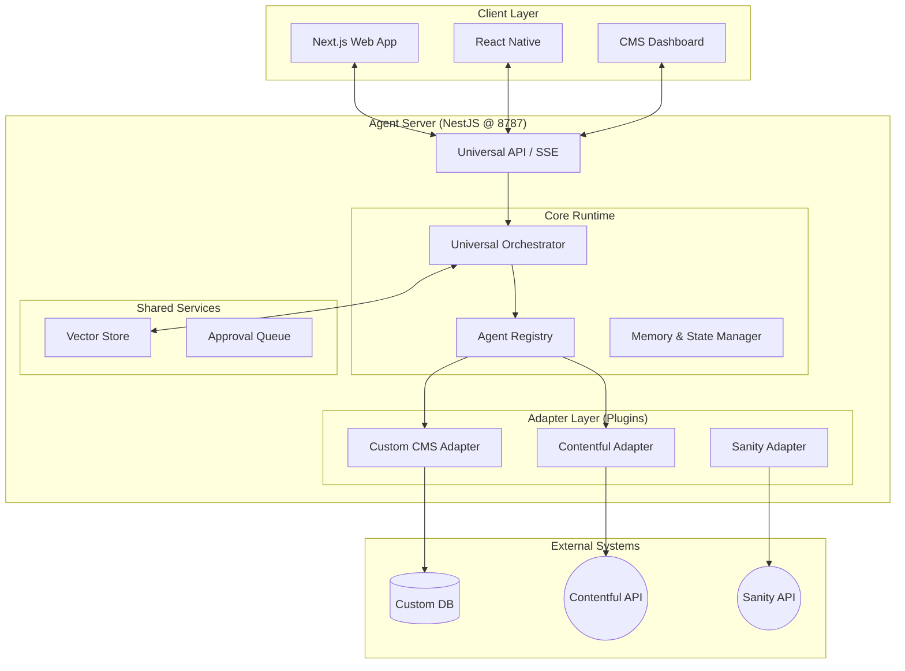

# Multiservice Agent Architecture Plan V4 (The Modular Adapter System)

**Date**: 2025-12-16
**Status**: APPROVED Strategy (Final)
**Architecture Style**: Hexagonal / Layered (Adapters & Ports)
**Key Concept**: "Agents as Composable Modules"

---

## 1. Executive Summary

This architecture (V4) represents the evolution of our planning into a **Modular, Adapter-Based System**. It decouples the **Core Agent Runtime** from the specific CMS implementations, allowing the system to scale indefinitely across different content platforms (Contentful, Sanity, Custom DB).

**Core Philosophy**:
1.  **The Adapter Pattern**: The Agent Server is generic. All CMS-specific logic (Tools, Prompts, Auth, Schemas) is encapsulated in **Pluggable Adapters**.
2.  **The Agent Spectrum**: We do not have "One Agent". We have a registry of **Agent Classes** ranging from simple Q&A bots to complex, autonomous Workflow Engines.
3.  **Agents-as-Tools**: A complex agent (e.g., "Campaign Manager") can utilize other agents (e.g., "Researcher", "Content Writer") as tools, creating a highly composable hierarchy.

---

## 2. High-Level Architecture (Layered)

We adopt the precise separation of concerns requested:



---

## 3. The Agent Spectrum (Preconfigured Classes)

We define **Three distinct classes of agents**. These are not just different prompts; they use different *system architectures* and *tool permissions*.

### Type A: The Librarian (Informational)
*   **Goal**: Answer questions based on RAG or documentation.
*   **Autonomy**: Zero. Read-only.
*   **Tools**: `vector_search`, `read_docs`.
*   **Model**: Fast (o3-mini / gpt-4o-mini).
*   **Use Case**: "How do I format a blog post header?"

### Type B: The Scout (Task-Based / Free Roam)
*   **Goal**: Execute a specific, bounded task with autonomy to "figure it out".
*   **Autonomy**: Low/Medium. Can try multiple searches/reads but has no write access (or limited).
*   **Tools**: `web_search`, `cms_read`, `analyze_image`.
*   **Model**: Medium (gpt-4o).
*   **Use Case**: "Find the latest stats on AI adoption and summarize them for me."

### Type C: The Engineer (Workflow & Agency)
*   **Goal**: Execute complex, multi-step mutations with self-correction.
*   **Autonomy**: High (within workflow bounds).
*   **Capabilities**:
    *   **Self-Correction**: If a tool fails, it reads the error and retries with different params.
    *   **Task Tracking**: Maintains an internal `todo_list` mechanism to track progress.
    *   **Sub-Delegation**: Can call Type A or Type B agents as tools.
*   **Tools**: `cms_create`, `cms_update`, `code_interpreter`, `spawn_agent`.
*   **Model**: High/Reasoning (o1 / Claude 3.5 Sonnet / gpt-4o).
*   **Use Case**: "Create a 5-page microsite, seed it with content, and link it to the navbar."

---

## 4. The Adapter Layer Architecture

This is the system's scalability engine. An Adapter is a **NestJS Module** that implements a standard interface.

### 4.1 Adapter Interface Definition

```typescript
interface CmsAdapter {
  id: string; // e.g., 'contentful-v1'
  
  // 1. Tool Factory: Returns valid AI SDK Tools
  getTools(auth: AuthContext): Promise<Record<string, Tool>>;
  
  // 2. Prompt Factory: Instructions specific to this CMS
  getSystemPrompt(): Promise<string>;
  
  // 3. Schema Validation: Zod schemas for this CMS's data types
  getSchemas(): Record<string, z.ZodSchema>;
  
  // 4. Content Mapping: Normalized "Universal Content" format
  normalizeContent(entry: any): UniversalContent;
}
```

### 4.2 Dynamic Tool Injection
When a user connects a workspace to "Contentful", the Agent Server loads the `ContentfulAdapter`.
*   **Authentication**: The adapter handles API Keys/OAuth.
*   **Tool Generation**: The adapter generates tools like `contentful_create_entry`, `contentful_publish_asset` dynamically based on the user's Contentful content types.

---

## 5. Agent-Server Internal Design (NestJS)

### 5.1 Core Modules

*   **`AgentRuntimeModule`**:
    *   **`AgentFactory`**: The "Class" builder. It takes an Agent Type (A, B, C) + an Adapter + User Instructions and instantiates a `SessionProcessor`.
    *   **`SessionProcessor`**: The OpenCode-derived `while(true)` loop. It handles the `ToolCall` -> `Execute` -> `Stream` cycle.
*   **`AdapterRegistryModule`**:
    *   Scans `src/adapters/` for available CMS integrations.
    *   Dynamically loads the correct adapter for the current request context.
*   **`SharedServicesModule`**:
    *   **`VectorStoreService`**: Embeds documentation and user guidelines.
    *   **`HitlService` (Human-in-the-Loop)**: Intercepts destructive tools (`delete`, `publish`) and pushes them to an Approval Queue.

### 5.2 Workflow: "Agents as Tools"

The core innovation here is **Recursive Capability**.

1.  **Request**: "Research X and write a Blog Post about it."
2.  **Root Agent (Type C - Engineer)**:
    *   Analyzes request.
    *   Realizes it needs research.
    *   **Call Tool**: `spawn_agent({ type: 'scout', task: 'Research X' })`.
3.  **Child Agent (Type B - Scout)**:
    *   Spins up.
    *   Executes `web_search`.
    *   Summarizes findings.
    *   **Returns Result**: "Here is the summary of X..."
4.  **Root Agent**:
    *   Receives summary.
    *   **Call Tool**: `cms_create_post({ content: summary })`.

---

## 6. Implementation Stages (Revised for V4)

### Stage 1: The Skeleton & Core Runtime (Week 1)
*   **Goal**: A NestJS server running a generic agents.
*   **Tasks**:
    *   Setup NestJS Monorepo.
    *   Implement `SessionProcessor` (The Engine).
    *   Implement `AgentFactory` (The Configurator).
    *   Create `MockAdapter` (In-memory DB) for testing.

### Stage 2: The Adapter Layer (Week 2)
*   **Goal**: Pluggable CMS support.
*   **Tasks**:
    *   Define `CmsAdapter` interface.
    *   Implement `CustomCmsAdapter` (Connecting to our own DB).
    *   Implement `ContentfulAdapter` (Using Contentful API).
    *   Verify dynamic tool switching based on active adapter.

### Stage 3: Agent Classes & Autonomy (Week 3)
*   **Goal**: Specialized intelligence.
*   **Tasks**:
    *   Implement **Type A (Librarian)** with RAG.
    *   Implement **Type C (Engineer)** with `todo_list` state tracking and self-correction loops.
    *   Implement `spawn_agent` tool for nesting.

### Stage 4: Enterprise Features (Week 4)
*   **Goal**: Production ready.
*   **Tasks**:
    *   **Approval Queue**: "Tool X requires approval".
    *   **Live Preview**: Connect `apps/preview-engine` via SSE.

---

## 7. Scalability & Extensibility

*   **Adding a new CMS?** Just write a new Adapter class in `src/adapters/`. No core changes needed.
*   **New Agent Capability?** Add a new Agent Type in `AgentFactory` or a new shared tool in `SharedServices`.
*   **Scaling Load?** The Agent Server is stateless (state is in DB/Redis). Spin up 100 instances of the NestJS server behind a load balancer.

This plans fulfills the vision of a **Universal Agent Platform** that serves as the brain between the Client Layer and the Data Layer.
