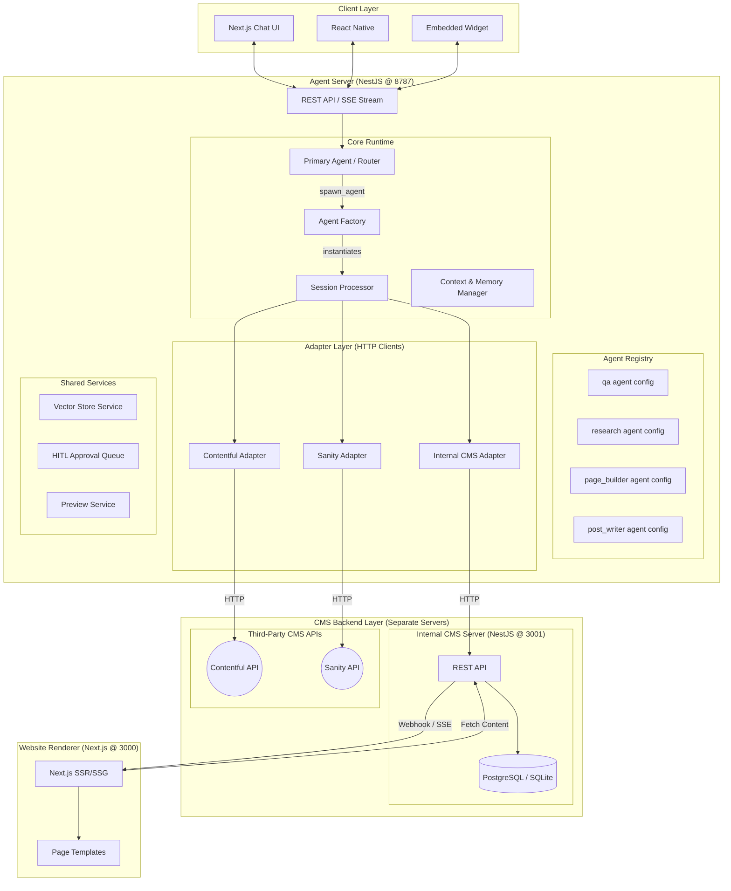

# Multiservice Agent Architecture Plan V5 (CMS-Focused Modular Agents)

**Date**: 2025-12-16
**Status**: APPROVED Final Architecture
**Architecture Style**: Hexagonal / Adapter-Based + Composable Agents
**Key Concept**: "Agents are Configurable Blueprints, not Fixed Types"

---

## 1. Executive Summary

This architecture (V5) refines the system into a **Practical CMS Agent Platform**. It removes the abstract "Librarian/Scout/Engineer" naming in favor of **Natural Agent Categories** that map directly to what a CMS admin would understand.

**Key Principles**:
1.  **Agents are Configurable**: An "Agent" is a *configuration object* (System Prompt + Tool Set + Model) not a hardcoded class.
2.  **Two Tiers**: "General Purpose" agents (Q&A, Research) vs. "Domain Specific" agents (Page Builder, Post Writer, Bulk Editor).
3.  **CMS Scoped**: Users manage **Sections from Templates**, compose pages, write posts. No "build from scratch" capability.

---

## 2. The CMS Capability Scope

Before defining agents, we define **what users can do in this CMS**:

| Capability | Description |
|---|---|
| **Content Composition** | Compose pages using pre-built section templates (Hero, Features, CTA). |
| **Content Editing** | Update text, images, links within existing sections. |
| **Blog Management** | Create, edit, publish blog posts. |
| **Global Data** | Manage site-wide settings (Logo, Nav, Footer, SEO). |
| **Media Handling** | Upload images, search stock photos, manage media library. |
| **Bulk Operations** | Update multiple entries at once (e.g., change all CTAs). |

*No: Building custom components, editing code, modifying schemas.*

---

## 3. Agent Categories (Natural Names)

We define agents with **practical, CMS-centric names**.

### 3.1 General Purpose Agents

| Agent | Role | Model | Tools | Autonomy |
|---|---|---|---|---|
| **`qa`** | Answer questions about CMS, content, guidelines. | Fast (gpt-4o-mini) | `vector_search`, `cms_read` | None (Read-only) |
| **`research`** | Find information (Web, Docs, CMS). | Medium (gpt-4o) | `web_search`, `image_search`, `cms_read`, `vector_search` | Low (Multi-step search) |

### 3.2 Domain Specific Agents (Workflow-Guided)

| Agent | Role | Model | Tools | Autonomy |
|---|---|---|---|---|
| **`page_builder`** | Compose a new page from section templates. | High (gpt-4o / o1-mini) | `cms_list_templates`, `cms_add_section`, `cms_update_section`, `cms_preview`, `spawn_agent` | Medium (Self-corrects, tracks progress) |
| **`post_writer`** | Draft and publish blog posts. | High (gpt-4o) | `cms_create_post`, `cms_update_post`, `cms_publish_post`, `image_search`, `spawn_agent` | Medium |
| **`bulk_editor`** | Execute batch content changes. | High (gpt-4o) | `cms_batch_update`, `cms_batch_delete` | High (Requires HITL for destructive ops) |
| **`media_manager`** | Upload, search, organize media. | Medium (gpt-4o) | `media_upload`, `image_search`, `media_tag` | Low |

### 3.3 The Primary Orchestrator

| Agent | Role | Model | Tools | Autonomy |
|---|---|---|---|---|
| **`primary`** (Router) | Understands user intent and delegates to the right specialist. | Medium (gpt-4o) | `spawn_agent` (to call any other agent) | Low (Routes, doesn't execute) |

---

## 4. Agent Configuration Model

An agent is **not a class**, it's a **data configuration**. This enables easy creation/modification without code changes.

```typescript
// Agent Configuration Schema (Stored in DB or YAML)
interface AgentConfig {
  id: string;                          // 'page_builder'
  name: string;                        // 'Page Builder'
  description: string;                 // 'Compose new pages...'
  mode: 'primary' | 'general' | 'domain';
  
  // Model Selection
  model: {
    default: string;                   // 'gpt-4o'
    reasoning?: string;                // 'o1-mini' (for complex planning steps)
  };
  
  // System Prompt (Can import .txt files)
  prompt: string | { file: string };
  
  // Tool Access (Whitelist)
  tools: string[];                     // ['cms_add_section', 'cms_preview']
  
  // Permissions
  permission: {
    write: 'allow' | 'ask' | 'deny';   // Default behavior for mutations
    delete: 'allow' | 'ask' | 'deny';
  };
  
  // Autonomy Settings
  maxSteps?: number;                   // Limit on tool loop iterations
  canSpawnAgents?: boolean;            // Can use spawn_agent tool
}
```

---

## 5. High-Level Architecture

The system consists of **four independent services**:
1.  **Client Layer**: Any frontend for the Agent Chat (Web, Mobile, Dashboard widget).
2.  **Agent Server**: The AI brain (NestJS @ 8787). Stateless, scalable.
3.  **CMS Backend(s)**: Standalone servers with their own APIs and databases.
4.  **Website Renderer**: Next.js app that renders the actual website from CMS data.



---

## 6. The Adapter Layer (Per-CMS HTTP Clients)

Each adapter is an **HTTP client** that communicates with an external CMS server (including our own Internal CMS).

**Key Point**: Adapters do NOT contain database logic. They call CMS APIs over HTTP.

```typescript
interface CmsAdapter {
  id: string; // 'internal' | 'contentful' | 'sanity'
  
  // Base URL of the CMS API
  baseUrl: string; // e.g., 'http://localhost:3001/api' or 'https://api.contentful.com'
  
  // Returns tools scoped to this CMS (tools make HTTP calls)
  getTools(): Promise<Record<string, AiSdkTool>>;
  
  // CMS-specific prompt additions (e.g., "Contentful uses 'Entries'...")
  getPromptContext(): Promise<string>;
  
  // Data Schemas (For validation)
  getSchemas(): Record<string, z.ZodSchema>;
  
  // Auth handling (API Keys, OAuth tokens)
  authenticate(credentials: unknown): Promise<AuthContext>;
}
```

**Example Tools from `InternalCmsAdapter`** (All HTTP calls to Internal CMS Server):
- `cms_list_pages` -> `GET /api/pages`
- `cms_get_page` -> `GET /api/pages/:id`
- `cms_list_templates` -> `GET /api/templates`
- `cms_add_section` -> `POST /api/pages/:id/sections`
- `cms_update_section` -> `PATCH /api/sections/:id`
- `cms_delete_section` -> `DELETE /api/sections/:id`
- `cms_create_post` -> `POST /api/posts`
- `cms_publish_post` -> `POST /api/posts/:id/publish`
- `media_upload` -> `POST /api/media`
- `media_search` -> `GET /api/media?q=...`

---

## 6.1 Internal CMS Server (Standalone)

The Internal CMS is a **separate NestJS application** with its own database.

| Component | Description |
|---|---|
| **Server** | NestJS @ Port 3001 |
| **Database** | PostgreSQL (Production) / SQLite (Dev) |
| **API** | REST endpoints for Pages, Sections, Posts, Media, Templates |
| **Auth** | API Key or JWT validation |

This separation ensures:
1.  **Decoupling**: Agent Server can be deployed/scaled independently of CMS.
2.  **Multi-Tenancy Ready**: One Agent Server can connect to multiple CMS instances.
3.  **Testability**: CMS Server can be developed/tested without AI components.

---

## 6.2 Website Renderer (Next.js @ 3000)

The Website Renderer is a **separate Next.js application** that renders the actual public website from CMS content.

| Component | Description |
|---|---|
| **Server** | Next.js @ Port 3000 |
| **Mode (Dev)** | Hot-reloading via SSE/WebSocket from CMS Server on content changes |
| **Mode (Prod)** | Static Site Generation (SSG) with Incremental Static Regeneration (ISR) or full rebuild on webhook trigger |
| **Templates** | Pre-built React components for each Section type (Hero, Features, CTA, etc.) |

### Data Flow

1.  **Development**:
    *   CMS Server emits events (SSE or WebSocket) when content changes.
    *   Website Renderer listens and triggers Next.js Fast Refresh.
    *   Agent's `cms_preview` tool returns `http://localhost:3000/preview/[pageId]`.

2.  **Production**:
    *   CMS Server sends a webhook to the hosting platform (Vercel, Netlify) on publish.
    *   Hosting platform rebuilds or revalidates affected pages.
    *   Website serves statically generated HTML for performance.

### Why Separate?

*   **Performance**: The public website is pure Next.js SSG/ISR - no AI overhead.
*   **Security**: Public visitors never touch the Agent Server or CMS API directly.
*   **Flexibility**: Website can be hosted on Vercel Edge while Agent/CMS run elsewhere.

---

## 7. Execution Flow Example

**User**: "Create a new pricing page with a hero section and a pricing table."

1.  **Primary Agent (Router)** receives message.
2.  **Router** analyzes intent: "This is page creation -> delegate to `page_builder`".
3.  **Router** calls `spawn_agent({ agent_id: 'page_builder', task: '...' })`.
4.  **`page_builder` Agent (Child Session)** activates:
    *   **Step 1**: Calls `cms_list_templates` to see available sections.
    *   **Step 2**: Calls `cms_add_section({ page_id: 'new', template: 'hero' })`.
    *   **Step 3**: Calls `cms_add_section({ page_id: 'new', template: 'pricing_table' })`.
    *   **Step 4**: Calls `cms_preview({ page_id: 'new' })` -> Returns preview URL.
5.  **`page_builder`** returns result to **Primary Agent**.
6.  **Primary Agent** responds to user: "I've created a draft pricing page. [Preview Link]"

---

## 8. Memory & Context Strategy

*   **Session-Based**: Each conversation is a `Session`. Child agents create `Child Sessions`.
*   **Compaction**: Long sessions are summarized to keep context window efficient (OpenCode pattern).
*   **Working Memory**: Active "Plan" or "Todo List" is kept in a special prompt section, not lost during compaction.
*   **Vector Store**: Brand guidelines, past successful pages, and CMS documentation are embedded for RAG.

---

## 9. Human-in-the-Loop (HITL)

For non-technical users, **safety is paramount**.

*   **Approval Required Actions**:
    *   `cms_delete_*` (Any delete)
    *   `cms_publish_*` (Publishing live)
    *   `bulk_editor` operations
*   **UI**: When HITL is triggered, the chat shows:
    > "I'm about to publish [Page Name]. [Approve] [Reject] [Edit]"

---

## 10. Implementation Stages

### Stage 1: Core Runtime (Week 1)
*   NestJS setup.
*   `SessionProcessor` (The Loop).
*   `AgentFactory` (Config -> Instance).
*   Define `AgentConfig` schema.

### Stage 2: Agents & Registry (Week 2)
*   Implement `qa` agent (Simple RAG).
*   Implement `research` agent (Web search tool).
*   Implement `primary` agent (Router logic).
*   Implement `spawn_agent` tool.

### Stage 3: Domain Agents & Adapter (Week 3)
*   Implement `InternalCmsAdapter` with page/section/post tools.
*   Implement `page_builder` agent.
*   Implement `post_writer` agent.
*   Connect Memory/Compaction.

### Stage 4: UI & Polish (Week 4)
*   Next.js Chat UI with SSE streaming.
*   HITL Approval flow in UI.
*   Preview integration.

---

## 11. Extensibility

| To Add... | Action |
|---|---|
| New Agent | Add a new `AgentConfig` YAML/JSON file. No code. |
| New CMS | Implement the `CmsAdapter` interface in a new module. |
| New Tool | Add to `SharedTools` or to a specific Adapter's `getTools()`. |
| New Model | Update `model.default` in the relevant `AgentConfig`. |

This V5 plan delivers a **CMS-Native Agent Platform** with practical agent roles, clear separation of concerns, and a configuration-driven architecture for long-term scalability.

---

## 12. OpenCode Innovations to Adopt

The following patterns from OpenCode's battle-tested architecture should be incorporated:

### 12.1 Event Bus (Decoupled Communication)

**Pattern**: A typed pub/sub system for internal events.

```typescript
// Event definitions (typed)
const AgentEvents = {
  SessionStarted: BusEvent.define('session.started', z.object({ sessionId: z.string() })),
  ToolExecuted: BusEvent.define('tool.executed', z.object({ toolId: z.string(), result: z.any() })),
  ApprovalRequired: BusEvent.define('approval.required', z.object({ action: z.string() })),
};

// Publishing
Bus.publish(AgentEvents.ToolExecuted, { toolId: 'cms_add_section', result: {...} });

// Subscribing (e.g., in UI service)
Bus.subscribe(AgentEvents.ApprovalRequired, (data) => pushToClient(data));
```

**Benefit**: The UI, logging, and approval systems can react to agent events without tight coupling.

### 12.2 Retry Strategy with Error Classification

**Pattern**: Classifies errors and applies appropriate retry logic.

```typescript
// Error types
type RetryableError = 'rate_limit' | 'timeout' | 'transient';
type FatalError = 'auth_failed' | 'invalid_input' | 'permission_denied';

// Retry logic
function shouldRetry(error: Error): { retry: boolean; delay: number } {
  if (isRateLimitError(error)) return { retry: true, delay: exponentialBackoff(attempt) };
  if (isTimeoutError(error)) return { retry: true, delay: 1000 };
  return { retry: false, delay: 0 }; // Fatal
}
```

**Benefit**: Graceful handling of API hiccups without failing entire workflows.

### 12.3 Plugin Hooks (Lifecycle Events)

**Pattern**: Allow external code to hook into tool execution.

```typescript
// Hook points
await Plugin.trigger('tool.execute.before', { tool: 'cms_add_section', input });
const result = await tool.execute(input, ctx);
await Plugin.trigger('tool.execute.after', { tool: 'cms_add_section', result });
```

**Use Cases**:
- Logging/Analytics plugins
- Compliance checks before writes
- Custom validation per tenant

### 12.4 Prompt Reminders (Plan Continuity)

**Pattern**: Inject reminder prompts at intervals to keep the agent focused.

```typescript
// Every N steps, inject a reminder
if (step % 5 === 0) {
  messages.push({
    role: 'system',
    content: PLAN_REMINDER_PROMPT, // "Remember your current plan is: ..."
  });
}
```

**Benefit**: Prevents context drift in long workflows.

### 12.5 Doom Loop Detection

**Pattern**: Detect when the agent is stuck repeating the same action.

```typescript
const DOOM_THRESHOLD = 3;
const lastCalls = getLastToolCalls(sessionId, DOOM_THRESHOLD);

if (allIdentical(lastCalls)) {
  throw new DoomLoopError('Agent stuck in loop. Intervention required.');
}
```

**UI**: Shows "Agent seems stuck. [Intervene] [Let it continue]".

---

## 13. Architecture Comparison Summary

| Aspect | Current Prototype | OpenCode | V5 Plan |
|--------|-------------------|----------|---------|
| **Agent Loop** | Single `while(true)` | Single `while(true)` + Retry | `SessionProcessor` with Retry |
| **Multi-Agent** | None | `TaskTool` spawns child sessions | `spawn_agent` tool + Child Sessions |
| **Context Mgmt** | Basic trimming | Compaction + Pruning | Compaction + Pruning |
| **Routing** | None | None (single agent) | `primary` Router Agent |
| **Tools** | Static registry | Dynamic registry + MCP | Dynamic registry + Adapters |
| **Undo/Revert** | None | Snapshots | Not needed (CMS is template-based) |
| **Event System** | None | Full Event Bus | Event Bus (to add) |
| **Config** | Hardcoded | YAML/JSON config | `AgentConfig` schema |

**Conclusion**: V5 is superior to both the current prototype and raw OpenCode for a CMS use case because it adds:
1. **Routing** (OpenCode doesn't have this)
2. **CMS-specific tool scoping** (OpenCode is code-focused)
3. **Workflow-guided agents** (predictability for non-technical users)

The additions from Section 12 complete it into a production-grade system.
