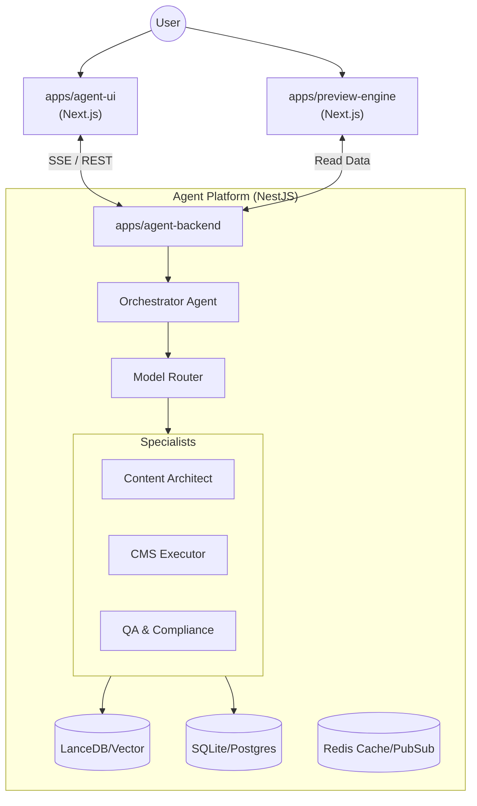

# High-Level Design: Multi-Agent CMS Architecture (React Agent Prototype Redesign)

**Date**: 2025-12-16  
**Status**: Proposed Architecture  
**Target Stack**: NestJS (Backend) + Next.js (Frontends) + AI SDK 6 (Agent Runtime)

---

## 1. Executive Summary

This design redesigns the current single-agent prototype into a robust, scalable **Multi-Agent System** (MAS). The goal is to separate concerns, improve reliability, and enable complex "Agency" workflows (planning, execution, review) that are difficult to manage with a single LLM context.

**Core Pivot**: Moving from a monolith Express server with one "God Agent" to a **NestJS modular backend** orchestrating a team of specialized agents.

## 2. System Architecture

We will adopt a **Monorepo** structure containing three distinct applications:



### 2.1 Component Breakdown

1.  **`apps/agent-backend` (NestJS)**: The brain. Hosts the AI SDK 6 runtime, manages the database, vector store, and allows for dynamic tool injection. It exposes a unified API for the frontend.
2.  **`apps/agent-ui` (Next.js)**: The command center. A chat interface that renders streamed agent events, tools, and provides Human-in-the-Loop (HITL) controls.
3.  **`apps/preview-engine` (Next.js)**: The renderer. Connects to the CMS data to generate live previews of websites based on templates and agent modifications.

---

## 3. NestJS Agent Backend Design

The backend will be structured using **NestJS Modules** to enforce separation of concerns and scalability.

### 3.1 Core Modules

*   **`AgentModule`**: Uses AI SDK 6 to define the agent runtime.
    *   **`OrchestratorService`**: The entry point for all requests. Maintains the high-level plan.
    *   **`AgentFactory`**: Dynamically instantiates specialist agents with specific tools and system prompts.
*   **`CmsModule`**:
    *   **`Adapters`**: Abstract strategy pattern to support different CMS targets (Internal SQLite, Contentful, Webflow).
    *   **`ToolDefinitions`**: Auto-generates AI SDK tool schemas from the active adapter.
*   **`MemoryModule`**:
    *   **`VectorStoreService`**: Manages LanceDB connection for RAG (retrieving brand guidelines, past plans).
    *   **`ContextService`**: Handles token management, conversation compression, and "Short-term" working memory.

### 3.2 AI SDK 6 Integration

We will use the **`streamText`** and **`generateText`** primitives from AI SDK 6, wrapped in NestJS services.

*   **Custom `AgentRuntime` Class**: A wrapper around AI SDK that handles:
    1.  **State Management**: Persisting tool calls and messages to the DB.
    2.  **Event Emission**: Streaming custom events (planning_start, tool_approval_request) via SSE.
    3.  **Tiered Model Routing**: Automatically selecting `o3-mini` (Tier 1) for routine tasks and `o1/gpt-4o` (Tier 2) for complex reasoning.

---

## 4. Multi-Agent Composition Strategy

Instead of one loop, we use a **Router-Solver** pattern.

### 4.1 The Agents

| Agent Role | Model Tier | Responsibility | Tools |
| :--- | :--- | :--- | :--- |
| **Orchestrator** | **Tier 1 (o3-mini)** | Traffic cop. Analyzes intent, breaks down tasks, delegates to specialists. | `delegate_task`, `search_knowledge`, `ask_user` |
| **Architect** | **Tier 2 (o1/Claude)** | Planner. Designs site structure, content strategy, and "Brand Voice". | `read_guidelines`, `propose_sitemap`, `draft_content` |
| **Executor** | **Tier 1 (o3-mini)** | Doer. Executes precise CMS mutations. | `create_page`, `update_section`, `upload_image` |
| **QA/Reviewer** | **Tier 1 (GPT-4o)** | Critic. Validates changes against the request and safety rules. | `diff_content`, `validate_links`, `check_compliance` |

### 4.2 Workflow Example: "Redesign the detailed pricing page"

1.  **Orchestrator** receives request. Recognizes "Redesign" implies planning + execution.
2.  **Orchestrator** calls **Architect Agent**: "Create a plan for a pricing page aimed at Enterprise users."
3.  **Architect** (Tier 2) thinks deeply, reads "Enterprise Brand Guidelines" from Vector Store, and outputs a structured JSON plan (Sections: Hero, Table, FAQ).
4.  **Orchestrator** reviews plan, then loops **Executor Agent**:
    *   "Create Section: Hero"
    *   "Update Content: Pricing Table"
5.  **Executor** runs tools.
6.  **Orchestrator** calls **QA Agent**: "Verify the new page matches the plan."
7.  **QA Agent** checks. If pass -> Final Answer.

---

## 5. Data & Context Management

### 5.1 Context Handling
*   **Token Trimming**: We will implement a `WorkingMemory` service that summarizes older interaction turns while keeping the latest "Plan" active in the system prompt.
*   **Compaction**: Triggered every 10 turns. An LLM summarizer compresses the history into key facts (e.g., "User prefers dark mode", "Active project is ID: 123").

### 5.2 Vector Search (RAG)
*   **Docs**: `docs/knowledge-base/` will be indexed.
*   **Usage**: The **Architect Agent** automatically queries the vector store when it detects ambiguity (e.g., "What is our refund policy?") before generating content.

---

## 6. Frontend Strategy

### 6.1 `apps/agent-ui`
*   **Stream Handling**: Uses `useChat` from AI SDK React.
*   **Agent Status**: A dedicated UI component showing *which* agent is currently active (e.g., "Architect is planning...", "Executor is working...").
*   **Generative UI**: When the agent wants to show a "Plan", it uses `streamUI` to render a React component (Interactive Sitemaps) instead of markdown text.

### 6.2 `apps/preview-engine`
*   **Dynamic Routing**: `/preview/[siteId]/[pageSlug]`
*   **Live Updates**: Uses a WebSocket or Polling to refetch CMS data immediately after the Executor Agent commits a change.

---

## 7. Implementation Roadmap

1.  **Phase 1: Foundation (Week 1)**
    *   Initialize Nx/Turbo monorepo.
    *   Scaffold NestJS backend with `AgentModule` and `CmsModule`.
    *   Port existing Drizzle schema and `sqlite.db` to the new backend.
2.  **Phase 2: The Brain (Week 2)**
    *   Implement AI SDK 6 in NestJS.
    *   Create the `Orchestrator` and `Executor` agents.
    *   Wire up the "Router" logic.
3.  **Phase 3: The UI (Week 3)**
    *   Build `agent-ui` chat interface.
    *   Implement SSE streaming for multi-agent events.
4.  **Phase 4: Specialists & Search (Week 4)**
    *   Add `Architect` agent (Tier 2 model integration).
    *   Set up LanceDB and `VectorStoreService`.
5.  **Phase 5: Polish**
    *   Preview engine integration.
    *   E2E testing of the full "Redesign" workflow.

## 8. Proposed Directory Structure (NestJS Backend)

```
apps/agent-backend/
├── src/
│   ├── app.module.ts
│   ├── main.ts
│   ├── agent/                 # Agent Domain
│   │   ├── agent.module.ts
│   │   ├── orchestration/    # The Router & Coordinator
│   │   ├── specialists/      # Specialized Agents
│   │   │   ├── architect.agent.ts
│   │   │   ├── executor.agent.ts
│   │   │   └── qa.agent.ts
│   │   └── tools/            # Dynamic Tool Registry
│   ├── cms/                   # CMS Domain
│   │   ├── adapters/         # CMS Adapters
│   │   │   ├── internal-sqlite/
│   │   │   └── contentful/
│   │   └── cms.service.ts
│   ├── memory/                # Memory Domain
│   │   ├── vector-store/     # LanceDB integration
│   │   └── context/          # Trimming/Compaction
│   └── shared/                # Shared Utils
│       ├── database/
│       └── types/
```
