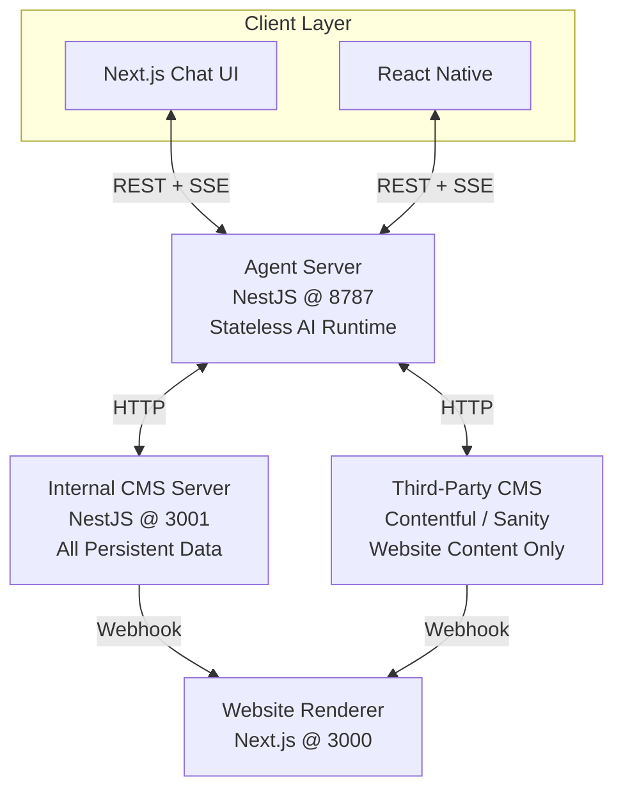
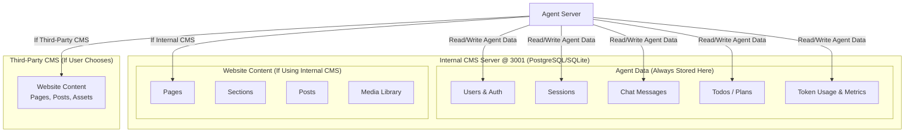
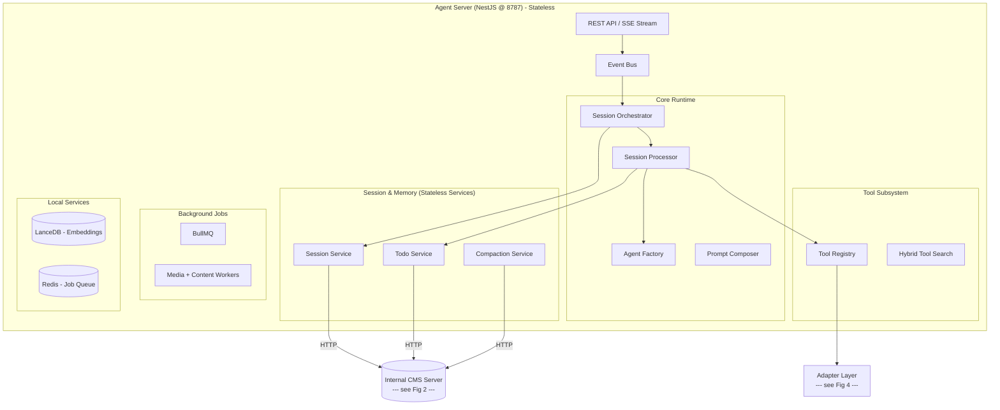
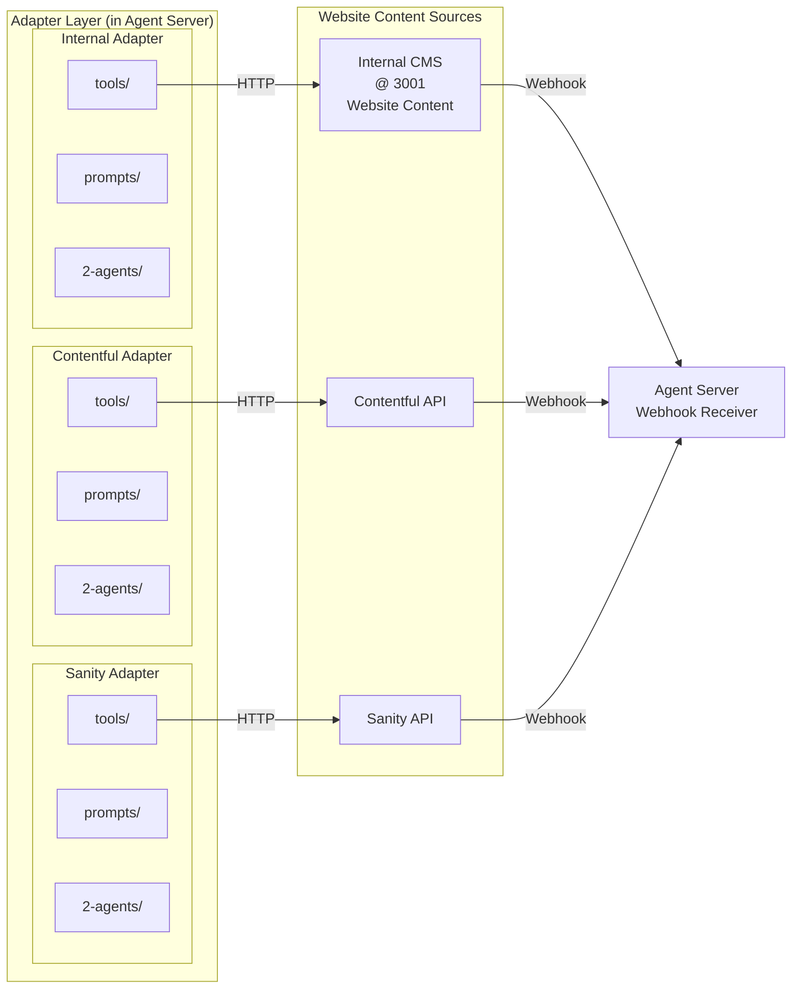
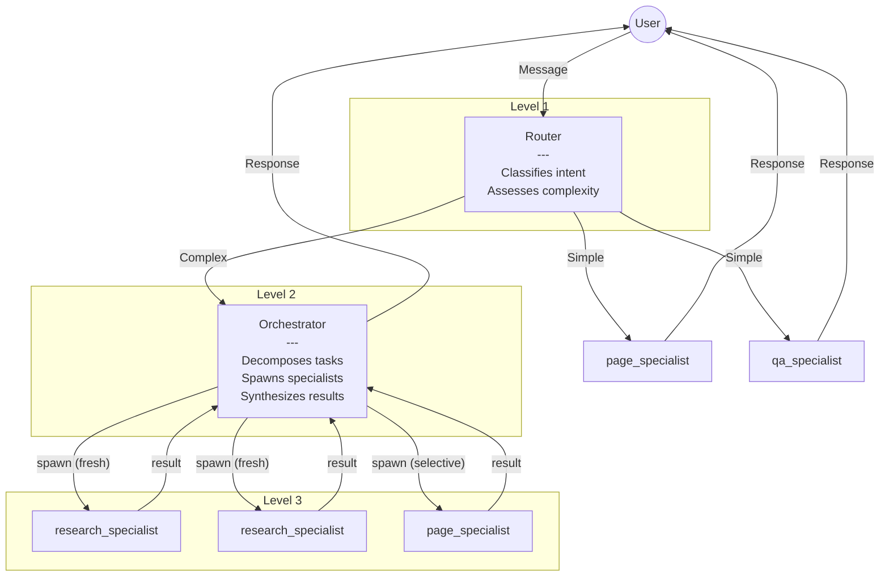

# Multiservice Agent Architecture V7 — Overview

> **Summary**: V7 is the complete, production-ready architecture that builds on V6 with a refined agent model: Router → Orchestrator → Specialist with fixed 3-level depth, context modes for optimized spawning, and feature flags for incremental rollout.
>
> **Prerequisites**: None (start here)

## Executive Summary

V7 is the **complete, production-ready architecture** that builds on V6 with a refined agent model:

**Foundation (from V6):**
- 4-service separation, adapter pattern, configurable agents
- Tool search, compaction, background jobs
- Event bus, retry strategy, doom loop detection

**V7 Enhancements:**
- Router → Orchestrator → Specialist model
- Context modes (fresh/inherited/selective)
- Feature flags for incremental rollout

---

## Key Changes from V6

| Aspect | V6 | V7 |
|--------|----|----|
| Agent types | `mode: 'primary' \| 'general' \| 'domain'` | `type: 'router' \| 'orchestrator' \| 'specialist'` |
| Orchestrators | Multiple domain-specific | ONE general-purpose orchestrator |
| Max depth | Configurable (default 3) | Fixed at 3, enforced by `canSpawn: false` |
| spawn_agent tool | Exposed to LLM | Internal to orchestrator only |
| Routing | Implicit in primary agent prompt | Explicit router with complexity assessment |
| Context passing | Always inherited | fresh/inherited/selective modes |
| Feature flags | None | SystemConfig for incremental rollout |

---

## V7 Agent Model

```
7 agents total:
  1 router         (intent + complexity classification)
  1 orchestrator   (task decomposition + coordination)
  5 specialists    (page, post, research, image, qa)

3 levels max:
  Router → Orchestrator → Specialists (complex tasks)
  Router → Specialist (simple tasks)
```

---

## System Diagrams

### Fig 1: High-Level Service Overview

Shows the 4 main services and how they connect.



### Fig 2: Data Storage Architecture (Critical)

**Our Internal CMS Server is the single source of truth for ALL persistent agent data**, regardless of which CMS the user chooses for their website content.



**Key Insight**: Even if a user connects Contentful or Sanity for their website content, they still have an account in our Internal CMS Server. This is where we store:

| Data Type | Stored In | Notes |
|-----------|-----------|-------|
| **Users & Authentication** | Internal CMS Server | All users register here |
| **Sessions** | Internal CMS Server | Parent/child session hierarchy |
| **Chat Messages** | Internal CMS Server | Full conversation history |
| **Todos** | Internal CMS Server | Simple plan tracking (OpenCode-style) |
| **Token Usage & Metrics** | Internal CMS Server | Observability, billing |
| **Website Content** | User's chosen CMS | Internal CMS OR Contentful/Sanity |

This design allows the Agent to be a **standalone product** that works with any CMS while maintaining consistent user management and observability.

### Fig 3: Agent Server Internal Architecture

The Agent Server is **stateless** - all persistent data is stored in the Internal CMS Server (see Fig 2). Connects to CMS backends via Adapters (see Fig 4).



### Fig 4: Adapter Layer & CMS Connections

Each adapter is a **self-contained bundle** with tools, prompts, agents, and schemas. The Internal Adapter talks to our CMS Server for website content. Third-party adapters talk to external APIs.



### Fig 5: V7 Multi-Agent Architecture



---

## Key Architecture Principles

1. **Agents are Configurations**: Not hardcoded classes. Each agent is defined by `AgentConfig` with `type`, tools, permissions, and autonomy settings.

2. **3-Level Maximum Depth**: Router → Orchestrator → Specialists. Fixed, not configurable.

3. **ONE Orchestrator**: Domain knowledge lives in specialists and their prompts. Orchestrator is a domain-agnostic coordinator.

4. **Specialists Cannot Spawn**: `canSpawn: false` enforced in all specialist configs. Tools only, no sub-agents.

5. **Context Modes**: Fresh context for independent parallel items, selective context for dependent workflow steps.

6. **Simple Memory**: Chat history + compaction handles context. Optional todo list for orchestrator.

7. **Feature Flags**: Incremental rollout via SystemConfig. MVP can ship without orchestration.

8. **HITL Integration**: Destructive operations require human approval based on agent permission settings.

9. **Adapter Modularity**: Each CMS adapter bundles its own tools, prompts, agents, and schemas.

10. **Stateless Agent Server**: All persistent data in Internal CMS Server enables horizontal scaling.

---

## Subsystem Placement Matrix

### Agent Server Subsystems (Stateless Runtime)

| Subsystem | Location | Responsibility | Persists Data To |
|-----------|----------|----------------|------------------|
| **Event Bus** | Agent Server | Typed pub/sub for all agent events | - (in-memory) |
| **Session Orchestrator** | Agent Server | Entry point for all session operations; manages session lifecycle, parent/child relationships, cancellation propagation | Internal CMS Server |
| **Session Processor** | Agent Server | Runs the agent loop for ONE session; handles tool execution, streaming, retry | Internal CMS Server |
| **Agent Factory** | Agent Server | Loads and caches AgentConfig by ID; merges shared + adapter-specific agents | - (in-memory cache) |
| **Session Service** | Agent Server | CRUD for sessions, messages | Internal CMS Server |
| **Todo Service** | Agent Server | Simple plan tracking (OpenCode-style) | Internal CMS Server |
| **Compaction Service** | Agent Server | Summarizes long contexts | Internal CMS Server |
| **Tool Registry** | Agent Server | Loads built-in + adapter + MCP tools | - (in-memory) |
| **MCP Loader** | Agent Server | Connects to MCP plugin servers | External MCP servers |
| **Hybrid Tool Search** | Agent Server | BM25 + Vector search for tools | LanceDB (local) |
| **Vector Store (LanceDB)** | Agent Server | Embeddings for RAG + tool search | LanceDB (local) |
| **BullMQ + Redis** | Agent Server | Job queue for async tasks | Redis (local) |
| **Media Worker** | Agent Server | Generates metadata, embeddings | Internal CMS Server + LanceDB |
| **Content Worker** | Agent Server | Generates RAG embeddings | LanceDB |

### Internal CMS Server Data (Persistent Storage)

| Data Type | Stored In | Used By |
|-----------|-----------|---------|
| **Users & Auth** | Internal CMS Server (PostgreSQL/SQLite) | Agent Server (future) |
| **Sessions** | Internal CMS Server | Session Service |
| **Messages (Chat History)** | Internal CMS Server | Session Service, Compaction |
| **Todos (Plan Tracking)** | Internal CMS Server | Todo Service |
| **Token Usage & Metrics** | Internal CMS Server | Observability (future) |
| **Website Content** | Internal CMS Server OR Third-Party CMS | Adapters |

**Note**: The Agent Server is stateless - all persistent agent data (sessions, messages, todos) is stored in the Internal CMS Server via HTTP calls. This allows horizontal scaling of Agent Server instances.

---

## Related Documents

- → [1-subsystems/01-service-architecture.md](1-subsystems/01-service-architecture.md) - Deep dive into 4-service model
- → [2-agents/08-agent-model.md](2-agents/08-agent-model.md) - Router/Orchestrator/Specialist details
- → [2-agents/09-agent-catalog.md](2-agents/09-agent-catalog.md) - All 7 agent configurations
- ↗ [4-appendices/appendix-d-changelog.md](4-appendices/appendix-d-changelog.md) - V5 → V6 → V7 evolution
