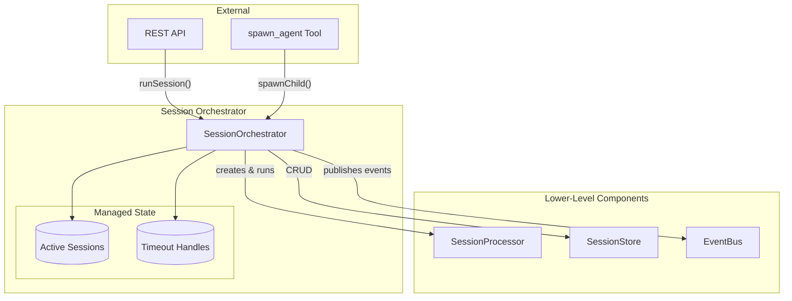
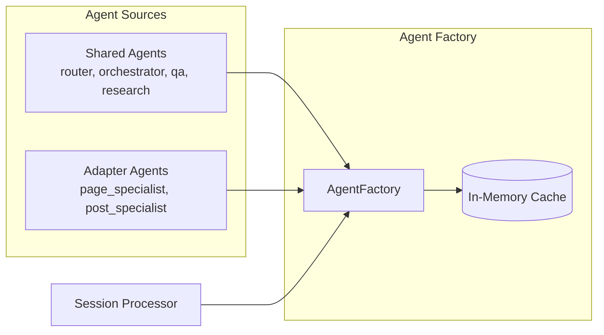

# Agent Server Internals

> **Summary**: The Agent Server is a stateless NestJS application that hosts the AI runtime. It contains the core agent loop, tool registry, memory services, and background job workers. All persistent data is stored externally in the Internal CMS Server.
>
> **Prerequisites**: [00-overview.md](../00-overview.md), [01-service-architecture.md](01-service-architecture.md)

## Overview

The Agent Server (NestJS @ 8787) is the **stateless AI runtime**. It processes user messages, runs agent loops, executes tools, and streams responses. All persistent data lives in the Internal CMS Server.

---

## Core Runtime Components

### Session Orchestrator

**Responsibility**: Entry point for all session operations. Manages session lifecycle, parent/child relationships, and cancellation propagation.



**Key methods**:
- `runSession(sessionId, message)` - Main entry point for user messages
- `spawnChild(options)` - Create and run child sessions
- `abortSession(sessionId, reason)` - Cancel session and all children

→ See [../2-agents/10-spawning-flow.md](../2-agents/10-spawning-flow.md) for `spawnChild` implementation

#### runSession Implementation

```typescript
class SessionOrchestrator {
  private activeSessions: Map<string, AbortController> = new Map();
  private timeoutHandles: Map<string, NodeJS.Timeout> = new Map();

  async runSession(sessionId: string, userMessage: string): Promise<SessionResult> {
    const session = await this.sessionStore.get(sessionId);
    const startTime = Date.now();

    // Setup abort controller for cancellation
    const abortController = new AbortController();
    this.activeSessions.set(sessionId, abortController);

    // Setup timeout (default: 5 minutes)
    const maxDuration = this.config.defaultMaxDuration;
    const timeoutHandle = setTimeout(() => {
      this.abortSession(sessionId, 'timeout');
    }, maxDuration);
    this.timeoutHandles.set(sessionId, timeoutHandle);

    try {
      this.eventBus.publish('session.started', {
        sessionId,
        agentId: session.agentId,
        userId: session.userId,
        parentId: session.parentId,
      });

      const processor = this.processorFactory();
      const result = await processor.run(sessionId, userMessage, abortController.signal);

      await this.sessionStore.update(sessionId, {
        status: 'completed',
        finalResponse: result.finalResponse,
        artifacts: result.artifacts,
        metadata: { ...session.metadata, totalTokens: result.totalTokens, totalSteps: result.totalSteps },
      });

      this.eventBus.publish('session.completed', {
        sessionId,
        result: result.finalResponse,
        artifacts: result.artifacts,
      });

      return {
        sessionId,
        status: 'completed',
        finalResponse: result.finalResponse,
        artifacts: result.artifacts,
        metrics: { totalTokens: result.totalTokens, totalSteps: result.totalSteps, durationMs: Date.now() - startTime },
      };

    } catch (error) {
      const status = abortController.signal.aborted ? 'aborted' : 'error';
      await this.sessionStore.update(sessionId, { status });
      this.eventBus.publish('session.error', { sessionId, error: error.message, recoverable: status === 'aborted' });
      return { sessionId, status, error: error.message, metrics: { totalTokens: 0, totalSteps: 0, durationMs: Date.now() - startTime } };
    } finally {
      this.activeSessions.delete(sessionId);
      const handle = this.timeoutHandles.get(sessionId);
      if (handle) { clearTimeout(handle); this.timeoutHandles.delete(sessionId); }
    }
  }
}
```

#### abortSession Implementation

```typescript
async abortSession(sessionId: string, reason: 'timeout' | 'user_cancelled' | 'parent_aborted'): Promise<void> {
  const session = await this.sessionStore.get(sessionId);

  // Abort this session
  const controller = this.activeSessions.get(sessionId);
  if (controller) {
    controller.abort();
  }

  // Recursively abort all children
  const childIds = session.metadata.childSessions || [];
  for (const childId of childIds) {
    await this.abortSession(childId, 'parent_aborted');
  }

  this.eventBus.publish('session.aborted', { sessionId, reason });
}
```

### Session Processor

**Responsibility**: Runs the agent loop for ONE session. Handles tool execution, streaming, retry logic, and doom loop detection.

**Key features**:
- AI SDK 6 integration (`streamText` with `stopWhen`, `prepareStep`)
- Error handling with retry/backoff
- Tool name repair (case-insensitive matching)
- Doom loop detection

→ See [../3-implementation/12-session-processor.md](../3-implementation/12-session-processor.md) for full implementation

### Why Not Just Tool-Wrapped Sub-Agents?

A simpler approach would be wrapping sub-agents as AI SDK tools (each tool runs its own `generateText` loop). That works for basic multi-agent, but this architecture adds production requirements:

| Requirement | Why It Matters |
|-------------|----------------|
| **Cancellation propagation** | Abort parent → automatically aborts all children |
| **Timeout enforcement** | Prevent runaway sub-agents from running forever |
| **Session persistence** | Save conversation history for debugging and resume |
| **Metrics rollup** | Track total tokens/cost across the entire agent tree |
| **UI observability** | Stream nested agent progress to the frontend via EventBus |

These are hard to retrofit. The Orchestrator layer provides them from the start.

### Agent Factory

**Responsibility**: Loads and caches `AgentConfig` objects. Merges shared agents with adapter-specific agents.



```typescript
class AgentFactory {
  private cache: Map<string, AgentConfig> = new Map();
  private cacheTimestamp: number = 0;
  private readonly CACHE_TTL_MS = 60_000;  // 1 minute

  /**
   * Get an agent config by ID.
   * Checks shared agents first, then active adapter's agents.
   */
  async get(agentId: string, cmsType: string): Promise<AgentConfig> {
    const cacheKey = `${cmsType}:${agentId}`;

    if (this.isCacheValid() && this.cache.has(cacheKey)) {
      return this.cache.get(cacheKey)!;
    }

    const config = await this.loadAgent(agentId, cmsType);
    this.cache.set(cacheKey, config);
    return config;
  }

  /**
   * List all available agents for a given CMS type.
   */
  async listAvailable(cmsType: string): Promise<AgentConfig[]> {
    const adapter = await this.adapterRegistry.get(cmsType);
    const adapterAgents = await adapter.getAgents();

    return [
      ...Object.values(this.sharedAgents),
      ...Object.values(adapterAgents),
    ];
  }
}
```

### Shared vs Adapter Agents

| Agent Type | Location | Examples | Override Behavior |
|------------|----------|----------|-------------------|
| **Shared** | `agent-server/src/2-agents/shared/` | `router`, `orchestrator`, `qa_specialist`, `research_specialist` | Used across all adapters |
| **Adapter-specific** | `adapters/{cms}/2-agents/` | `page_specialist`, `post_specialist` | CMS-specific implementations |

**Note**: The same agent ID can exist in both locations. Adapter agents take precedence.

---

## Session & Memory Services

### Session Service

**Responsibility**: CRUD for sessions and messages.

**Storage**: Internal CMS Server (via HTTP)

**Operations**:
- Create/get/update sessions
- Add messages to session
- Query session hierarchy (parent/children)

### Todo Service

**Responsibility**: Simple plan tracking (OpenCode-style).

**Storage**: Internal CMS Server (via HTTP)

**Schema**:
```typescript
interface TodoItem {
  id: string;
  content: string;
  status: 'pending' | 'in_progress' | 'completed' | 'cancelled';
  priority: 'high' | 'medium' | 'low';
}
```

**Tools**: `todowrite` and `todoread` - available to agents with `memory.todoEnabled: true`

### Compaction Service

**Responsibility**: Summarizes long contexts to stay within model limits.

**Two-phase approach**:
1. **Pruning**: Trim large tool outputs first (replace with `[trimmed]`)
2. **Summarization**: If still over limit, summarize older messages

**Provider-anchored**: Uses the provider's reported context window, not hardcoded values.

→ See [04-memory-subsystem.md](04-memory-subsystem.md) for full details

---

## Tool Subsystem

### Tool Registry

**Responsibility**: Loads and manages tools from three sources:
1. Built-in tools (`shared/`)
2. Adapter tools (`adapters/{cms}/tools/`)
3. MCP Plugin tools (external servers)

### Hybrid Tool Search

**Responsibility**: When agents have many tools (50+), use search instead of loading all:
1. BM25 lexical search (fast, keyword match)
2. Vector semantic search (understands intent)
3. Reciprocal rank fusion to blend results

→ See [03-tool-subsystem.md](03-tool-subsystem.md) for full details

---

## Background Jobs

### BullMQ + Redis

**Jobs run in Agent Server** because:
- Third-party CMSs don't allow custom workers
- Unified pipeline regardless of CMS source
- Direct vector store access (no HTTP overhead)

### Job Types

| Job | Trigger | Output |
|-----|---------|--------|
| `media.process` | Webhook/API | Image metadata |
| `media.embed` | After process | Embedding → LanceDB |
| `media.describe` | After process | AI-generated alt text |
| `content.embed` | Webhook | RAG embedding → LanceDB |
| `tool.index` | Tool registration | BM25 + Vector index |

→ See [06-background-jobs.md](06-background-jobs.md) for full details

---

## Local Services

### LanceDB (Vector Store)

**Purpose**: Embeddings for RAG and tool search

**Location**: Local to Agent Server

**Contents**:
- Content embeddings (for RAG search)
- Tool embeddings (for hybrid tool search)
- Image embeddings (for semantic image search)

### Redis

**Purpose**: Job queue for BullMQ

**Location**: Local (or external Redis Cluster for HA)

---

## Event Bus

**Responsibility**: Typed pub/sub for all agent events

**In-memory**: Does not persist events

**Subscribers**: UI (via SSE), logging, analytics

→ See [../3-implementation/13-event-bus.md](../3-implementation/13-event-bus.md) for event types

---

## Module Structure

```
agent-server/src/
├── core/
│   ├── event-bus/
│   │   ├── event-bus.service.ts
│   │   ├── event-types.ts
│   │   └── event-bus.module.ts
│   ├── session/
│   │   ├── session.orchestrator.ts   # Entry point
│   │   ├── session.processor.ts      # Agent loop
│   │   ├── session.store.ts
│   │   ├── doom-loop.detector.ts
│   │   └── session.module.ts
│   └── agent/
│       ├── agent.factory.ts
│       ├── agent.config.ts
│       └── agent.module.ts
├── memory/
│   ├── todo.service.ts
│   ├── compaction.service.ts
│   └── memory.module.ts
├── tools/
│   ├── _registry/
│   ├── _search/
│   ├── _loaders/
│   └── shared/
├── adapters/
├── workers/
├── services/
└── api/
```

---

## Key Decisions

| Decision | Rationale |
|----------|-----------|
| Stateless design | Horizontal scaling, any instance handles any request |
| In-memory event bus | Low latency, no persistence needed for events |
| LanceDB local | Fast vector operations, no external dependency |
| Agent Factory caching | Reduce config loading overhead |

---

## Related Documents

- → [03-tool-subsystem.md](03-tool-subsystem.md) - Tool registry details
- → [04-memory-subsystem.md](04-memory-subsystem.md) - Compaction and todos
- → [06-background-jobs.md](06-background-jobs.md) - Worker configuration
- → [../3-implementation/12-session-processor.md](../3-implementation/12-session-processor.md) - Processing flow
