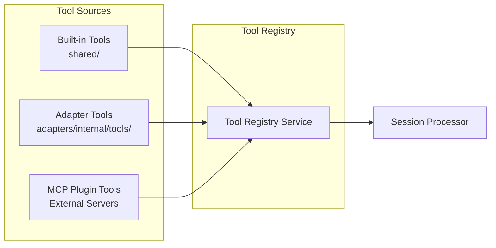

# Tool Subsystem

> **Summary**: The tool system is modular and searchable. Tools come from three sources: built-in, adapter-specific, and MCP plugins. When agents have many tools, hybrid search (BM25 + Vector) selects the most relevant ones.
>
> **Prerequisites**: [00-overview.md](../00-overview.md), [02-agent-server.md](02-agent-server.md)

## Overview

Tools are the **capabilities** that agents use to interact with the world. The tool subsystem handles:
- Loading tools from multiple sources
- Registering tools with schemas and metadata
- Searching for relevant tools when there are many
- Executing tools with proper context

---

## Tool Sources



### 1. Built-in Tools

Core tools bundled with Agent Server:
- `web_search` - Search the web
- `vector_search` - Semantic search over content
- `todowrite` / `todoread` - Plan tracking

### 2. Adapter Tools

CMS-specific tools from the active adapter:
- `cms_list_pages`, `cms_create_page`, etc.
- Different tools per CMS (Internal, Contentful, Sanity)

### 3. MCP Plugin Tools

External tools from Model Context Protocol servers:
- Airtable, Google Sheets, Notion, Slack, etc.
- Loaded dynamically via SSE connections

---

## Tool Interface

```typescript
interface ToolDefinition {
  id: string;
  name: string;
  description: string;
  category: 'cms' | 'search' | 'media' | 'utility';

  // For search indexing
  searchMetadata: {
    keywords: string[];
    useCases: string[];
  };

  // AI SDK compatible schema
  parameters: z.ZodSchema;

  // Execution
  execute: (input: unknown, ctx: ToolContext) => Promise<ToolResult>;
}

interface ToolContext {
  sessionId: string;
  agentId: string;
  userId: string;
  cmsType: string;
  abortSignal: AbortSignal;
  eventBus: EventBus;
  orchestrator: SessionOrchestrator;  // For spawn_agent tool
}
```

---

## Folder Structure

```
agent-server/src/tools/
├── _registry/
│   ├── tool-registry.service.ts    # Central registry
│   ├── mcp-loader.ts               # Loads tools from MCP servers
│   └── tool-types.ts               # Tool interface definitions
├── _search/
│   ├── hybrid-search.service.ts    # BM25 + Vector blending
│   ├── bm25-search.ts              # Lexical search
│   └── vector-search.ts            # Semantic search
├── _loaders/
│   └── dynamic-loader.ts           # Loads tools from adapters
└── shared/                         # Built-in tools (not CMS-specific)
    ├── web_search/
    │   ├── web_search.metadata.ts
    │   ├── web_search.tool.ts
    │   └── index.ts
    ├── vector_search/
    ├── spawn_agent/
    ├── todowrite/
    └── todoread/
```

---

## Hybrid Tool Search

When an agent has access to **many tools** (e.g., 50+), we don't load all into context. Instead, search for relevant tools.

### Search Algorithm

```typescript
class HybridToolSearchService {
  async search(query: string, limit: number = 10): Promise<ToolDefinition[]> {
    // 1. BM25 lexical search (fast, keyword match)
    const bm25Results = await this.bm25Search.search(query, limit * 2);

    // 2. Vector semantic search (understands intent)
    const vectorResults = await this.vectorSearch.search(query, limit * 2);

    // 3. Blend results (reciprocal rank fusion)
    return this.blendResults(bm25Results, vectorResults, limit);
  }

  private blendResults(
    bm25: ToolDefinition[],
    vector: ToolDefinition[],
    limit: number
  ): ToolDefinition[] {
    const scores = new Map<string, number>();

    // Reciprocal Rank Fusion
    bm25.forEach((tool, i) => {
      const rrf = 1 / (60 + i);  // k=60
      scores.set(tool.id, (scores.get(tool.id) || 0) + rrf);
    });

    vector.forEach((tool, i) => {
      const rrf = 1 / (60 + i);
      scores.set(tool.id, (scores.get(tool.id) || 0) + rrf);
    });

    // Sort by combined score
    return [...scores.entries()]
      .sort((a, b) => b[1] - a[1])
      .slice(0, limit)
      .map(([id]) => this.registry.get(id));
  }
}
```

### When to Use Search

| Agent Config | Behavior |
|--------------|----------|
| `tools: ['cms_listPages', 'cms_createPage']` | Load explicit list, no search |
| `tools: ['cms_*']` | Search within CMS tools |
| `tools: ['*']` | Search all available tools |
| `tools.searchEnabled: true` | Always use search |

---

## MCP Client Support

The Agent Server acts as an **MCP client** to connect to external MCP servers and consume their tools.

### Connection Config

```typescript
// SSE-only: Agent Server is stateless with no terminal access
interface McpConnectionConfig {
  id: string;
  name: string;
  url: string;             // SSE endpoint URL
  apiKey?: string;         // Optional auth
  enabled: boolean;
}
```

### Loading MCP Tools

```typescript
class McpClient {
  async loadTools(config: McpConnectionConfig): Promise<ToolDefinition[]> {
    const connection = await this.connect(config);
    const mcpTools = await connection.listTools();

    return mcpTools.map(tool => ({
      id: `mcp_${config.id}_${tool.name}`,
      name: tool.name,
      description: tool.description,
      category: 'utility',
      parameters: tool.inputSchema,
      execute: async (input, ctx) => {
        return await connection.callTool(tool.name, input);
      },
    }));
  }
}
```

### Example MCP Servers

- Airtable MCP - access Airtable bases
- Google Sheets MCP - read/write spreadsheets
- Notion MCP - access Notion databases
- Slack MCP - send messages, read channels

---

## Tool Registration Flow

```
1. Server Startup
   ├── Load built-in tools from shared/
   ├── Load adapter tools from active adapter
   ├── Connect to MCP servers
   └── Index all tools in search

2. Tool Indexing
   ├── Extract searchMetadata (keywords, useCases)
   ├── Generate BM25 index
   └── Generate vector embeddings → LanceDB

3. Tool Resolution (per request)
   ├── Get agent's tool config
   ├── If explicit list → load directly
   ├── If pattern/search → run hybrid search
   └── Return resolved ToolDefinition[]
```

---

## Tool Context Injection

All tools receive services via context:

```typescript
const toolContext: ToolContext = {
  sessionId,
  agentId: session.agentId,
  userId: session.userId,
  cmsType: session.cmsType,
  abortSignal,
  eventBus: this.eventBus,
  orchestrator: this.orchestrator,  // For spawn_agent
  spawningMode: agent.spawning?.mode || 'parallel',
};
```

This enables:
- Tools to emit events
- spawn_agent to create child sessions
- Tools to check abort signal
- Tools to access user context

---

## Key Decisions

| Decision | Rationale |
|----------|-----------|
| Hybrid search (BM25 + Vector) | Combines keyword precision with semantic understanding |
| Per-tool folder structure | Self-contained, easy to add/remove |
| MCP via SSE only | Agent Server is stateless, no stdio/terminal access |
| Context injection | Clean dependency injection, testable tools |

---

## Related Documents

- → [05-adapter-layer.md](05-adapter-layer.md) - How adapters bundle tools
- → [../3-implementation/12-session-processor.md](../3-implementation/12-session-processor.md) - Tool execution flow
- ↗ [../4-appendices/appendix-a-schemas.md](../4-appendices/appendix-a-schemas.md) - ToolDefinition schema
