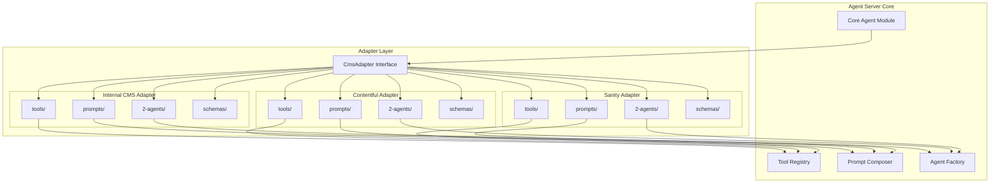

# Adapter Layer

> **Summary**: Each adapter is a self-contained, pluggable module that bundles everything needed for a specific CMS: tools, prompts, agents, and schemas. Adding a new CMS = creating a new adapter folder.
>
> **Prerequisites**: [00-overview.md](../00-overview.md), [03-tool-subsystem.md](03-tool-subsystem.md)

## Overview

Adapters are **portable, self-contained packages** that provide CMS-specific functionality. The adapter pattern enables:
- Supporting multiple CMSs with the same agent core
- Clean separation of CMS-specific code
- Easy addition of new CMS integrations

---

## Adapter Architecture



---

## Adapter Bundle Structure

Each adapter folder contains **everything bundled together**:

```
adapters/
├── adapter.interface.ts        # Common interface all adapters implement
├── adapter.registry.ts         # Loads and manages active adapters
│
├── internal/                   # Internal CMS Adapter (full bundle)
│   ├── tools/
│   │   ├── list-pages.tool.ts
│   │   ├── create-page.tool.ts
│   │   ├── update-section.tool.ts
│   │   └── index.ts            # Exports all tools
│   ├── prompts/
│   │   ├── page-builder.prompt.txt
│   │   ├── post-writer.prompt.txt
│   │   └── index.ts            # Exports all prompts
│   ├── 2-agents/
│   │   ├── page-builder.agent.ts
│   │   ├── post-writer.agent.ts
│   │   └── index.ts            # Exports agent configs
│   ├── schemas/
│   │   ├── page.schema.ts
│   │   ├── section.schema.ts
│   │   └── index.ts
│   ├── auth.ts                 # Auth handler for this CMS
│   └── index.ts                # Adapter entry point
│
├── contentful/                 # Contentful Adapter (full bundle)
│   ├── tools/
│   │   ├── list-entries.tool.ts
│   │   ├── create-entry.tool.ts
│   │   ├── publish-entry.tool.ts
│   │   └── index.ts
│   ├── prompts/
│   │   ├── content-editor.prompt.txt
│   │   └── index.ts
│   ├── 2-agents/
│   │   ├── content-editor.agent.ts
│   │   └── index.ts
│   ├── schemas/
│   │   ├── content-type.schema.ts
│   │   └── index.ts
│   ├── auth.ts                 # Contentful API key handling
│   ├── webhook-parser.ts       # Parse Contentful webhook payloads
│   └── index.ts
│
└── sanity/                     # Sanity Adapter (full bundle)
    ├── tools/
    ├── prompts/
    ├── 2-agents/
    ├── schemas/
    ├── auth.ts
    ├── webhook-parser.ts
    └── index.ts
```

---

## Adapter Interface

```typescript
interface CmsAdapter {
  id: string;                    // 'internal' | 'contentful' | 'sanity'
  name: string;                  // Human-readable name

  // ═══════════════════════════════════════════════════════════
  // BUNDLED COMPONENTS - Each adapter provides ALL of these
  // ═══════════════════════════════════════════════════════════

  // Tools specific to this CMS
  getTools(): Promise<Record<string, ToolDefinition>>;

  // Prompts specific to this CMS
  getPrompts(): Promise<Record<string, string>>;

  // Agent configurations specific to this CMS
  getAgents(): Promise<Record<string, AgentConfig>>;

  // Schema validators for this CMS's data models
  getSchemas(): Record<string, z.ZodSchema>;

  // ═══════════════════════════════════════════════════════════
  // RUNTIME METHODS
  // ═══════════════════════════════════════════════════════════

  // Context injected into all prompts when using this adapter
  getPromptContext(): Promise<string>;

  // Parse incoming webhooks from this CMS
  parseWebhook(payload: unknown): CmsWebhookEvent;

  // Authenticate with this CMS
  authenticate(credentials: unknown): Promise<void>;
}
```

---

## Implementation Example

```typescript
// adapters/internal/index.ts
import { tools } from './tools/index.js';
import { prompts } from './prompts/index.js';
import { agents } from './2-agents/index.js';
import { schemas } from './schemas/index.js';
import type { CmsAdapter } from '../adapter.interface.js';

export class InternalCmsAdapter implements CmsAdapter {
  id = 'internal';
  name = 'Internal CMS';

  constructor(private config: { baseUrl: string; apiKey: string }) {}

  // Return all tools bundled in this adapter
  async getTools() {
    return tools;  // { cms_list_pages, cms_create_page, ... }
  }

  // Return all prompts bundled in this adapter
  async getPrompts() {
    return prompts;  // { page_builder: '...', post_writer: '...' }
  }

  // Return all agent configs bundled in this adapter
  async getAgents() {
    return agents;  // { page_builder: AgentConfig, post_writer: AgentConfig }
  }

  // Return schema validators
  getSchemas() {
    return schemas;  // { page: z.object(...), section: z.object(...) }
  }

  // Runtime: inject CMS-specific context into prompts
  async getPromptContext(): Promise<string> {
    const templates = await this.fetchTemplateList();
    return `
      You are working with the Internal CMS.
      - Pages contain Sections
      - Sections use Templates: ${templates.join(', ')}
      - All content supports localization
    `;
  }

  // Runtime: parse webhooks from Internal CMS
  parseWebhook(payload: unknown): CmsWebhookEvent {
    return {
      type: payload.event,  // 'page.created', 'asset.uploaded'
      entityId: payload.id,
      entityType: payload.type,
      data: payload.data,
    };
  }
}
```

---

## Adapter Lifecycle

| Phase | Behavior |
|-------|----------|
| **Initialization** | Adapters instantiated at server startup based on configuration |
| **Per-request context** | Each request receives adapter instance with user's credentials injected |
| **Caching** | Adapters may cache CMS metadata (templates, content types) with TTL-based invalidation |
| **Shutdown** | Adapters release connections on server shutdown |

Adapters are **stateless between requests** - any cached data is for performance only and can be rebuilt from the CMS source.

---

## Adding a New CMS

To add support for a new CMS (e.g., Strapi):

### 1. Create Adapter Folder

```
adapters/strapi/
├── tools/
├── prompts/
├── 2-agents/
├── schemas/
├── auth.ts
├── webhook-parser.ts
└── index.ts
```

### 2. Implement Tools

```typescript
// adapters/strapi/tools/list-entries.tool.ts
export const listEntries: ToolDefinition = {
  id: 'strapi_list_entries',
  name: 'list_entries',
  description: 'List content entries from Strapi',
  category: 'cms',
  parameters: z.object({
    contentType: z.string(),
    limit: z.number().optional(),
  }),
  execute: async (input, ctx) => {
    const strapi = ctx.adapter as StrapiAdapter;
    return await strapi.client.findMany(input.contentType, {
      pagination: { limit: input.limit || 25 }
    });
  },
};
```

### 3. Implement Adapter

```typescript
// adapters/strapi/index.ts
export class StrapiAdapter implements CmsAdapter {
  id = 'strapi';
  name = 'Strapi CMS';

  // ... implement all interface methods
}
```

### 4. Register Adapter

```typescript
// adapters/adapter.registry.ts
import { StrapiAdapter } from './strapi/index.js';

const adapters = {
  internal: InternalCmsAdapter,
  contentful: ContentfulAdapter,
  sanity: SanityAdapter,
  strapi: StrapiAdapter,  // Add new adapter
};
```

---

## Webhook Handling

Each adapter parses webhooks from its CMS:

```typescript
// Agent Server: Webhook receiver
@Post('/webhooks/:adapterId')
async handleCmsWebhook(
  @Param('adapterId') adapterId: string,
  @Body() payload: unknown,
) {
  const adapter = this.adapterRegistry.get(adapterId);
  const event = adapter.parseWebhook(payload);

  switch (event.type) {
    case 'asset.created':
    case 'asset.updated':
      await this.queue.add('media.process', {
        adapterId,
        assetId: event.assetId,
        assetUrl: event.url,
      });
      break;

    case 'entry.published':
      await this.queue.add('content.embed', {
        adapterId,
        entryId: event.entryId,
        content: event.content,
      });
      break;
  }
}
```

---

## Key Decisions

| Decision | Rationale |
|----------|-----------|
| Bundle everything together | Tools, prompts, agents co-located for portability |
| Interface-based design | Easy to add new CMSs without changing core |
| Stateless between requests | Enables horizontal scaling |
| Webhook parsing per adapter | Each CMS has different payload formats |

---

## Related Documents

- → [03-tool-subsystem.md](03-tool-subsystem.md) - How tools are loaded from adapters
- → [06-background-jobs.md](06-background-jobs.md) - Webhook job processing
- → [07-internal-cms.md](07-internal-cms.md) - Internal CMS adapter target
- ↗ [../4-appendices/appendix-a-schemas.md](../4-appendices/appendix-a-schemas.md) - CmsAdapter interface
