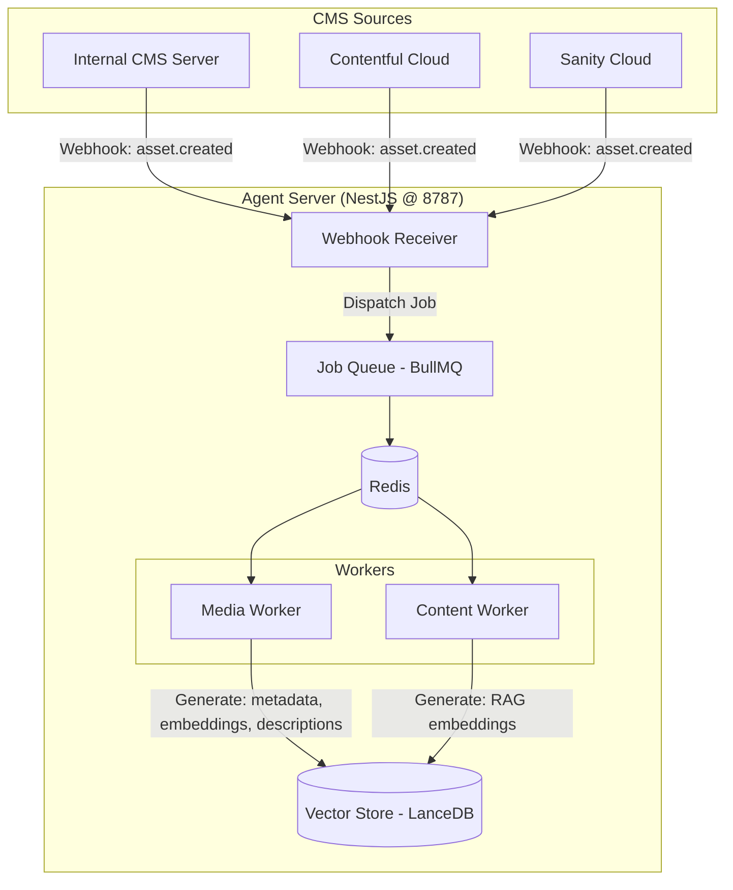

# Background Jobs

> **Summary**: Background jobs (image processing, embedding generation) live in the Agent Server using BullMQ + Redis. This is necessary because third-party CMSs don't allow custom workers, and we need a unified pipeline regardless of CMS source.
>
> **Prerequisites**: [00-overview.md](../00-overview.md), [02-agent-server.md](02-agent-server.md)

## Overview

Background jobs handle async tasks that shouldn't block the agent loop:
- Media processing (metadata extraction, optimization)
- Embedding generation (for RAG and image search)
- AI-generated descriptions (alt text, tags)

---

## Why Jobs Live in Agent Server

**Key Insight**: Background jobs must live in the **Agent Server**, not the CMS Server.

| Reason | Explanation |
|--------|-------------|
| Third-party CMSs don't allow workers | Contentful, Sanity are cloud services - no custom code |
| Unified pipeline | Same processing regardless of CMS source |
| Direct vector store access | No HTTP overhead for embeddings |

---

## Architecture



---

## Job Types

| Job | Trigger | Input | Output |
|-----|---------|-------|--------|
| `media.process` | Webhook or API call | Image URL from any CMS | Metadata (dimensions, format, colors) |
| `media.embed` | After `media.process` | Image + metadata | Embedding → Vector Store |
| `media.describe` | After `media.process` | Image URL | AI-generated alt text, tags |
| `content.embed` | Webhook: `entry.published` | Content JSON | RAG embedding → Vector Store |
| `tool.index` | Tool registration | Tool metadata | BM25 + Vector index |

---

## Job Flow

### Media Processing Pipeline

```
1. Webhook received (asset.created)
   └── Dispatch: media.process

2. media.process
   ├── Download image
   ├── Extract metadata (dimensions, format, EXIF)
   ├── Extract dominant colors
   └── Dispatch: media.embed, media.describe

3. media.embed
   ├── Generate image embedding
   └── Store in LanceDB

4. media.describe
   ├── Call vision model for description
   ├── Generate alt text
   ├── Extract tags
   └── Store metadata in CMS
```

### Content Embedding Pipeline

```
1. Webhook received (entry.published)
   └── Dispatch: content.embed

2. content.embed
   ├── Extract text from content fields
   ├── Chunk if necessary
   ├── Generate embeddings
   └── Store in LanceDB
```

---

## BullMQ Configuration

```typescript
// workers/queue.service.ts
import { Queue, Worker } from 'bullmq';
import Redis from 'ioredis';

const connection = new Redis(process.env.REDIS_URL);

// Queues
export const mediaQueue = new Queue('media', { connection });
export const contentQueue = new Queue('content', { connection });

// Default job options
const defaultJobOptions = {
  attempts: 3,
  backoff: {
    type: 'exponential',
    delay: 1000,
  },
  removeOnComplete: 100,  // Keep last 100 completed
  removeOnFail: 1000,     // Keep last 1000 failed
};
```

---

## Worker Implementations

### Media Worker

```typescript
// workers/media.worker.ts
import { Worker, Job } from 'bullmq';
import sharp from 'sharp';

const mediaWorker = new Worker('media', async (job: Job) => {
  switch (job.name) {
    case 'media.process':
      return await processMedia(job.data);
    case 'media.embed':
      return await embedMedia(job.data);
    case 'media.describe':
      return await describeMedia(job.data);
  }
}, { connection });

async function processMedia(data: { adapterId: string; assetUrl: string }) {
  // 1. Download image
  const imageBuffer = await fetch(data.assetUrl).then(r => r.arrayBuffer());

  // 2. Extract metadata with Sharp
  const metadata = await sharp(imageBuffer).metadata();

  // 3. Extract dominant colors
  const { dominant } = await sharp(imageBuffer)
    .resize(100, 100, { fit: 'cover' })
    .stats();

  // 4. Dispatch follow-up jobs
  await mediaQueue.add('media.embed', { ...data, metadata });
  await mediaQueue.add('media.describe', { ...data, metadata });

  return { metadata, colors: dominant };
}

async function embedMedia(data: { assetUrl: string; metadata: any }) {
  // Generate image embedding via vision model
  const embedding = await embeddingService.embedImage(data.assetUrl);

  // Store in LanceDB
  await vectorStore.upsert('images', {
    id: data.assetId,
    embedding,
    metadata: data.metadata,
  });

  return { success: true };
}

async function describeMedia(data: { assetUrl: string }) {
  // Call vision model for description
  const description = await openai.chat.completions.create({
    model: 'gpt-4o-mini',
    messages: [{
      role: 'user',
      content: [
        { type: 'text', text: 'Describe this image briefly. Include: subject, mood, colors.' },
        { type: 'image_url', image_url: { url: data.assetUrl } },
      ],
    }],
  });

  return {
    description: description.choices[0].message.content,
    altText: generateAltText(description),
    tags: extractTags(description),
  };
}
```

### Content Worker

```typescript
// workers/content.worker.ts
const contentWorker = new Worker('content', async (job: Job) => {
  switch (job.name) {
    case 'content.embed':
      return await embedContent(job.data);
  }
}, { connection });

async function embedContent(data: { entryId: string; content: any }) {
  // 1. Extract text from content
  const text = extractText(data.content);

  // 2. Chunk if needed (for long content)
  const chunks = chunkText(text, { maxTokens: 500, overlap: 50 });

  // 3. Generate embeddings
  const embeddings = await Promise.all(
    chunks.map(chunk => embeddingService.embed(chunk))
  );

  // 4. Store in LanceDB
  for (let i = 0; i < chunks.length; i++) {
    await vectorStore.upsert('content', {
      id: `${data.entryId}_${i}`,
      text: chunks[i],
      embedding: embeddings[i],
      metadata: { entryId: data.entryId, chunkIndex: i },
    });
  }

  return { chunksProcessed: chunks.length };
}
```

---

## Error Handling

### Retry Strategy

```typescript
const jobOptions = {
  attempts: 3,
  backoff: {
    type: 'exponential',
    delay: 1000,  // 1s, 2s, 4s
  },
};
```

### Failed Jobs

Failed jobs are kept for debugging:
- Last 1000 failed jobs retained
- Accessible via BullMQ dashboard
- Can be manually retried

### Dead Letter Queue

For jobs that fail all retries:

```typescript
// Move to dead letter queue after all attempts
const deadLetterQueue = new Queue('dead-letter', { connection });

mediaWorker.on('failed', async (job, err) => {
  if (job.attemptsMade >= job.opts.attempts) {
    await deadLetterQueue.add('media.failed', {
      originalJob: job.data,
      error: err.message,
      failedAt: new Date().toISOString(),
    });
  }
});
```

---

## Monitoring

### BullMQ Dashboard

Access job status via Bull Board or similar:

```typescript
// api/admin.controller.ts
import { createBullBoard } from '@bull-board/api';
import { BullMQAdapter } from '@bull-board/api/bullMQAdapter';

const serverAdapter = new ExpressAdapter();
createBullBoard({
  queues: [
    new BullMQAdapter(mediaQueue),
    new BullMQAdapter(contentQueue),
  ],
  serverAdapter,
});

app.use('/admin/queues', serverAdapter.getRouter());
```

### Metrics

| Metric | Description |
|--------|-------------|
| `jobs.waiting` | Jobs in queue |
| `jobs.active` | Currently processing |
| `jobs.completed` | Successfully completed |
| `jobs.failed` | Failed (will retry) |
| `jobs.dead` | Failed all retries |

---

## Key Decisions

| Decision | Rationale |
|----------|-----------|
| Jobs in Agent Server | Third-party CMSs don't allow custom workers |
| BullMQ + Redis | Battle-tested, good DX, dashboard support |
| Exponential backoff | Handle transient failures gracefully |
| Separate queues per type | Independent scaling, isolation |

---

## Related Documents

- → [02-agent-server.md](02-agent-server.md) - Worker integration
- → [05-adapter-layer.md](05-adapter-layer.md) - Webhook sources
- ↗ [../4-appendices/appendix-c-docker.md](../4-appendices/appendix-c-docker.md) - Redis setup
