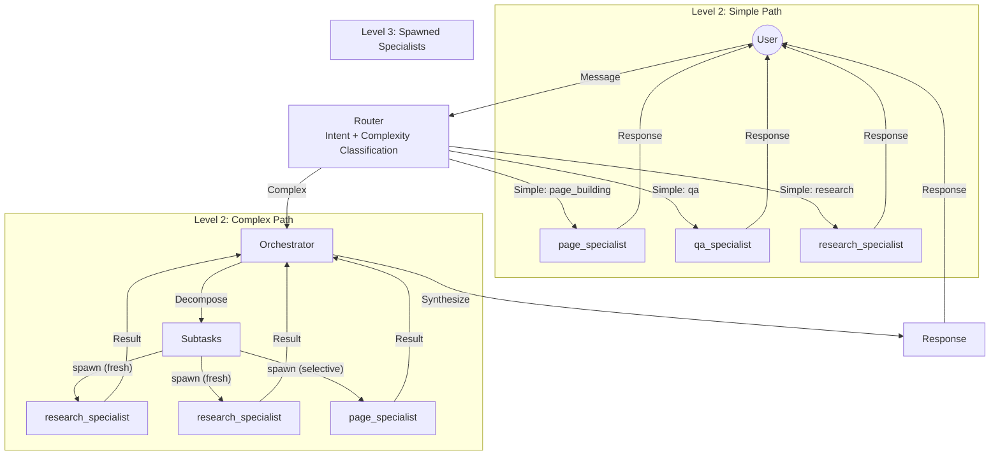

# Agent Model

> **Summary**: V7 introduces a 3-level agent model: Router → Orchestrator → Specialists. The router classifies intent and complexity, the orchestrator decomposes complex tasks, and specialists execute domain-specific work. Maximum depth is fixed at 3.
>
> **Prerequisites**: [00-overview.md](../00-overview.md)

## Overview

V7's agent model is built around three agent **types**:

| Type | Count | Level | Purpose |
|------|-------|-------|---------|
| **Router** | 1 | 1 | Classify intent + complexity, route to handler |
| **Orchestrator** | 1 | 2 | Decompose complex tasks, spawn specialists |
| **Specialist** | 5 | 2-3 | Execute domain-specific tasks with tools |

**Total: 7 agent configurations**

---

## The 3-Level Architecture



**V7 Key Architecture Points:**
- **Router** is the mandatory entry point (Level 1)
- **Simple tasks** go directly to specialists (2 levels: Router → Specialist)
- **Complex tasks** go through orchestrator (3 levels: Router → Orchestrator → Specialists)
- **Specialists never spawn** - they use tools only
- **Orchestrator spawns internally** - no spawn_agent tool exposed to LLM

**Maximum depth: 3. No exceptions.**

---

## Why This Model?

### Problem with V6

In V6, the primary agent had an exposed `spawn_agent` tool. Issues:
- LLM could hallucinate invalid agent IDs
- Depth limits bypassed by creative prompting
- Inconsistent parallel/sequential decisions

### V7 Solution

| V6 Issue | V7 Fix |
|----------|--------|
| LLM hallucinates agent IDs | Orchestrator has hardcoded `availableSpecialists` list |
| Depth limit bypassed | Specialists have `canSpawn: false` enforced |
| Inconsistent execution | Orchestrator decides based on task dependencies |

---

## Agent Types

### Router

**Level**: 1 (always first)

**Purpose**: Classify user intent and assess complexity

**Capabilities**:
- No tools (classification only)
- Routes simple tasks directly to specialists
- Routes complex tasks to orchestrator

**Output**:
```typescript
{
  intent: 'page_building' | 'post_writing' | 'image_management' | 'cms_query' | 'web_research' | 'general_qa',
  complexity: 'simple' | 'complex',
  targetAgent: string  // specialist ID for simple, 'orchestrator' for complex
}
```

### Orchestrator

**Level**: 2 (for complex tasks)

**Purpose**: Decompose, coordinate, synthesize

**Capabilities**:
- Decomposes complex requests into subtasks
- Spawns specialists (internal mechanism, not exposed tool)
- Decides execution order (parallel vs sequential)
- Tracks progress via todo list
- Synthesizes results into coherent response

**Key Design**: ONE orchestrator. Domain knowledge lives in specialists.

### Specialists

**Levels**: 2 (direct from router) or 3 (spawned by orchestrator)

**Purpose**: Execute domain-specific tasks

**Capabilities**:
- Domain-specific tools
- Cannot spawn sub-agents (`canSpawn: false`)
- Focused on single domain

**Available specialists**:
| ID | Domain | Description |
|----|--------|-------------|
| `page_specialist` | page_building | Create/edit pages and sections |
| `post_specialist` | post_writing | Create/edit blog posts |
| `research_specialist` | web_research | Web research, information gathering |
| `image_specialist` | image_management | Image search, upload, management |
| `qa_specialist` | cms_query | Answer questions about CMS content |

---

## Context Modes

When the orchestrator spawns specialists, it chooses a **context mode**:

| Mode | Use Case | Context Passed |
|------|----------|----------------|
| `fresh` | Independent parallel items | Clean slate, no cross-contamination |
| `inherited` | Continuation of parent task | Full parent context |
| `selective` | Dependent step in workflow | Only relevant previous results |

### When to Use Each

**Fresh** - Parallel independent research:
```
"Research 5 competitors"
→ Spawn 5 research_specialists with FRESH context
→ No bleeding between competitors
```

**Inherited** - Continue conversation:
```
"Now add more detail to that page"
→ Specialist needs full conversation history
```

**Selective** - Workflow dependency:
```
"Research competitors, then create comparison page"
→ research_specialist returns reports
→ page_specialist receives ONLY the research reports, not full history
```

---

## Agent Behavior Patterns

Different agents exhibit different patterns:

### Pattern A: Simple Q&A (qa_specialist)
```
User Query → Vector Search → Direct Answer
```
- No planning, no state tracking
- Single-shot retrieval and response
- maxSteps: 5

### Pattern B: Research Loop (research_specialist)
```
Query → Search → Analyze → [Need more?] → Search → Synthesize → Report
```
- Multi-step search with synthesis
- Chat history sufficient (no todo)
- maxSteps: 10

### Pattern C: Workflow Execution (page_specialist, post_specialist)
```
Goal → Plan → [Execute Step → Verify → Update Plan] → Complete
```
- Full plan tracking with step-by-step execution
- Self-correction on errors
- Todo list tracks progress
- maxSteps: 15

### Pattern D: Batch Operations (future: bulk_editor)
```
Goal → List Targets → Plan Changes → [HITL Approval] → Execute Batch → Report
```
- Always requires human approval
- High autonomy but gated by HITL
- maxSteps: 25

---

## Depth Enforcement

V7 uses **fixed 3-level depth**, enforced by multiple mechanisms:

| Mechanism | How It Works |
|-----------|--------------|
| `specialist.canSpawn: false` | Config enforced - specialists cannot spawn |
| Hardcoded `availableSpecialists` | Orchestrator only knows about 5 specialists |
| No `spawn_agent` tool | LLM cannot call spawning directly |
| Depth check before spawn | Orchestrator validates depth < 3 |

```typescript
// V7 Depth Enforcement
if (parentSession.depth >= 3) {
  throw new Error('Maximum agent depth reached');
}
```

---

## Flow Comparison: V6 vs V7

| Aspect | V6 | V7 |
|--------|----|----|
| Entry point | Primary agent routes via spawn_agent | Router classifies, routes directly |
| Spawning | LLM calls spawn_agent tool | Orchestrator spawns internally |
| Depth control | maxDepth config | Fixed at 3, canSpawn: false |
| Context passing | Always inherited | fresh/inherited/selective modes |
| Complexity assessment | Implicit in prompt | Explicit router config |

---

## Key Design Rules

| Rule | Enforcement |
|------|-------------|
| **Max depth = 3** | Orchestrator spawns specialists. Specialists cannot spawn. |
| **ONE orchestrator** | Only one orchestrator agent exists. No domain-specific orchestrators. |
| **Specialists have tools, not sub-agents** | `canSpawn: false` in all specialist configs |
| **Router is mandatory entry point** | All requests start at router |
| **Orchestrator decides parallelism** | Based on task dependencies, not hardcoded |
| **Fresh context for independent items** | `contextModes.independent: 'fresh'` |
| **Selective context for dependent steps** | `contextModes.dependent: 'selective'` |

---

## Related Documents

- → [09-agent-catalog.md](09-agent-catalog.md) - All 7 agent configurations
- → [10-spawning-flow.md](10-spawning-flow.md) - How spawning works
- → [11-hitl-integration.md](11-hitl-integration.md) - Approval patterns
- ↗ [../4-appendices/appendix-a-schemas.md](../4-appendices/appendix-a-schemas.md) - AgentConfig schema
