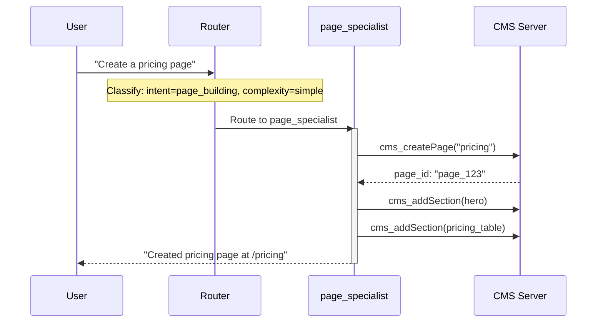
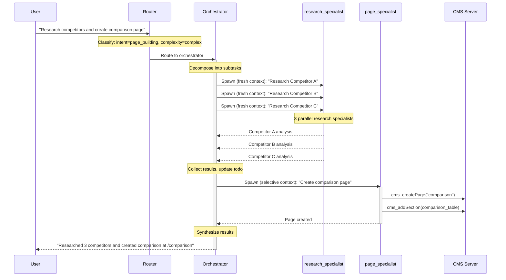
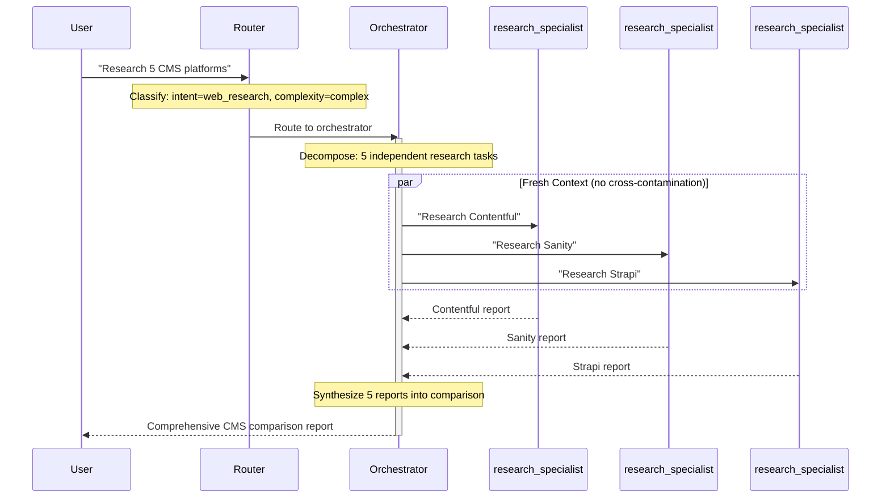

# Spawning Flow

> **Summary**: The orchestrator spawns specialists internally (not via exposed tool). Sessions form a tree with fixed 3-level depth. Results are aggregated and synthesized by the orchestrator.
>
> **Prerequisites**: [08-agent-model.md](08-agent-model.md), [09-agent-catalog.md](09-agent-catalog.md)

## Overview

In V7, spawning is an **internal orchestrator mechanism**, not an LLM-accessible tool. This prevents:
- LLM hallucinating invalid agent IDs
- Depth limit bypass via creative prompting
- Inconsistent parallel/sequential decisions

---

## Session Hierarchy

Sessions form a **tree structure** with enforced depth limiting:

```
Root (router, depth: 1)
├── Orchestrator (depth: 2) - for complex tasks
│   ├── research_specialist (depth: 3)
│   ├── research_specialist (depth: 3)
│   └── page_specialist (depth: 3)
│       └── ❌ Cannot spawn (depth limit + canSpawn: false)
│
└── page_specialist (depth: 2) - for simple tasks
    └── ❌ Cannot spawn (canSpawn: false)
```

### Session Schema

```typescript
interface Session {
  id: string;
  parentId: string | null;      // null for root sessions
  agentId: string;              // Which agent config to use
  userId: string;
  cmsType: string;
  status: 'active' | 'paused' | 'completed' | 'error';

  // V7: Fixed 3-level hierarchy
  depth: number;                // 1 = router, 2 = orchestrator/specialist, 3 = spawned

  // Results
  finalResponse?: string;
  artifacts?: string[];         // IDs of created/modified entities

  metadata: {
    totalTokens?: number;
    totalSteps?: number;
    childSessions?: string[];   // IDs of spawned children
  };
}
```

---

## How Orchestrator Spawns

The orchestrator spawns specialists **internally** based on its decomposition plan:

```typescript
class SessionOrchestrator {
  async spawnSpecialists(
    parentSessionId: string,
    subtasks: Subtask[],
    contextMode: 'fresh' | 'inherited' | 'selective'
  ): Promise<SpecialistResult[]> {
    // Validate specialists exist
    for (const subtask of subtasks) {
      if (!this.availableSpecialists.includes(subtask.specialist)) {
        throw new Error(`Unknown specialist: ${subtask.specialist}`);
      }
    }

    // Group by dependency for parallel execution
    const { parallel, sequential } = this.groupByDependency(subtasks);

    // Execute parallel tasks with fresh context
    const parallelResults = await Promise.all(
      parallel.map(subtask =>
        this.spawnSingle(parentSessionId, subtask, 'fresh')
      )
    );

    // Execute sequential tasks with selective context
    const sequentialResults = [];
    for (const subtask of sequential) {
      const result = await this.spawnSingle(
        parentSessionId,
        subtask,
        'selective',
        parallelResults  // Pass previous results as context
      );
      sequentialResults.push(result);
    }

    return [...parallelResults, ...sequentialResults];
  }
}
```

---

## Example Flow: Simple Task (2 Levels)

**User**: "Create a pricing page"



**Depth: 2** (Router → Specialist)

---

## Example Flow: Complex Task (3 Levels)

**User**: "Research our competitors and create a comparison page"



**Depth: 3** (Router → Orchestrator → Specialists)

---

## Example Flow: Wide Research (Manus Pattern)

**User**: "Research 5 CMS platforms"



**Key Pattern**: Fresh context prevents cross-contamination between parallel items.

---

## spawnChild Implementation

```typescript
interface SpawnChildOptions {
  parentSessionId: string;
  agentId: string;
  task: string;
  context?: string;
  sessionId?: string;  // Optional: resume existing child
}

class SessionOrchestrator {
  async spawnChild(options: SpawnChildOptions): Promise<SessionResult> {
    const { parentSessionId, agentId, task, context, sessionId } = options;
    const parentSession = await this.sessionStore.get(parentSessionId);

    let childSession: Session;
    let isResuming = false;

    if (sessionId) {
      // Resume existing session
      const existing = await this.sessionStore.get(sessionId).catch(() => null);
      if (existing && this.isDescendantOf(existing, parentSessionId)) {
        childSession = existing;
        isResuming = true;
      } else {
        childSession = await this.createChildSession(parentSession, agentId);
      }
    } else {
      // Check depth limit for new sessions
      if (parentSession.depth >= 3) {
        throw new Error('Maximum agent depth reached');
      }
      childSession = await this.createChildSession(parentSession, agentId);
    }

    // Track child in parent
    if (!isResuming) {
      await this.sessionStore.update(parentSessionId, {
        metadata: {
          ...parentSession.metadata,
          childSessions: [...(parentSession.metadata.childSessions || []), childSession.id],
        },
      });
    }

    // Emit spawn event
    this.eventBus.publish('agent.spawned', {
      parentSessionId,
      childSessionId: childSession.id,
      agentId,
      task,
      resumed: isResuming,
    });

    // Build initial message with context
    const initialMessage = context
      ? `Context from parent agent:\n${context}\n\nTask: ${task}`
      : task;

    // Run child session (blocking)
    const result = await this.runSession(childSession.id, initialMessage);

    // Emit completion
    this.eventBus.publish('agent.child_completed', {
      parentSessionId,
      childSessionId: childSession.id,
      agentId,
      result: result.finalResponse,
    });

    // Roll up metrics to parent
    await this.rollUpMetrics(parentSessionId, result.metrics);

    return result;
  }
}
```

---

## Depth Enforcement

| Level | Agent Type | Can Spawn? | Example |
|-------|------------|------------|---------|
| 1 | Router | Routes only | Routes to orchestrator or specialist |
| 2 | Orchestrator | Yes (internal) | Spawns specialists for subtasks |
| 2 | Specialist | No | Direct from router for simple tasks |
| 3 | Specialist | No | Spawned by orchestrator |

**Enforcement Mechanisms**:
1. `specialist.canSpawn: false` in all specialist configs
2. Orchestrator's `availableSpecialists` list is hardcoded
3. No `spawn_agent` tool exposed to LLM
4. Depth check in orchestrator before spawning

---

## Child Failure Handling

| Scenario | Behavior |
|----------|----------|
| **Child completes successfully** | Result collected for synthesis |
| **Child errors** | Error preserved in context (Manus pattern), orchestrator can retry or skip |
| **Child times out** | After `maxDuration` (5 min), child aborted, error recorded |
| **All children complete** | Orchestrator synthesizes results into unified response |

---

## Metrics Rollup

Token usage from children is aggregated to parent:

```typescript
private async rollUpMetrics(
  parentSessionId: string,
  childMetrics: SessionResult['metrics']
): Promise<void> {
  const parent = await this.sessionStore.get(parentSessionId);

  await this.sessionStore.update(parentSessionId, {
    metadata: {
      ...parent.metadata,
      totalTokens: (parent.metadata.totalTokens || 0) + childMetrics.totalTokens,
    },
  });
}
```

---

## Related Documents

- → [08-agent-model.md](08-agent-model.md) - Agent types and context modes
- → [09-agent-catalog.md](09-agent-catalog.md) - Specialist configurations
- → [11-hitl-integration.md](11-hitl-integration.md) - Approval before spawning
- → [../3-implementation/12-session-processor.md](../3-implementation/12-session-processor.md) - Session execution
